# Configuración de IP dinámica sobre interfaz física.

# Índice

Introducción  
Ejemplo 3 — Configuración de IP dinámica sobre un bridge  
Creación del bridge Gateway 
Asignación de la interfaz física al bridge 
Eliminando la configuración aplicada 
Eliminación del cliente DHCP  

# Introducción

A lo largo de esta práctica volveremos a trabajar sobre la configuración de la 
interfaz que actuará como gateway, obteniendo su dirección IP de un servidor 
DHCP, pero en lugar de configurar un cliente DHCP sobre la interfaz física ether1, 
realizaremos la configuración sobre un bridge.

Un bridge en RouterOS es una entidad lógica que actúa como un switch virtual, 
permitiendo agrupar varias interfaces físicas para que funcionen como un único 
segmento de red. La dirección IP, las rutas y los servicios de red se aplican al bridge, 
no a los puertos individuales, lo que permite separar claramente la configuración 
de red del hardware físico.

Esta abstracción aporta ventajas operativas clave. Por un lado, permite que varios 
puertos físicos del dispositivo se comporten como una única red lógica. Por 
otro, si un puerto físico falla o necesita ser sustituido, basta con retirarlo del 
bridge y añadir otro puerto, sin modificar la dirección IP, las rutas ni los servicios 
asociados. De este modo, la red sigue funcionando sin cambios estructurales y se 
reducen tanto los tiempos de intervención como la probabilidad de errores.

Desde el punto de vista conceptual, es importante interiorizar que:

• Las interfaces físicas actúan como puertos.  
• El bridge actúa como un switch lógico.  
• La dirección IP se asigna al bridge, no a cada puerto.  


# Ejemplo 3 — Configuración de IP dinámica sobre un bridge

Este tercer escenario representa una evolución del modelo inicial de configuración, 
introduciendo una capa de abstracción que aporta resiliencia frente al fallo de un 
puerto físico.

Para ello, se creará un bridge al que se añadirá la primera interfaz del router. La 
configuración de red se aplicará sobre este bridge, y no directamente sobre la 
interfaz física. A continuación, se configurará un cliente DHCP en el bridge, se 
analizará la información de red recibida automáticamente y se verificará que el 
router puede comunicarse correctamente a través del bridge sin necesidad de 
configurar manualmente el direccionamiento IP.


# Creación del bridge Gateway

En primer lugar, vamos a listar los bridges configurados en nuestro router, 
ejecutando el siguiente comando: 
```sh
interface/bridge/print
```

Podemos observar cómo no hay ningún bridge configurado por defecto. 

Vamos a crear el bridge que actuará como Gateway de la red, ejecutando el 
siguiente comando:
```sh
interface/bridge/add name=bridge-gateway comment=”Bridge Gateway”
```
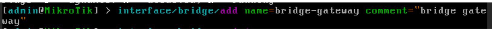

Verificamos que todo ha ido bien:
```sh
interface/bridge/print
```
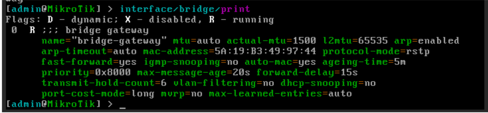
# Asignación de la interfaz física al bridge

Vamos a listar los bridges configurados en nuestro router, ejecutando el siguiente 
comando: 
```sh
interface/bridge/print
```
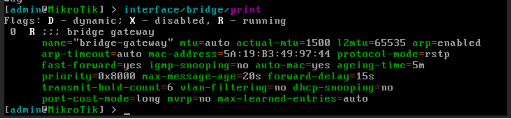
Añadimos la interfaz ether1 al bridge “bridge-gateway”:
```sh
interface/bridge/port/add bridge=bridge-gateway interface=ether1
```

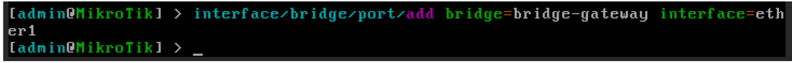
Una vez añadida al bridge, ether1 deja de ser el punto lógico de red. El punto 
lógico pasa a ser el bridge. Verificamos que todo ha ido bien:

```sh
interface/bridge/port/print
```
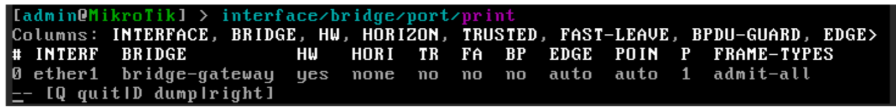
# Creación del cliente DHCP en la interfaz ether1

Antes de continuar, vamos a comprobar que la interfaz ether1 y el bridge “bridge-gateway” no tienen asignada ninguna IP, tal como hemos visto en los tutoriales 
anteriores:

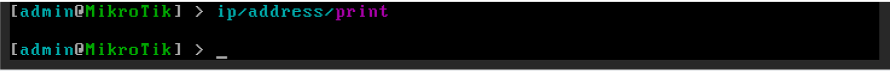
```sh
ip/address/print
```
* Si existe alguna dirección IP asignada a la interfaz o el bridge, 
debe eliminarse antes de crear el cliente DHCP.

Una vez nos hemos asegurado de que la interfaz y el bridge no tienen asignada 
ninguna IP, podemos crear el cliente DHCP sobre el bridge: 
```sh
ip/dhcp-client/add interface=bridge-gateway disable=no
```
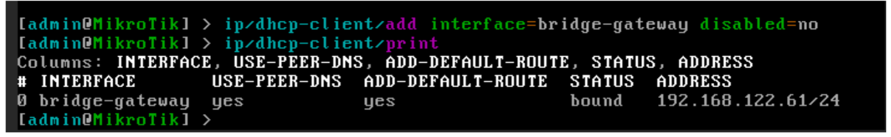
Como podemos observar en la captura, para comprobar los clientes DHCP activos 
ejecutando el comando:
```sh
ip/dhcp-client/print
```
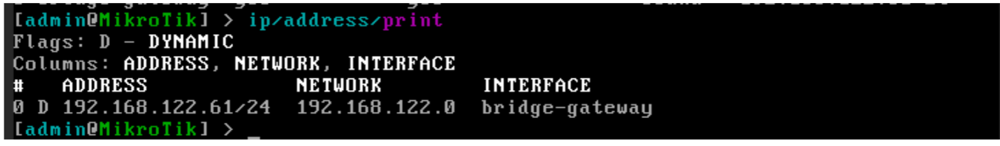
En mi caso, el servidor DHCP de la red NAT ha asignado la IP 192.168.122.61/24, al 
bridge. Esta información la podemos obtener también desde el listado de IPs 
asignadas a interfaces, con el comando:
```sh
ip/addresses/print
```
En la captura podemos observar el flag ‘D’, que indica que la asignación de IP se ha 
realizado de manera dinámica.

Si queremos obtener información detallada de la configuración asignada por DHCP, 
podemos ejecutar el siguiente comando:
```sh
Ip/dhcp-client/print detail
```
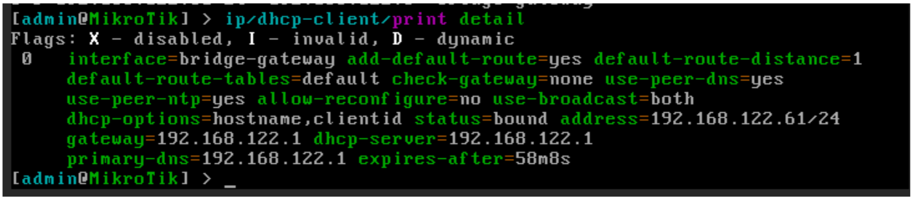
En la captura podemos observar, entre otros:

• La IP asignada.  
• La Puerta de enlace de la red  
• La IP del servidor DHCP  
• La IP del servidor DNS primario  
• …  

También podemos comprobar la configuración asignada por DHCP (IP, ruta por 
defecto y servidores DNS) ejecutando los siguientes comandos:
```sh
Ip/address/print  
```
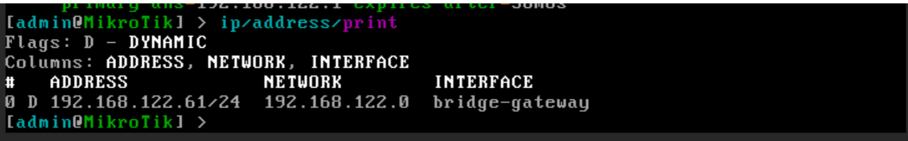
```sh 
Ip/route/print  
```
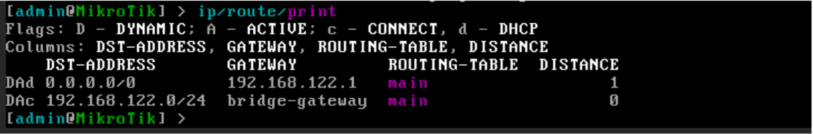
```sh
Ip/dns/print  
```
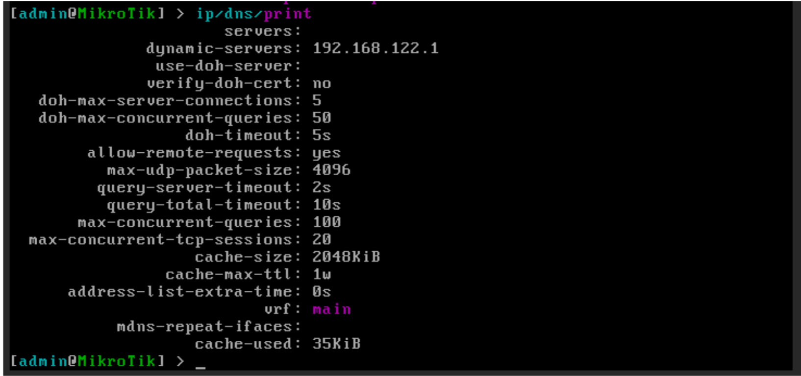
Por último, Podemos probar la conectividad de red, ejecutando un ping a 
Google.com, por ejemplo, mediante el comando:
```sh
Ping google.com
```
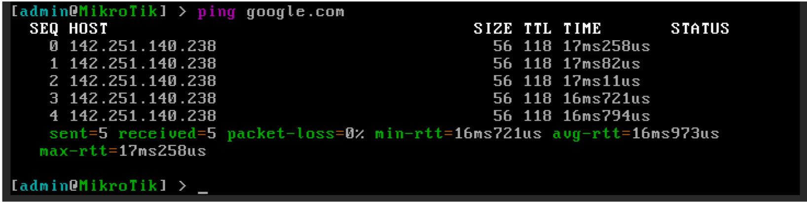
También podemos acceder al router utilizando un navegador web de la máquina 
anfitrión, a través de la IP configurada:
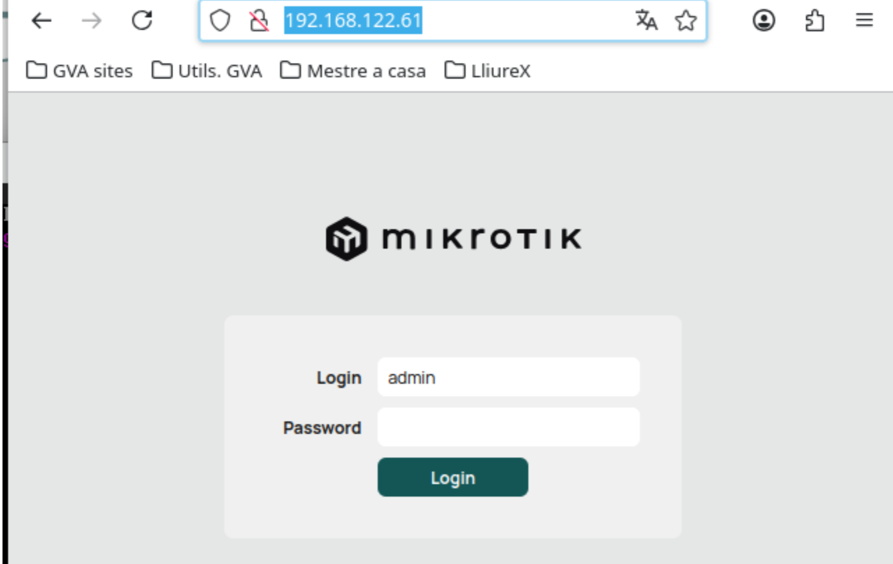

# Eliminando la configuración aplicada

Antes de continuar, vamos a eliminar toda la configuración aplicada al router, para 
volver a tener un dispositivo limpio.


# Eliminación del cliente DHCP

Para mostrar los clientes DHCP configurados, ejecutamos el siguiente comando:
```sh
ip/dhcp-client/print
```
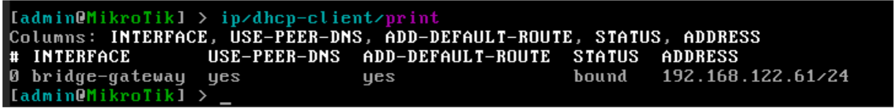
Para eliminar el cliente DHCP ejecutamos el siguiente comando:
```sh
Ip/dhcp-client/remove <<índice>>
```
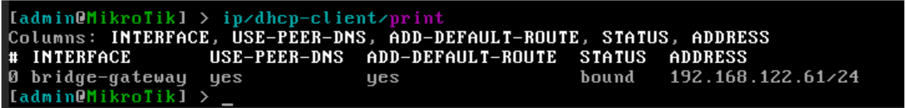
Al eliminar el cliente DHCP, se eliminará toda la configuración aplicada por el 
mismo. Podemos comprobarlo ejecutando los siguientes comandos:
```sh
Ip/address/print  
```
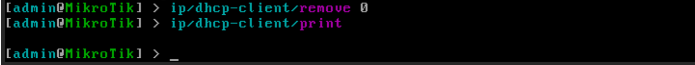
```sh
Ip/route/print  
```
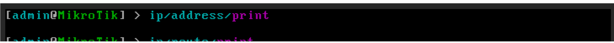
```sh
Ip/dns/print  
```
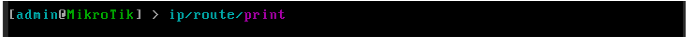
Ya tenemos nuestro router sin configuraciones por defecto, preparado para la 
siguiente práctica.