# Configuración de IP estática sobre bridge.

## Índice

- Introducción
- Ejemplo 4 — Configuración de IP estática sobre un bridge
  - Creación del bridge Gateway
  - Asignación de la interfaz física al bridge
  - Asignación manual de IP al bridge
  - Asignación manual de ruta por defecto
  - Asignación manual de servidores DNS
- Eliminando la configuración aplicada

---

## Introducción

A lo largo de esta práctica volveremos a trabajar sobre la configuración de la interfaz que actuará como gateway, aplicando una configuración de red estática sobre un bridge.

Este cuarto escenario representa la evolución del primer escenario, aportando resiliencia en caso de fallo del puerto físico.

---

## Ejemplo 4 — Configuración de IP estática sobre un bridge

Durante este ejemplo, se creará un bridge, al que añadiremos la primera interfaz del router. Posteriormente, aplicaremos una configuración de red estática sobre el bridge, y se verificará que el router puede comunicarse correctamente a través del bridge, utilizando la configuración de red aplicada sobre el mismo.

---

## Creación del bridge Gateway

En primer lugar, vamos a listar los bridges configurados en nuestro router, ejecutando el siguiente comando:

```sh
interface/bridge/print
```

Podemos observar cómo no hay ningún bridge configurado por defecto.


Vamos a crear el bridge que actuará como Gateway de la red, ejecutando el siguiente comando:

```sh
interface/bridge/add name=bridge-gateway comment="Bridge Gateway"
```
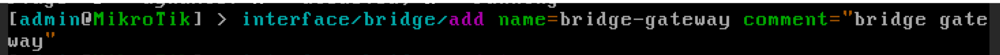
Verificamos que todo ha ido bien:

```sh
interface/bridge/print
```
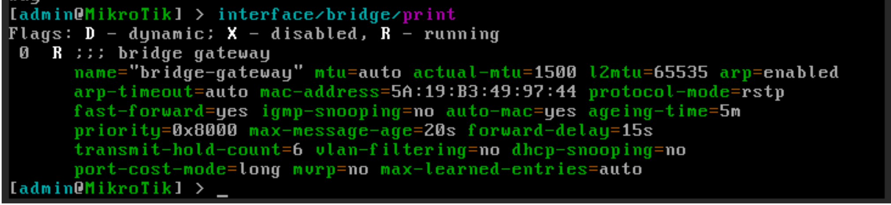
---

## Asignación de la interfaz física al bridge

Vamos a listar los bridges configurados en nuestro router, ejecutando el siguiente comando:

```sh
interface/bridge/print
```
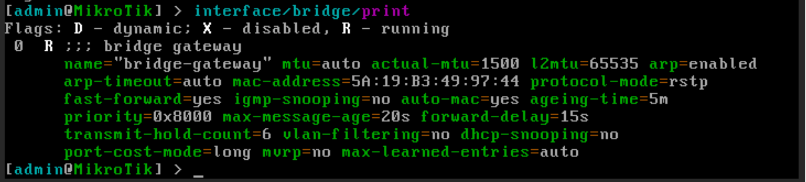
Añadimos la interfaz ether1 al bridge “bridge-gateway”:

```sh
interface/bridge/port/add bridge=bridge-gateway interface=ether1
```
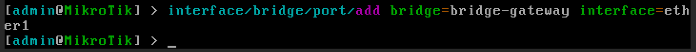
Una vez añadida al bridge, **ether1 deja de ser el punto lógico de red**. El punto lógico pasa a ser el bridge.

Verificamos que todo ha ido bien:

```sh
interface/bridge/port/print
```
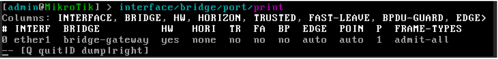
---

## Asignación manual de IP al bridge

Para finalizar el ejemplo, vamos a asignar una IP al bridge, de manera manual.

Primero listamos los bridges configurados en nuestro router, ejecutando el siguiente comando:

```sh
interface/bridge/print
```
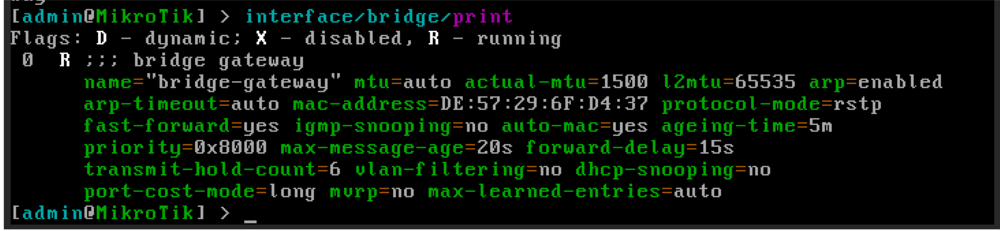
En mi caso, configuraré el bridge “bridge-gateway”, asignándole la IP 192.168.122.61/24, ejecutando:

```sh
ip/address/add address=192.168.122.61/24 interface=bridge-gateway comment="IP Bridge gateway"
```
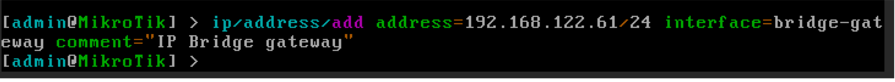
Podemos comprobar la asignación de la IP, utilizando el comando:

```sh
ip/address/print
```
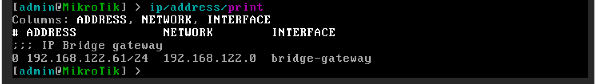
---

## Asignación manual de ruta por defecto

Si deseamos poder navegar por internet, deberemos indicar cuál es la puerta de enlace de la red, añadiendo una ruta por defecto:

```sh
ip/route/add dst-address=0.0.0.0/0 gateway=192.168.122.1 comment="Salida a NAT"
```
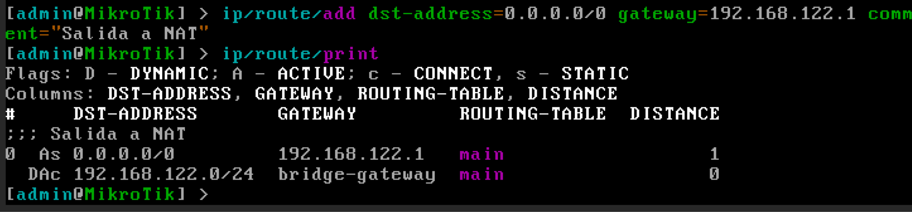
---

## Asignación manual de servidores DNS

Si se requiere traducción de nombres de dominio, deberemos configurar las IP de los servidores DNS:

```sh
ip/dns/set servers=8.8.8.8,8.8.4.4 allow-remote-requests=yes
```
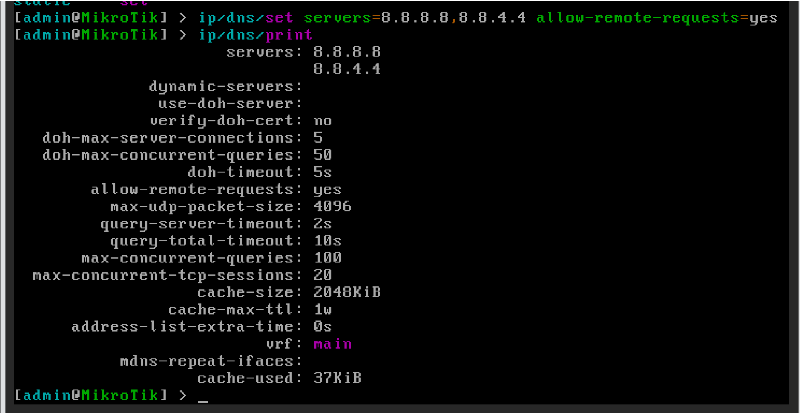

Con esta configuración, el router tendría acceso a internet. Podemos comprobarlo ejecutando un ping sobre un dominio conocido:

```sh
ping google.com
```
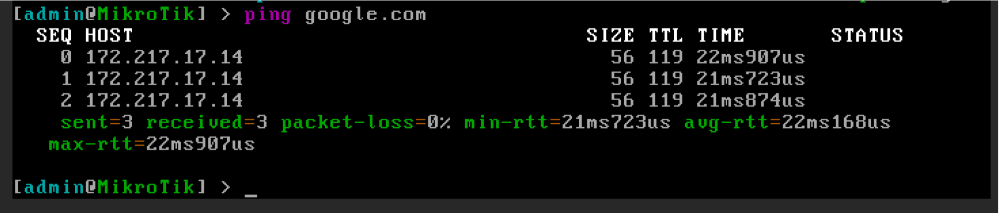
También podemos acceder al router utilizando un navegador web de la máquina anfitrión, a través de la IP configurada.
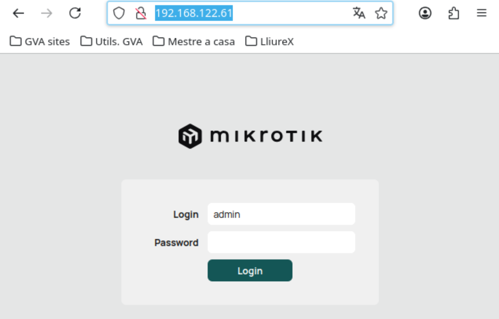
---

## Eliminando la configuración aplicada

Para eliminar la configuración aplicada, realizamos las siguientes operaciones:

### Eliminamos las direcciones de los servidores DNS

```sh
ip/dns/set servers=""
```
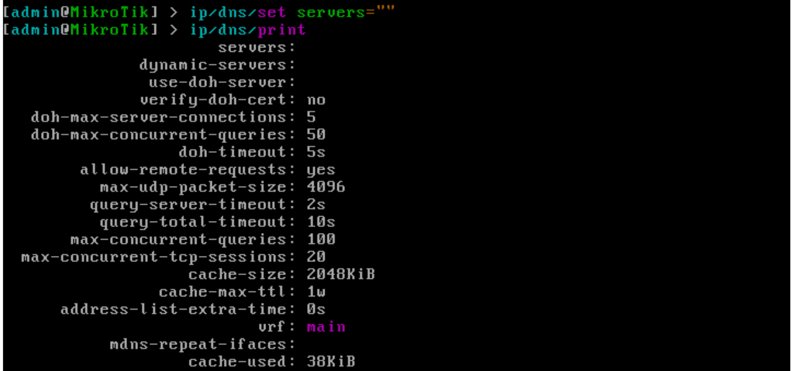
---

### Visualizamos las rutas existentes y eliminamos la ruta por defecto creada

```sh
ip/route/print
ip/route/remove <indice>
```
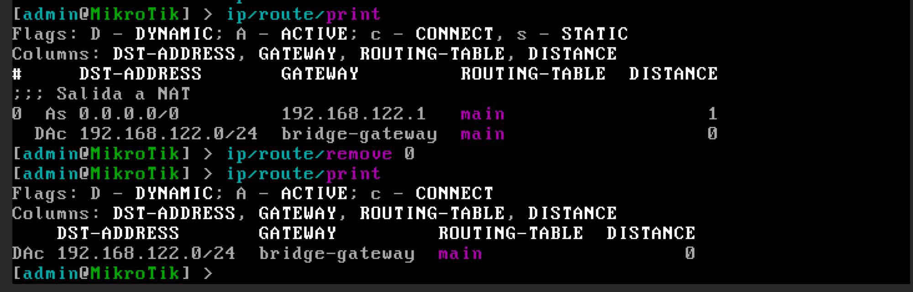
---

### Eliminamos la interfaz del bridge

```sh
interface/bridge/port/print
interface/bridge/port/remove <indice>
```
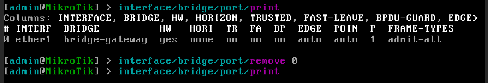
---

### Eliminamos la IP del bridge

```sh
ip/address/print
ip/address/remove <indice>
```
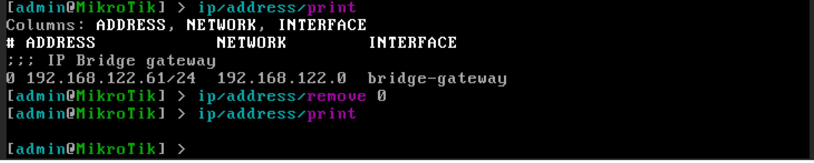

---

### Por último, eliminaremos el bridge

```sh
interface/bridge/print
interface/bridge/remove <indice>
```
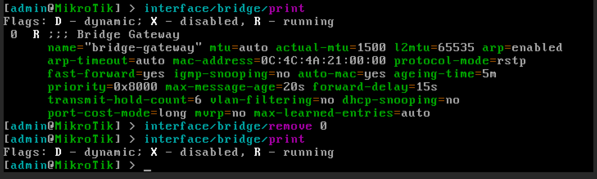
---

Tras eliminar los elementos configurados, volvemos a tener un router en blanco, preparado para la próxima práctica

# Preguntas
??? question "1. ¿Qué es un bridge en este escenario?"
    Es una interfaz lógica que actúa como un switch virtual donde se aplica la configuración de red.

??? question "2. ¿Dónde se configura la IP en este caso?"
    La IP se configura en el bridge, no en la interfaz física.

??? question "3. ¿Qué ventaja tiene usar un bridge con IP estática?"
    Permite mantener la configuración aunque cambien los puertos físicos.

??? question "4. ¿Qué ocurre con ether1 al añadirlo al bridge?"
    Deja de ser el punto lógico de red y pasa a ser un puerto del bridge.

??? question "5. ¿Qué aporta este modelo respecto a IP estática en interfaz física?"
    Mayor flexibilidad y resiliencia frente a fallos de hardware.

??? question "6. ¿Cómo se listan los bridges?"
    interface/bridge/print

??? question "7. ¿Cómo se crea un bridge?"
    interface/bridge/add name=bridge-gateway

??? question "8. ¿Cómo se añade ether1 al bridge?"
    interface/bridge/port/add bridge=bridge-gateway interface=ether1

??? question "9. ¿Cómo se asigna una IP al bridge?"
    ip/address/add address=192.168.122.61/24 interface=bridge-gateway

??? question "10. ¿Cómo comprobar la IP?"
    ip/address/print

??? question "11. ¿Cómo se configura la ruta por defecto?"
    ip/route/add dst-address=0.0.0.0/0 gateway=192.168.122.1

??? question "12. ¿Para qué sirve la ruta por defecto?"
    Permite salir de la red local hacia otras redes (Internet).

??? question "13. ¿Cómo se configuran los DNS?"
    ip/dns/set servers=8.8.8.8,8.8.4.4 allow-remote-requests=yes

??? question "14. ¿Para qué sirven los DNS?"
    Para resolver nombres de dominio en direcciones IP.

??? question "15. ¿Cómo comprobar conectividad?"
    ping google.com
??? question "16. ¿Qué ocurre si no configuras la ruta por defecto?"
    No tendrás acceso a Internet, solo a la red local.

??? question "17. ¿Qué ocurre si no configuras DNS?"
    No funcionarán los nombres de dominio, aunque sí las IPs.

??? question "18. ¿Por qué es importante configurar IP, ruta y DNS?"
    Porque cada uno cumple una función necesaria para la conectividad completa.

??? question "19. ¿Por qué el bridge es el elemento clave?"
    Porque centraliza toda la configuración de red.

??? question "20. ¿Cómo eliminar los DNS?"
    ip/dns/set servers=""

??? question "21. ¿Cómo eliminar la ruta?"
    ip/route/print  
    ip/route/remove <indice>

??? question "22. ¿Cómo eliminar la interfaz del bridge?"
    interface/bridge/port/print  
    interface/bridge/port/remove <indice>

??? question "23. ¿Cómo eliminar la IP del bridge?"
    ip/address/print  
    ip/address/remove <indice>

??? question "24. ¿Cómo eliminar el bridge?"
    interface/bridge/print  
    interface/bridge/remove <indice>

!!! warning "Importante"
    La IP SIEMPRE se configura en el bridge, no en la interfaz física.

!!! danger "Error típico"
    Si configuras la IP en ether1 en lugar del bridge, la red no funcionará correctamente.

!!! tip "Consejo"
    Piensa en el bridge como el verdadero "router lógico".

!!! info "Buenas prácticas"
    Verifica siempre:
    
    ip/address/print  
    ip/route/print  
    ip/dns/print  

!!! success "Comprobación final"
    Si ping google.com responde, la configuración es correcta.

??? question "💡 ¿Cuál es la diferencia clave entre IP estática en interfaz y en bridge?"
    En la interfaz física la configuración depende del hardware, mientras que en el bridge es independiente y más flexible.

