# Configuración de IP dinámica sobre interfaz física

## Índice

Introducción  
Ejemplo 2 — Configuración de IP dinámica sobre una interfaz física  
Eliminando la configuración aplicada  
Eliminación del cliente DHCP  

---

## Introducción

A lo largo de esta práctica trabajaremos sobre un escenario típico: la configuración de la interfaz que actuará como gateway, obteniendo su dirección IP de un servidor DHCP. Este enfoque es extremadamente habitual en entornos reales, donde el router no recibe una configuración fija, sino que depende de un proveedor externo (ISP, red corporativa, red del centro, laboratorio, etc.) para obtener sus parámetros de red.

Este escenario servirá además como punto de partida de una serie de ordenado para que el profesorado pueda comparar comportamientos y resultados:

• Primero, configuraremos direccionamiento IP dinámico, mediante un cliente DHCP sobre una interfaz física, el enfoque más simple y directo.  
• A continuación, configuraremos esa misma interfaz con direccionamiento IP estático, analizando qué cambia.  
• Después, daremos el salto conceptual al uso de bridges, aplicando una configuración de IP dinámica sobre un bridge, mediante la configuración de un cliente DHCP sobre el bridge.  
• Finalmente, cerraremos con la configuración de un bridge con IP estática, que es el modelo más habitual en entornos reales con múltiples routers configurados en una red LAN.  

Esta progresión permite observar cómo RouterOS separa claramente las capas de hardware, enlace y red, y prepara el terreno para configuraciones más avanzadas (LAN con múltiples puertos, firewall, etc.) que se abordarán más adelante en el curso.

---

## Ejemplo 1 — Configuración de IP dinámica sobre una interfaz física

Este escenario aborda una configuración usual en entornos reales: la obtención automática de parámetros de red mediante DHCP, configurando una interfaz física del router como cliente DHCP.

En este caso no se asigna ninguna dirección IP de forma manual. Será el servidor DHCP de la red quien proporcione al router:

• Dirección IP  
• Máscara de red  
• Puerta de enlace por defecto  
• (Opcionalmente) servidores DNS  

El objetivo de esta práctica es configurar la primera interfaz del router (ether1) como cliente DHCP, comprobar qué información recibe automáticamente y verificar que el router puede comunicarse a través de dicha interfaz sin intervención manual en el direccionamiento IP.

---

### Creación del cliente DHCP en la interfaz ether1

En primer lugar, vamos a comprobar que la interfaz ether1 no tiene ninguna IP configurada manualmente, tal como hemos visto en los tutoriales anteriores:

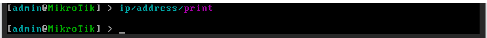
Una vez nos hemos asegurado de que no se ha aplicado configuración manual de IP sobre la interfaz ether1, podemos crear el cliente DHCP sobre dicha interfaz:

ip/dhcp-client/add interface=ether1 disable=no

---
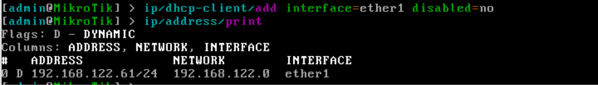
En la captura, podemos revisar los clientes DHCP activos, tras ejecutar el comando:

ip/dhcp-client/print

En mi caso, el servidor DHCP de la red NAT ha asignado la IP 192.168.122.61/24, a la interfaz. Esta información la podemos obtener también desde el listado de IPs asignadas a interfaces, con el comando:

ip/addresses/print

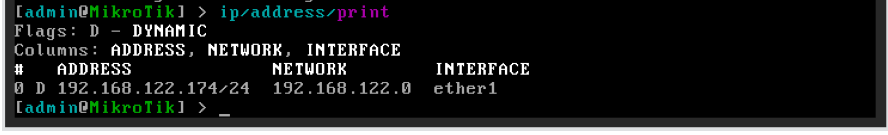

En la captura podemos observar el flag ‘D’, que indica que la asignación de IP se ha realizado de manera dinámica.

Si queremos obtener información detallada de la configuración asignada por DHCP, podemos ejecutar el siguiente comando:

ip/dhcp-client/print detail

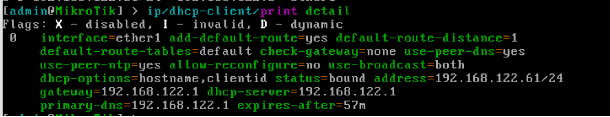

En la captura podemos observar, entre otros:

• La IP asignada.

[IMAGEN: consola DHCP]

---

• La Puerta de enlace de la red  
• La IP del servidor DHCP  
• La IP del servidor DNS primario  
• …  

También podemos comprobar la configuración asignada por DHCP (IP, ruta por defecto y servidores DNS) ejecutando los siguientes comandos:

ip/address/print  
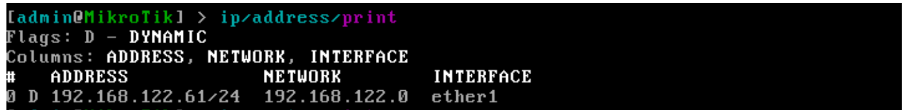
ip/route/print  
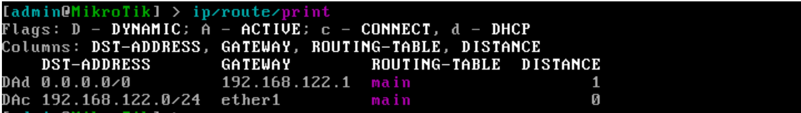
ip/dns/print  
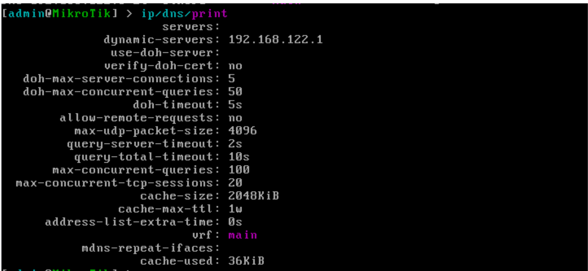

---

Por último, Podemos probar la conectividad de red, ejecutando un ping a Google.com, por ejemplo, mediante el comando:

ping google.com

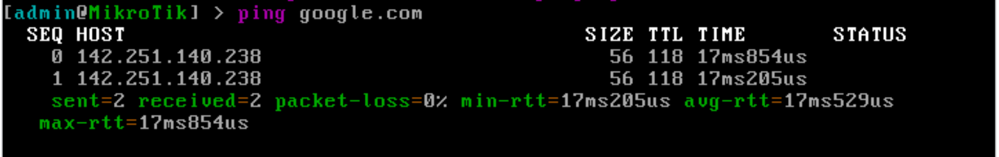

También podemos acceder al router utilizando un navegador web de la máquina anfitrión, a través de la IP configurada:

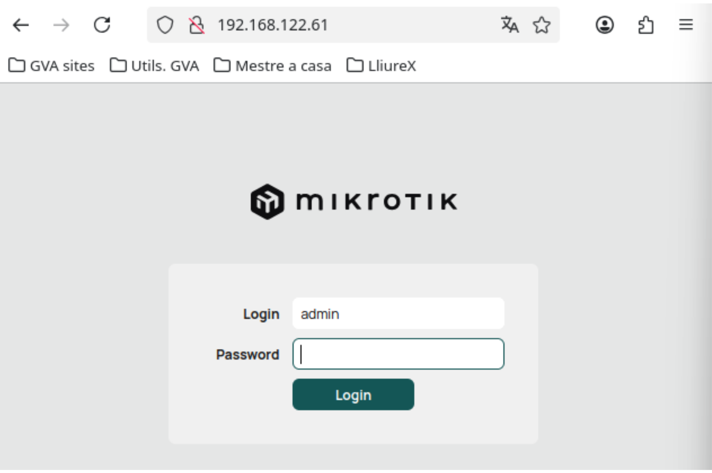

---

## Eliminando la configuración aplicada

Antes de continuar, vamos a eliminar toda la configuración aplicada al router, para volver a tener un dispositivo limpio, sin necesidad de aplicar la configuración de fábrica.

---

## Eliminación del cliente DHCP

Para mostrar los clientes DHCP configurados, ejecutamos el siguiente comando:

ip/dhcp-client/print

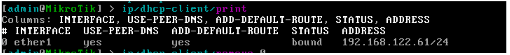
---

Para eliminar el cliente DHCP ejecutamos el siguiente comando:

ip/dhcp-client/remove <<índice>>

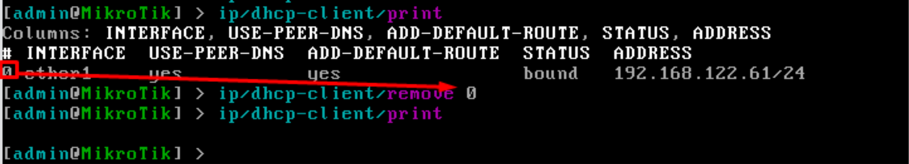

---

Al eliminar el cliente DHCP, se eliminará toda la configuración aplicada por el mismo. Podemos comprobarlo ejecutando los siguientes comandos:

ip/address/print  
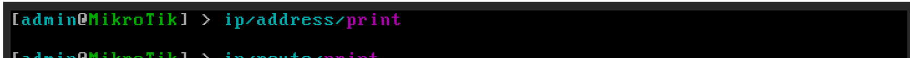
ip/route/print  

ip/dns/print  

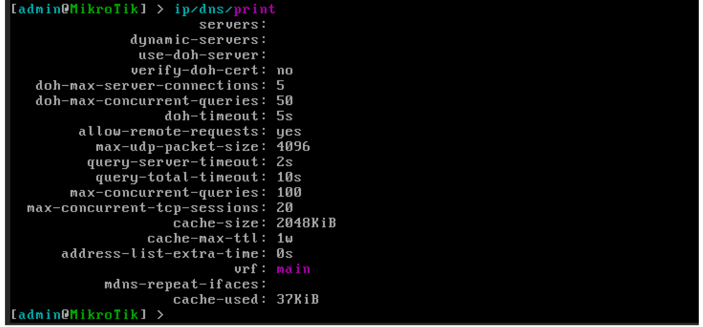

---

Ya tenemos nuestro router sin configuraciones por defecto, preparado para la siguiente práctica.
