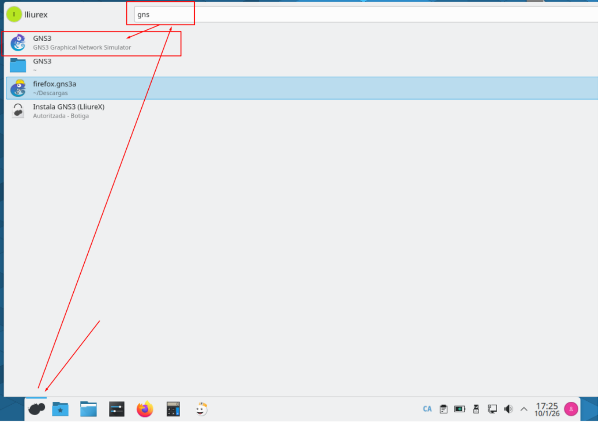
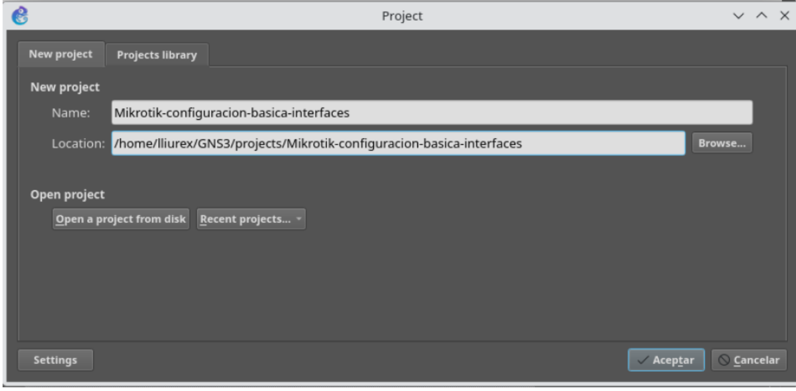
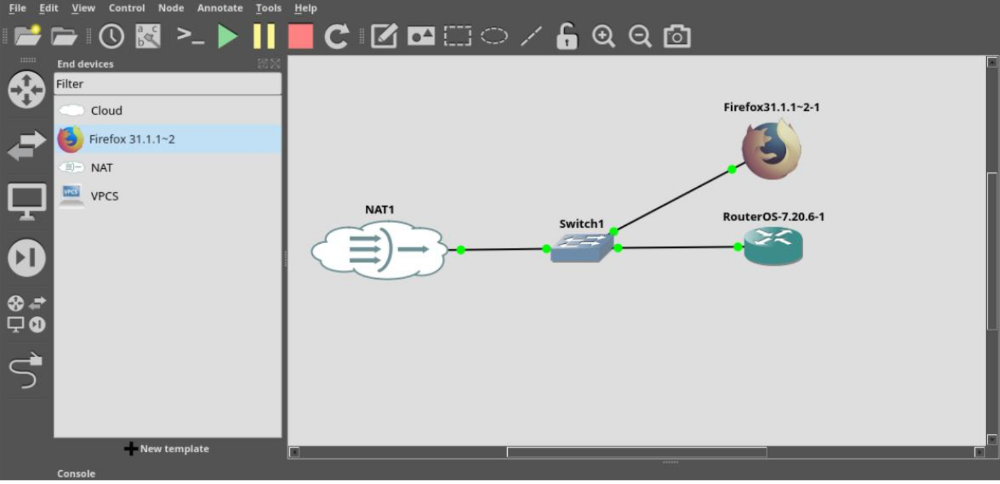
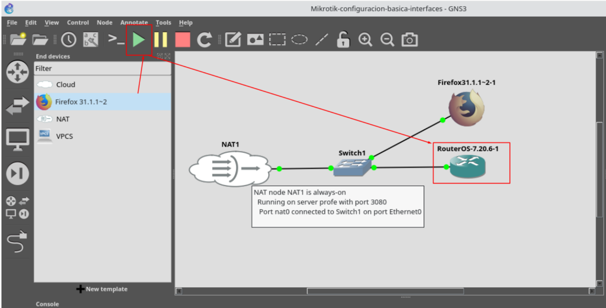
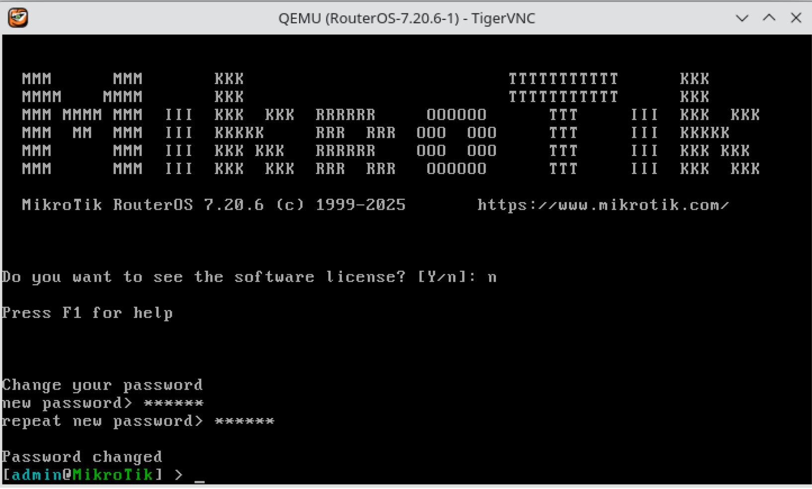

# Eliminación de configuración por defecto.

# Índice

Introducción  
Punto de partida: un router con configuración de fábrica.  
Usuario y contraseña por defecto en RouterOS  
Eliminación de la configuración por defecto de RouterOS.  

---

# Introducción

A lo largo de esta semana trabajaremos sobre un escenario típico: la configuración de la interfaz que actuará como gateway, lo que en muchos entornos se denomina de forma informal puerta cero del router. Esta interfaz será la responsable de proporcionar conectividad hacia la red externa (ISP, red del centro, laboratorio, etc.), por lo que resulta un excelente punto de partida para introducir buenas prácticas.

El recorrido que seguiremos está cuidadosamente ordenado para que el profesorado pueda comparar comportamientos y resultados. Pero antes de empezar, necesitamos dejar en blanco la configuración del router.

---

# Punto de partida: un router con configuración de fábrica.

Antes de comenzar cualquier configuración, es obligatorio partir de un entorno controlado y homogéneo. Uno de los errores más frecuentes en formación con MikroTik es trabajar sobre routers que arrastran configuraciones previas (por mínimas que sean), lo que provoca comportamientos inesperados y dificulta enormemente el aprendizaje.

Para evitarlo, el ejemplo se desarrollará sobre un router con configuración de fábrica (recién instalado en VirtualBox, o recién creado desde la plantilla en GNS3).

En mi caso, voy a crear un nuevo escenario en GNS3, en el que desplegaré un router desde la plantilla configurada en el tema anterior, que conectará la puerta 0 a un elemento Cloud.

Para ello, seguiremos los siguientes pasos:

• Abre GNS3.

• Crea un proyecto nuevo.  
  o Nombre recomendado: MikroTik-config-basica-interfaces

• Arrastra al escenario un elemento NAT, un switch, un router Mikrotik y un appliance Firefox, y conectarlos como muestra la figura, conectando una boca del switch a la primera interfaz física del router.

* Utilizaremos esta configuración para aislar la red del router, y poder conectar a la consola de administración web con un navegador. 

• Arranca el escenario, pulsando el botón PLAY, y abre la consola del router, haciendo doble clic sobre el mismo.

---

# Usuario y contraseña por defecto en RouterOS

Como vimos la pasada semana, el usuario por defecto es admin y la contraseña no está establecida, por lo que no debe introducirse nada en ese campo. Cuando el sistema solicite la contraseña, bastará con pulsar Enter, dejando el campo en blanco.

Estas credenciales se emplean únicamente para el primer acceso y permiten comprobar que el router funciona correctamente antes de comenzar con su configuración.

Posteriormente, el router nos solicitará introducir una nueva contraseña para el usuario admin, que deberemos recordar para poder realizar las siguientes prácticas.

---

# Eliminación de la configuración por defecto de RouterOS.

Para eliminar la configuración aplicada, y volver a la configuración de fábrica, podemos ejecutar el siguiente comando:

system reset-configuration no-defaults=yes

El router reiniciará con la configuración de fábrica, sin añadir ninguna configuración por defecto.

