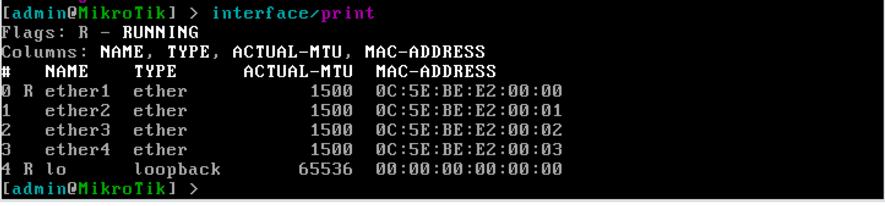
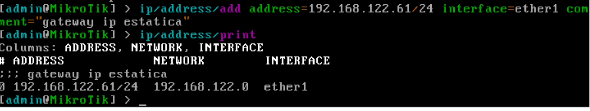
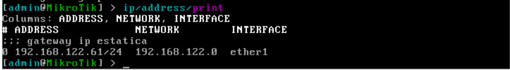
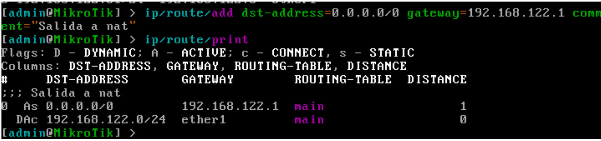
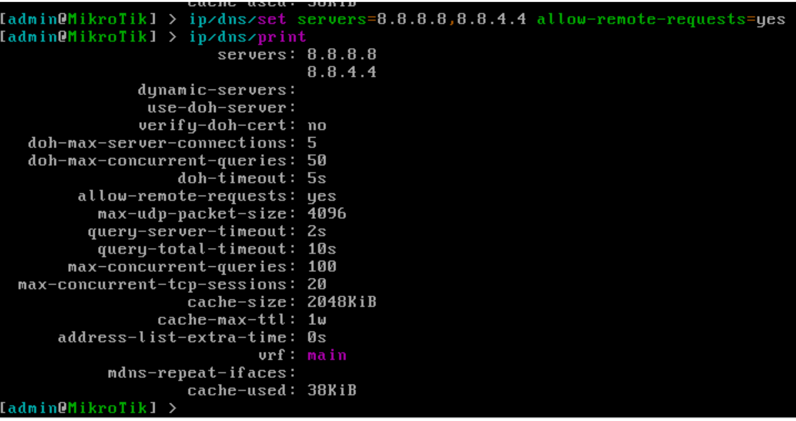
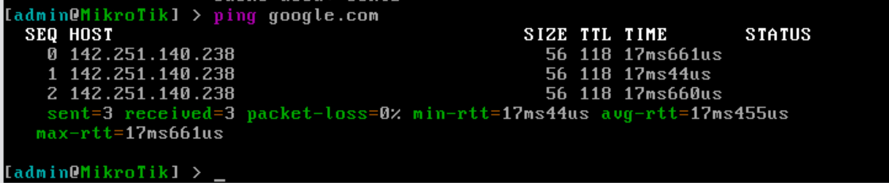
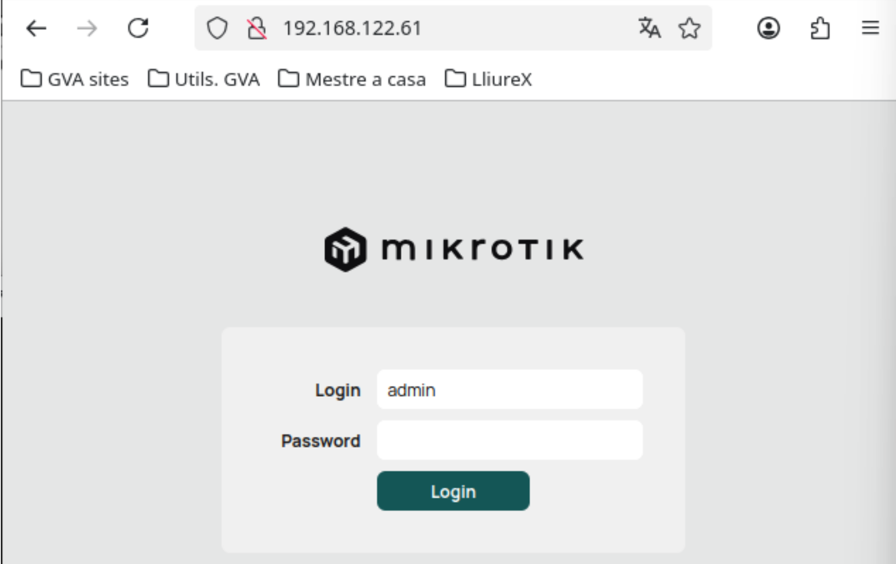
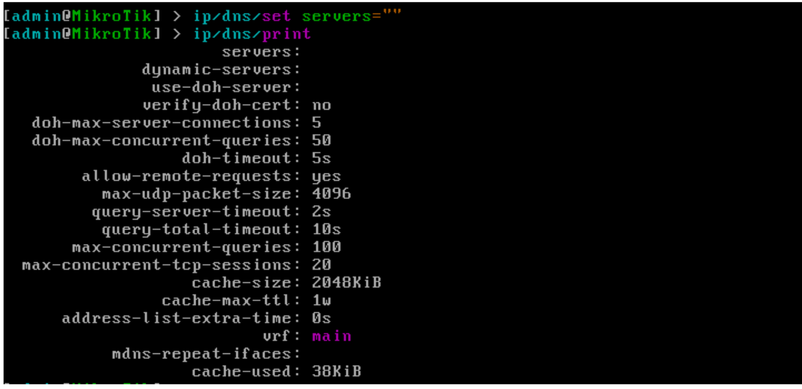
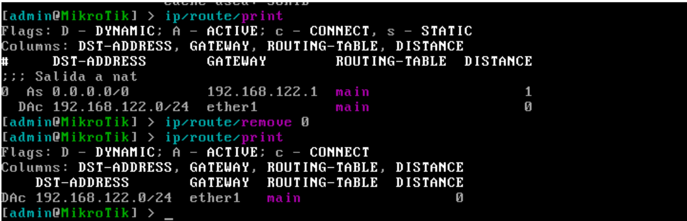
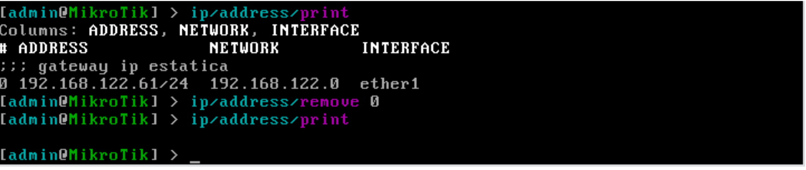

# Configuración de IP estática sobre interfaz física

## Índice

- Introducción
- Ejemplo 2 — Configuración de IP estática sobre una interfaz física
- Asignación manual de IP
- Asignación manual de ruta por defecto
- Asignación manual de servidores DNS
- Eliminación manual de la configuración aplicada

## Introducción

A lo largo de esta práctica trabajaremos sobre un escenario típico: la configuración de la interfaz que actuará como gateway, asignando su dirección IP estática de manera manual. Este enfoque es extremadamente habitual en entornos reales, donde el router no recibe una configuración dinámica, sino que depende de la configuración manual del operador de red.

## Ejemplo 2 — Configuración de IP estática sobre una interfaz física

Este segundo escenario representa la configuración manual más simple y directa posible en RouterOS: asignar manualmente una dirección IP a una interfaz física del router para que la interfaz pueda interactuar con la red existente.

Para ello, vamos a configurar la primera interfaz del router con la misma IP que tenía asignada por DHCP (en mi caso 192.168.122.61/24), para posteriormente comprobar que podemos acceder al router a través de esta interfaz.

## Asignación manual de IP

En primer lugar, vamos a listar las interfaces físicas de nuestro router, para seleccionar cuál configuraremos, ejecutando el siguiente comando:

```
interface/print
```

En mi caso, configuraré la interfaz ether1, asignándole la IP 192.168.122.61/24, ejecutando:

```
ip/address/add address=192.168.122.61/24 interface=ether1 comment="Gateway – IP estatica"
```

Como vemos en la captura, podemos comprobar la asignación de la IP, utilizando el comando:

```
ip/address/print
```



## Asignación manual de ruta por defecto

Si deseamos poder navegar por internet, deberemos indicar cuál es la puerta de enlace de la red, añadiendo una ruta por defecto:

```
ip/route/add dst-address=0.0.0.0/0 gateway=192.168.122.1 comment="Salida a NAT"
```



## Asignación manual de servidores DNS

Y si se requiere traducción de nombres de dominio, deberemos configurar las IP de los servidores DNS:

```
ip/dns/set servers=8.8.8.8,8.8.4.4 allow-remote-requests=yes
```

Con esta configuración, el router tendría acceso a internet. Podemos comprobarlo accediendo a una URL conocida, con el siguiente comando:

```
ping google.com
```

También podemos acceder al router utilizando un navegador web de la máquina anfitrión, a través de la IP configurada:



## Eliminación manual de la configuración aplicada

Para eliminar la configuración aplicada, realizamos las siguientes operaciones:

- Eliminamos las direcciones de los servidores DNS

```
ip/dns/set servers=""
```

- Visualizamos las rutas existentes, y eliminamos la ruta por defecto creada

```
ip/route/print
ip/route/remove <indice>
```

- Eliminamos la IP de la interfaz física ether1

```
ip/address/print
ip/address/remove <indice>
```



Tras eliminar los elementos configurados, volvemos a tener un router en blanco, preparado para la próxima práctica.