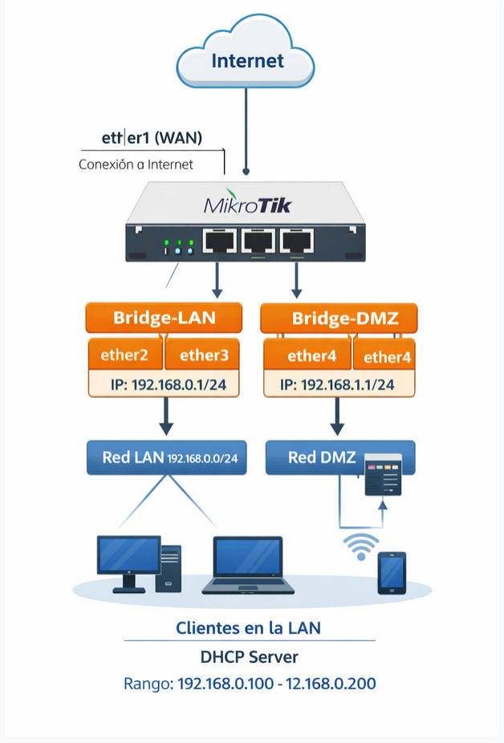

# Actividad a entregar
En esta actividad deberás crear una instancia virtual de RouterOS utilizando GNS3

El objetivo de la actividad es configurar el escenario de red propuesto en el router, aplicando NAT únicamente sobre el bridge de la red LAN, y excluyendo explícitamente el bridge de la DMZ.

Deberás entregar un breve documento o evidencias gráficas que permitan verificar correctamente la configuración realizada, y que incluyan, como mínimo:

    La configuración de red aplicada en el router.
    Las rutas configuradas.
    Los parámetros del servidor DHCP.
    La configuración de NAT, mostrando que solo se aplica a la red LAN.

Además, debes entregar exportable el proyecto gns3