# Configuración de DHCP Server sobre un bridge mediante el asistente de Router OS. 
  
# Índice 

Introducción 

Escenario a configurar 

Estado inicial esperado del router  

Creación del servicio DHCP Server mediante la ejecución del asistente 

Comprobación de la configuración aplicada 

Validación del servicio DHCP  

Comprobación de conectividad entre el cliente y el router  

Eliminando la configuración aplicada
 
 
# Introducción 

En este documento se aborda la creación de un servicio DHCP Server utilizando 

el  asistente  (DHCP  Setup)  integrado  en  RouterOS.  Este  método  guiado  permite 

desplegar rápidamente un servidor DHCP funcional, siendo especialmente útil en 

escenarios sencillos, laboratorios formativos o primeras configuraciones. 

A  diferencia  de  la  configuración  manual  —donde  cada  componente  (IP,  pool, 

network y servidor DHCP) se define de forma explícita—, el asistente automatiza 

gran parte del proceso. Sin embargo, es importante comprender  qué  elementos 

crea  internamente  y  con  qué  valores,  para  poder  diagnosticar  problemas  o 

modificar la configuración posteriormente. 

El escenario de partida será similar al utilizado en los documentos anteriores: 

•  Un router MikroTik con conectividad a Internet. 

•  Un bridge que agrupa las interfaces LAN. 

•  Una red local sobre la que se desplegará el servicio DHCP. 

A lo largo del documento se mostrará: 

•  Cómo lanzar el asistente DHCP. 

•  Qué preguntas realiza y qué significa cada una. 

•  Qué configuraciones se generan automáticamente. 

•  Cómo verificar y ajustar el resultado final. 

Este enfoque permite comparar de forma directa la configuración asistida frente a 

la configuración manual, reforzando la comprensión real de RouterOS y preparando 

al lector para entornos más complejos. 

 
# Escenario a configurar. 

Para este tutorial se propone reutilizar el escenario propuesto en el documento 

anterior, de modo que podamos centrarnos exclusivamente en el uso del asistente 

de RouterOS para la creación del servicio DHCP. 

A continuación, se presenta un diagrama visual del escenario, con el objetivo de 

facilitar la comprensión de la topología antes de proceder con la configuración paso 

a paso. 

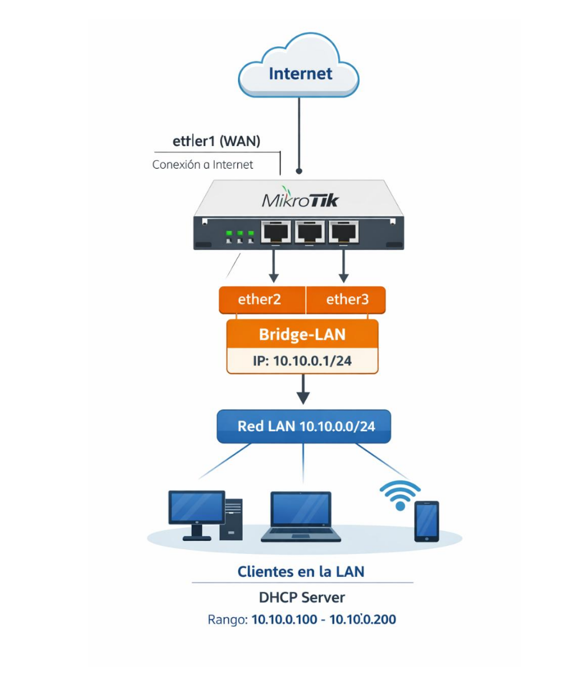

 
La configuración de la interfaz ether1, encargada de proporcionar la conexión a la 

red WAN, no se abordará en este documento, ya que fue tratada en detalle en los 

tutoriales de la semana pasada. 

Del mismo modo, no se explicará la creación del bridge que agrupa las interfaces 

ether2 y ether3, ni la asignación de la dirección IP al bridge, puesto que estos 

aspectos ya han sido desarrollados y validados en el documento anterior.  

# Estado inicial esperado del router 

Antes de ejecutar el asistente de configuración de DHCP, es importante comprobar 

que  el  router  se  encuentra  en  un  estado  inicial  coherente  con  el  escenario 

propuesto.  Esto  evitará  conflictos  y  permitirá  que  el  asistente  genere  la 

configuración de forma correcta. 

En este punto, el router debe cumplir las siguientes condiciones: 

•  Existe  un  bridge  de  LAN  que  agrupa  las  interfaces  internas  (por  ejemplo, 

ether2 y ether3). 

•  El bridge tiene asignada una dirección IP estática, que actuará como puerta 

de enlace de la red local (por ejemplo, 10.10.0.1/24). 

•  No  existe  ningún  servicio  DHCP  activo  sobre  el  bridge  ni  sobre  las 

interfaces LAN. 

•  El  router  dispone  de  conectividad  a  Internet  a  través  de  la  interfaz  WAN 

(ether1), aunque este aspecto no se validará en este documento. 

Antes  de  continuar,  se  recomienda  verificar  el  estado  del  router  ejecutando  los 

siguientes comandos: 

Comprobación de bridges: 
```sh
/interface/bridge/print 
```
 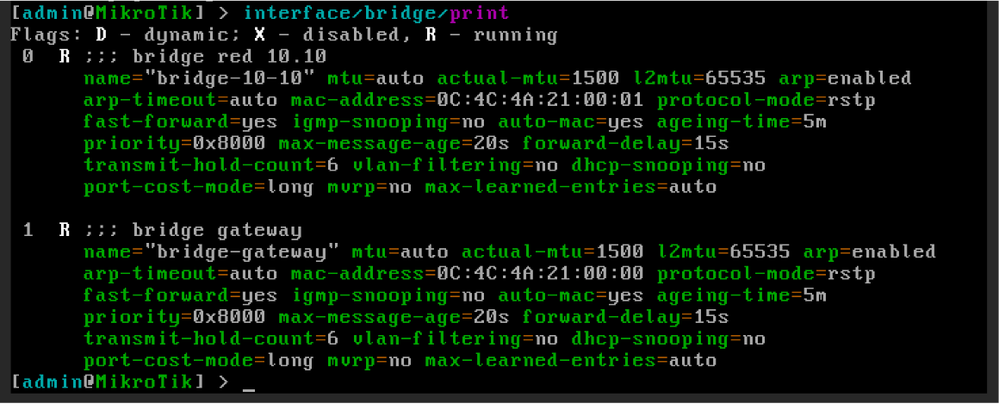
Comprobación de puertos asociados a los bridges: 
```sh
/interface/bridge/port/print 
```
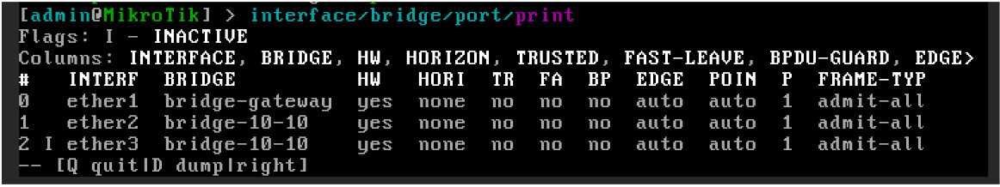
Comprobación de direcciones IP: 
```sh
/ip/address/print 
```
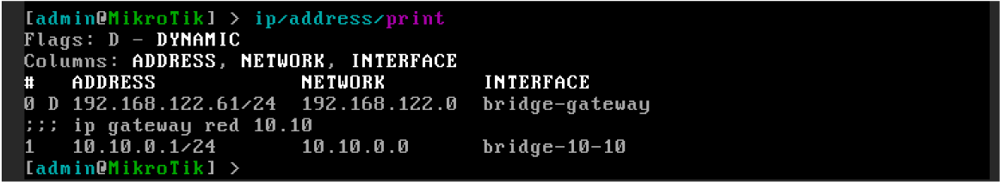

Comprobación de servicios DHCP existentes: 
```sh
/ip/dhcp-server/print 
```
 

 
 
Si  el  router  cumple  estas  condiciones,  se  puede  proceder  con  seguridad  a  la 

ejecución del asistente de configuración de DHCP. 

# Creación  del  servicio  DHCP  Server  mediante  la  ejecución  del asistente 

DHCP Setup permite desplegar un servidor DHCP funcional de forma guiada. Este 

asistente no introduce nuevos conceptos, sino que automatiza la creación de los 

mismos elementos que se configurarían manualmente: 

•  Pool de direcciones IP 

•  Parámetros de DHCP Network 

•  Activación del servicio DHCP 

El  asistente  se  ejecuta  desde  la  línea  de  comandos  mediante  la  siguiente 

instrucción: 
```sh
ip/dhcp-server/setup 
```
A  partir  de  su  ejecución,  RouterOS  irá  planteando  una  serie  de  preguntas 

secuenciales.  Cada  una  de  ellas  corresponde  a  una  parte  concreta  de  la 

configuración interna del servicio DHCP.  

Es fundamental comprender que cada respuesta genera uno o varios objetos de 

configuración reales, visibles posteriormente mediante los comandos print. 

Aunque  el  asistente  facilita  enormemente  el  despliegue  inicial,  es  importante 

remarcar que no valida el diseño de red ni comprueba si las decisiones tomadas 

son las más adecuadas para el escenario. Por este motivo, su uso debe ir siempre 

acompañado de una revisión posterior de la configuración generada. 

En primer lugar, el asistente solicita la interfaz de red sobre la que se activará el 

servicio DHCP. En este escenario, seleccionamos el bridge bridge-10-10, ya que 

representa el dominio lógico de la red LAN. 


 
 
 
 
A  continuación,  el  asistente  solicita  el  espacio  de  direcciones  IP  de  la  red. 

RouterOS propone automáticamente un valor basado en la dirección IP configurada 

en  la  interfaz  seleccionada  en  el  paso  anterior.  Para  este  ejemplo,  se  acepta  la 

propuesta 10.10.0.0/24. 

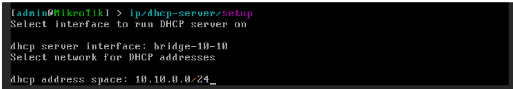

Una vez definido el espacio de direcciones, el asistente solicita la dirección IP de 

la  puerta  de  enlace  (gateway)  de  la  red.  De  nuevo,  RouterOS  genera  una 

sugerencia  coherente  con  la  configuración  existente.  En  este  escenario,  se 

mantiene la dirección 10.10.0.1 como gateway de la red.

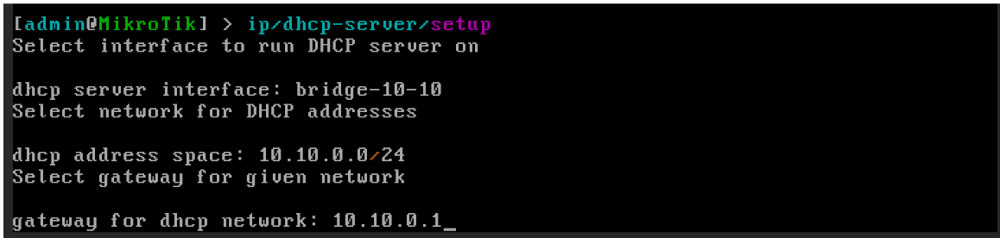

El siguiente parámetro corresponde al rango de direcciones IP que podrá asignar 

el  servicio  DHCP,  a  partir  del  cual  se  creará  el  pool  de  direcciones.  Para  este 

laboratorio, se define el rango 10.10.0.100-10.10.0.200. 

 
 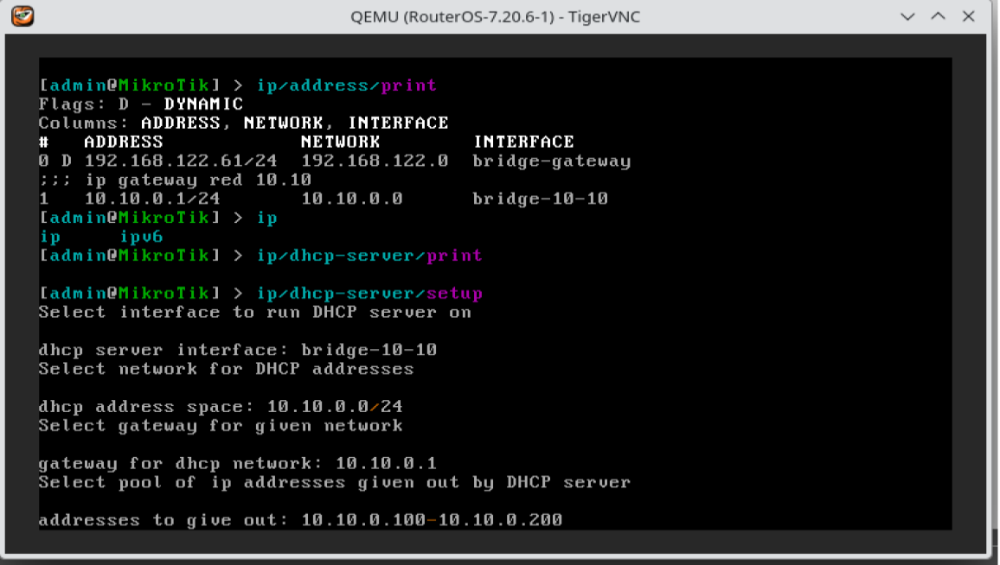
 
 
Posteriormente, el asistente pregunta si se desean configurar servidores DNS que 

serán proporcionados a los clientes. En este caso, se responde afirmativamente  e 

introducimos las direcciones 10.10.0.1 y 8.8.4.4. 

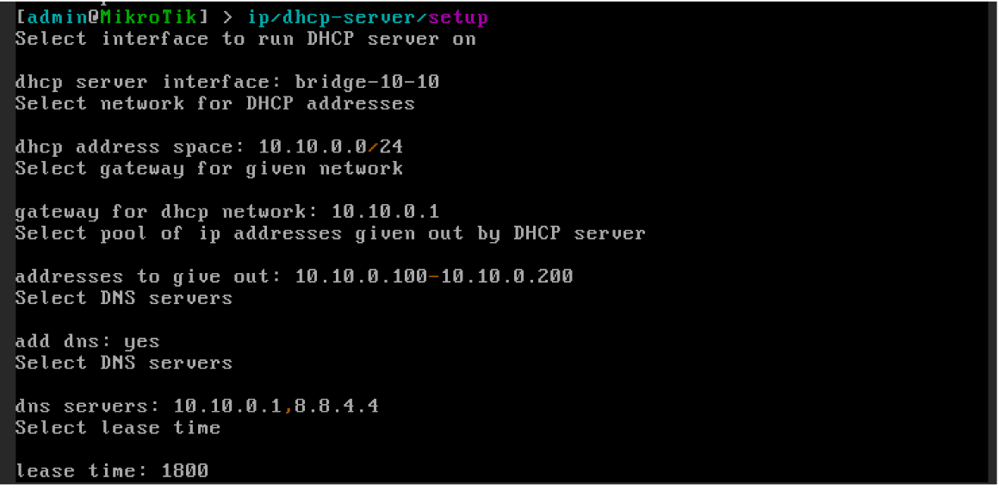

Por  último,  el  asistente  solicita  el  tiempo  de  concesión  (lease  time)  de  las 

direcciones  IP.  Para  el  ejemplo  actual,  se  mantiene  el  valor  por  defecto,  1800 

segundos, suficiente para un entorno de laboratorio. 

 
Una vez completadas estas preguntas, RouterOS crea automáticamente todos los 

elementos  necesarios  para  el  funcionamiento  del  servicio  DHCP,  que  serán 

analizados y verificados en la siguiente sección. 

# Comprobación de la configuración aplicada 

Una  vez  finalizado  el  asistente  de  configuración  del  servidor  DHCP,  es 

imprescindible verificar que todos los elementos se han creado correctamente y 

que el servicio está operativo.  

Podemos  realizar  esta  comprobación  desde  la  línea  de  comandos  (CLI),  ya  que 

permite validar cada componente de forma precisa. 

Comprobamos que el servidor DHCP está creado, habilitado y asociado a la interfaz 

correcta: 
```sh
Ip/dhcp-server print 
```


Confirmamos: 

•  Que el servidor aparece como enabled=yes. 

•  Que la interfaz asociada es bridge-10-10. 

•  Que el estado es running. 

A  continuación,  validamos  que  la  red  DHCP  se  ha  creado  con  los  parámetros 

correctos: 
```sh
ip/dhcp-server/network/print 
```


 
 
 
Comprobamos que se han credo correctamente los siguientes parámetros: 

•  Red: 10.10.0.0/24 

•  Gateway: 10.10.0.1 

•  Servidores DNS: 10.10.0.1, 8.8.4.4 

Verificamos que el rango de direcciones IP dinámicas se ha creado correctamente: 
```sh
Ip/pool/print 
```


Debemos encontrar un pool con el rango 10.10.0.100-10.10.0.200 

También podemos comprobar que los clientes están recibiendo direcciones IP del 

servidor DHCP: 
```sh
ip/dhcp-server/lease/print 
```


En este listado aparecerán los dispositivos conectados, mostrando: 

•  Dirección IP asignada 

•  Dirección MAC 

•  Estado de la concesión (bound) 

# Validación del servicio DHCP 

Para comprobar el correcto funcionamiento del DHCP Server, podemos conectar 

cualquier  equipo  cliente  a  la  interfaz  ether2  del  router.  En  este  ejemplo  se  ha 

utilizado una instancia de Alpine Linux como cliente DHCP.


 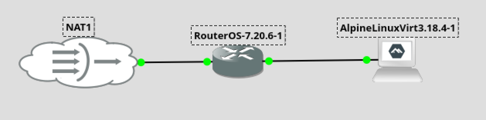
 
 
Una  vez  iniciada  la  instancia,  abrimos  la  consola  y  forzamos  la  renovación  de  la 

dirección IP ejecutando. 
```sh
udhcpc -i eth0 
```
Durante la ejecución, se puede observar en el terminal el proceso de negociación 

DHCP,  incluyendo  la  solicitud  y  la  concesión  de  la  dirección  IP  por  parte  del 

servidor. 


Verificamos la configuración de red asignada al cliente con: 
```sh
ip a 
```
Debemos comprobar que la dirección IP obtenida pertenece al pool configurado 

previamente en el router MikroTik (10.10.0.100–10.10.0.200) 

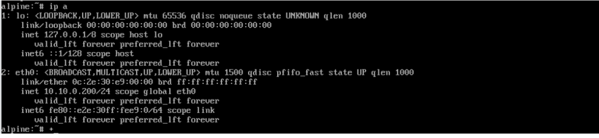

Desde la consola del router, es posible confirmar la asignación revisando el lease 

creado al conceder la IP al cliente: 
```sh
ip/dhcp-server/lease/print 
```
En la salida se mostrará el cliente, la IP asignada, el tiempo restante del lease y 

el estado de la asignación, confirmando que el proceso DHCP se ha completado 

correctamente.


Este procedimiento valida que el DHCP funciona correctamente y que los equipos 

conectados al bridge reciben su configuración IP automáticamente, tanto desde el 

cliente como desde el servidor. 

# Comprobación de conectividad entre el cliente y el router 

Para  asegurarnos  de  que  la  red  local  y  el  DHCP  funcionan  correctamente,  es 

importante verificar la conectividad entre el cliente y el router. 


Desde el terminal de la instancia Alpine Linux, comprobamos la conectividad hacia 

la puerta de enlace de la red (el bridge del router) ejecutando:
```sh
ping 10.10.0.1 
```
Si  el  ping  responde  correctamente,  significa  que  el  cliente  ha  recibido  la  IP 

adecuada y puede comunicarse con el router. 

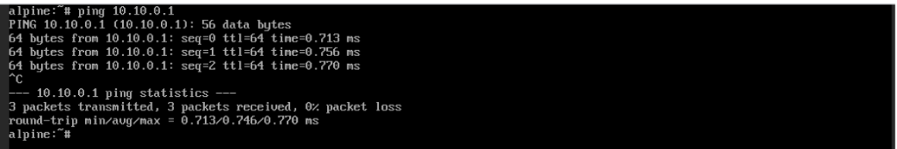

De manera inversa, podemos comprobar que el router puede comunicarse con el 

cliente. 

Primero, revisamos en el lease del DHCP Server la IP asignada al cliente 
```sh
ip/dhcp-server/lease/print 
```
En la salida, observaremos la dirección IP asignada a la instancia de Alpine Linux 

(por ejemplo, 10.10.0.200). 


A continuación, ejecutamos un ping desde la consola del router hacia el cliente. 
```sh
ping 10.10.0.200 
```
Si la respuesta es positiva, esto confirma que la comunicación bidireccional entre 

el router y el cliente funciona correctamente, y que el DHCP ha asignado la IP de 

forma adecuada. 

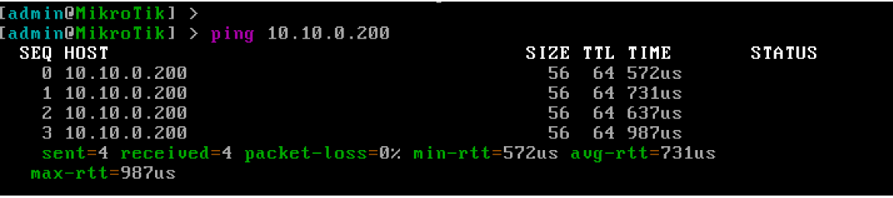

Este procedimiento garantiza que el cliente puede comunicarse con la puerta de 

enlace  y  que  el  router  puede  llegar  al  cliente,  estableciendo  así  la  base  para  la 

conectividad interna y futura salida a Internet. 

Eliminando la configuración aplicada. 

Dado que el asistente genera la misma configuración que el proceso manual, para 

deshacer  la  configuración,  seguiremos  el  procedimiento  descrito  en  el  anterior 

documento.  

 
 
 
 
 
 