# Reservas de IP en DHCP (DHCP Static Leases).


# Índice
Introducción
Escenario a configurar
Estado inicial esperado del router 
Conversión de un lease dinámico en estático 
Asignación de una IP estática sin existir un lease previo 
Modificación de los parámetros de un lease 

# Introducción
En redes medianamente organizadas, no todos los dispositivos pueden tratarse 
como clientes “anónimos”. Servidores, impresoras, puntos de acceso, cámaras IP 
o equipos sometidos a reglas específicas de firewall necesitan ser localizables 
siempre en la misma dirección IP.
La solución habitual es configurar direcciones IP fijas directamente en los 
dispositivos. Esta práctica puede generar conflictos, dificultar el mantenimiento y 
romper la gestión centralizada de la red.
Para evitar estos problemas, los servidores DHCP modernos permiten definir 
reservas de IP, también conocidas como DHCP static leases. Este mecanismo 
garantiza que un dispositivo concreto, identificado por su dirección MAC, reciba 
siempre la misma IP sin renunciar al uso de DHCP.

# Escenario a configurar.
Para este tutorial se propone reutilizar el escenario propuesto en el documento 
anterior, de modo que podamos centrarnos exclusivamente en la configuración y 
gestión de las reservas de IP mediante DHCP, sin introducir nuevas variables en el 
diseño de red.
A continuación, se presenta un diagrama visual del escenario, con el objetivo de 
facilitar la comprensión de la topología antes de proceder con la configuración paso 
a paso.

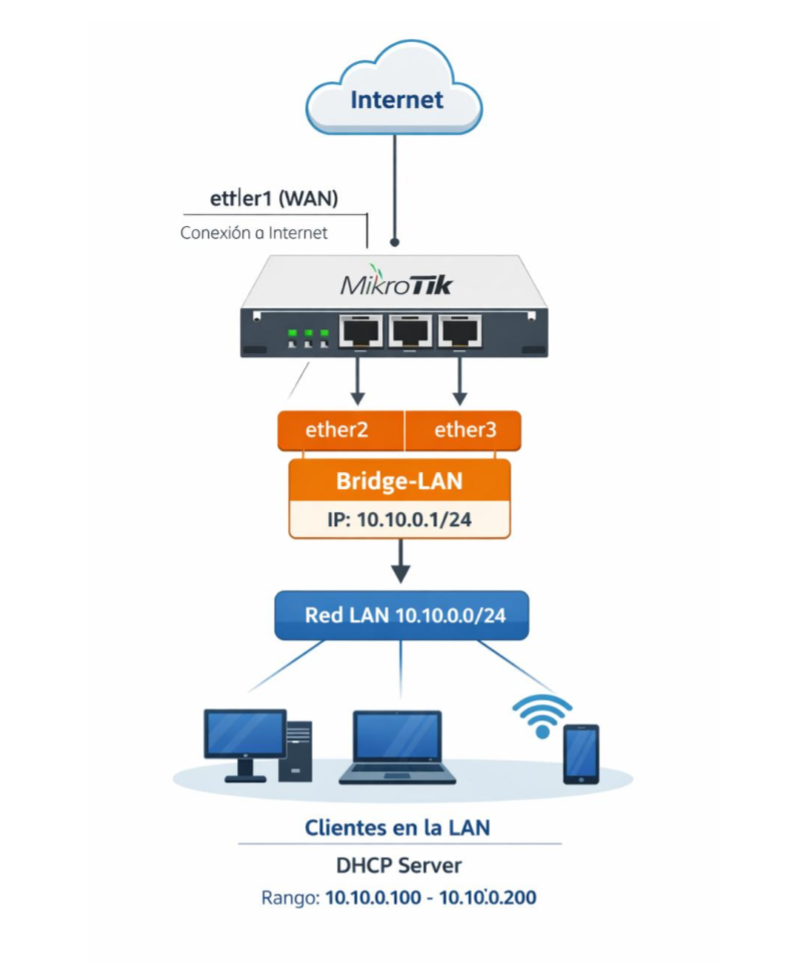

# Estado inicial esperado del router
Antes de ejecutar el asistente de configuración de DHCP, es importante comprobar 
que el router se encuentra en un estado inicial coherente con el escenario 
propuesto. Esto evitará conflictos y permitirá que el asistente genere la 
configuración de forma correcta.
En este punto, el router debe cumplir las siguientes condiciones:
• Existe un bridge de LAN que agrupa las interfaces internas (por ejemplo, 
ether2 y ether3).
• El bridge tiene asignada una dirección IP estática, que actuará como puerta 
de enlace de la red local (por ejemplo, 10.10.0.1/24).
• Existe un servicio DHCP activo sobre el bridge ni sobre las interfaces LAN.
• El router dispone de conectividad a Internet a través de la interfaz WAN 
(ether1), aunque este aspecto no se validará en este documento.

Antes de continuar, se recomienda verificar el estado del router ejecutando los 
siguientes comandos:

Comprobación de bridges:
```sh
/interface/bridge/print
```
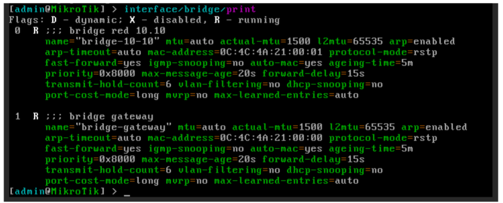

Comprobación de puertos asociados a los bridges:
```sh
/interface/bridge/port/print
```
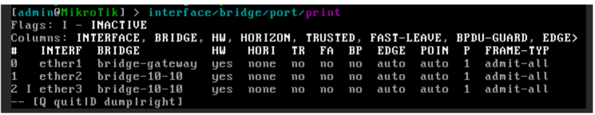

Comprobación de direcciones IP:
```sh
/ip/address/print
```
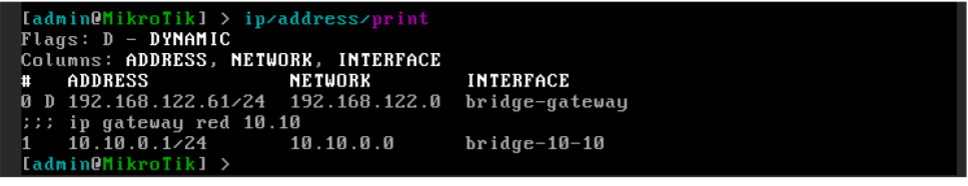
Comprobación de servicios DHCP existentes:
```sh
/ip/dhcp-server/print
```
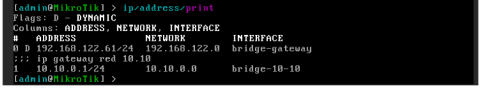
Validamos que la red DHCP se ha creado con los parámetros correctos:
```sh
ip/dhcp-server/network/print
```
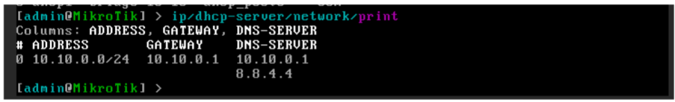
Verificamos que el rango de direcciones IP dinámicas se ha creado correctamente:
```sh
Ip/pool/print
```
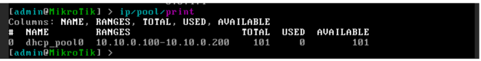
Si el router cumple estas condiciones, se puede proceder con seguridad a la 
ejecución del asistente de configuración de DHCP.

# Conversión de un lease dinámico en estático
Como vimos en el documento anterior, cuando un cliente solicita su configuración 
de red mediante el protocolo DHCP, el router le asigna una dirección IP en función 
de los parámetros definidos en el servidor DHCP y registra dicha asignación en la 
tabla de leases.

En este apartado vamos a:
• Identificar un cliente que haya obtenido su dirección IP mediante DHCP.
• Confirmar que la asignación es dinámica.
• Convertirla en una reserva de IP (lease estático), de modo que el cliente 
conserve siempre la misma dirección.

Para comprobar las asignaciones de IP generadas por el servicio DHCP en MikroTik, 
ejecutaremos el siguiente comando:
```sh
ip/dhcp-server/leases/print
```
En la salida del comando podemos observar, para cada asignación:
• La dirección IP entregada.
• La dirección física (MAC) del cliente.
• El servidor DHCP que ha realizado la asignación.
• El tiempo transcurrido desde la última renovación del lease.

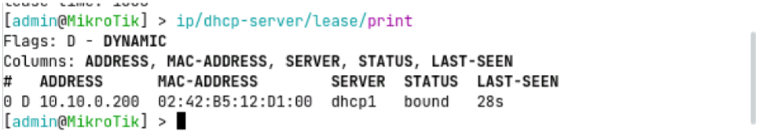
En el ejemplo se aprecia que la dirección IP ha sido asignada de forma dinámica, 
lo cual se identifica por la presencia del flag D en la segunda columna de la tabla. 
Esto implica que la IP será liberada si el cliente no renueva la petición antes de que 
expire el tiempo configurado en el servicio DHCP, quedando disponible para ser 
asignada a otro dispositivo.

En determinadas situaciones resulta preferible reservar una dirección IP a un 
dispositivo concreto, de forma que siempre sea accesible mediante la misma IP. 
Este es el caso, por ejemplo, de servidores publicados en una DMZ, impresoras de 
red o dispositivos de infraestructura.

Para convertir una asignación dinámica en estática, ejecutaremos el siguiente 
comando, suponiendo que el lease a modificar ocupa la posición 0 en la tabla:
```sh
ip/dhcp-server/leases/make-static numbers=0
```
Tras ejecutar el comando, podemos comprobar que el flag D desaparece del listado 
de leases, lo que indica que la asignación ha pasado a ser estática. A partir de este 
momento, el servidor DHCP reservará esa dirección IP para la dirección MAC 
asociada, evitando que sea asignada a otros clientes.

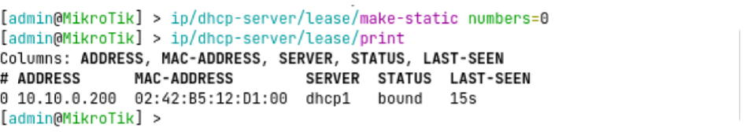
Desde este instante, el servidor DHCP reservará esta dirección IP para la 
dirección MAC del dispositivo, evitando que pueda ser asignada a otros clientes y 
asegurando una asignación consistente en cada conexión.

# Asignación de una IP estática sin existir un lease previo
En muchos escenarios de red resulta necesario reservar una dirección IP antes de 
que el dispositivo se conecte por primera vez. Este es el caso típico de 
impresoras, servidores, puntos de acceso o dispositivos que se instalan 
físicamente más tarde, pero cuya configuración queremos dejar preparada con 
antelación.

A diferencia del caso anterior, en este escenario no existe aún ninguna entrada 
dinámica en la tabla de leases, por lo que la reserva debe crearse manualmente.

Para poder crear una reserva de IP sin lease previo es imprescindible conocer:
• La dirección MAC del dispositivo.
• La dirección IP que se desea reservar.
• El servidor DHCP sobre el que se realizará la asignación.

Imaginemos que queremos reservar la IP 10.10.0.10 del servidor dhcp1, para un 
equipo cuya dirección MAC es 02:42:38:b4:f9:00. Para crear la reserva 
directamente en el router, ejecutaremos el siguiente comando:
```sh
Ip/dhcp-server/lease/add server=dhcp1
address=10.10.0.10 mac-address=02:42:38:b4:f9:00
comment="Servidor correo DMZ"
```
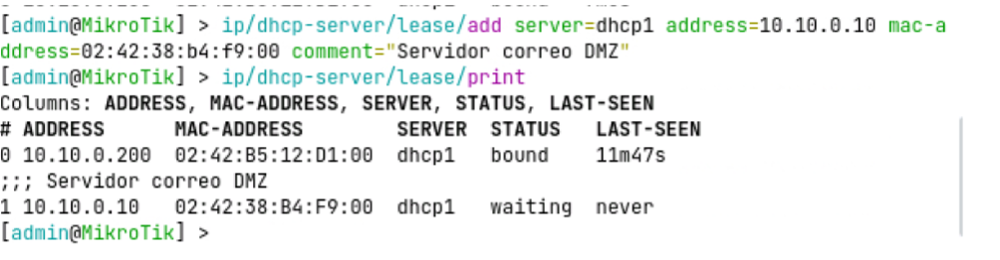
Una vez ejecutado el comando, podemos observar cómo el lease queda registrado 
en la tabla, indicando que la dirección IP todavía no ha sido asignada, ya que el 
dispositivo no se ha conectado aún a la red.

Si conectamos posteriormente un servidor con esa dirección MAC al router y realiza 
una solicitud de configuración mediante DHCP, el servidor identificará la reserva 
existente y le asignará directamente la dirección IP reservada.

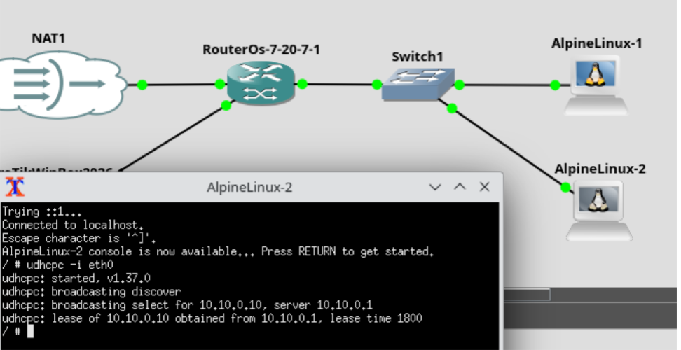
Finalmente, podremos comprobar en la tabla de leases cómo la IP aparece ya como 
asignada (bound), manteniéndose asociada de forma permanente a la dirección 
MAC indicada.

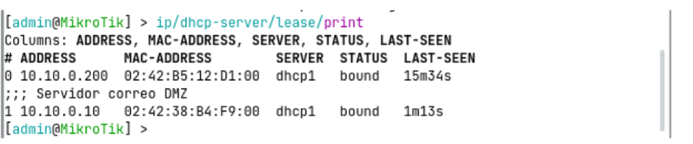

# Modificación de los parámetros de un lease
En ocasiones es necesario modificar la dirección IP asociada a un dispositivo, 
por ejemplo, debido a cambios en el esquema de direccionamiento, reorganización 
de la red o corrección de una asignación previa.

Si el dispositivo obtiene su configuración mediante DHCP y dispone de un lease 
estático, este cambio puede realizarse directamente desde el servidor DHCP, sin 
necesidad de reconfigurar manualmente el equipo.

Este procedimiento permite mantener la gestión centralizada de las direcciones 
IP y garantiza que el dispositivo continuará recibiendo siempre la IP definida por el 
administrador.

Antes de realizar el cambio, es importante tener en cuenta que:
• El lease debe ser estático.
• El cambio de IP no se aplica de forma inmediata al cliente.
• Será necesario forzar una renovación del lease para que el dispositivo 
adopte la nueva dirección.

Teniendo en cuenta la siguiente tabla de lease:

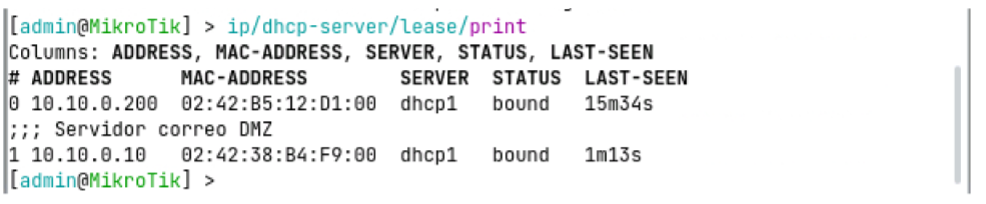
Supongamos que queremos modificar la IP reservada 10.10.0.10 y cambiarla por 
10.10.0.20, manteniendo la misma dirección MAC. Para ello, deberemos ejecutar
el siguiente comando:
```sh
Ip/dhcp-server/lease/set numbers=1 address=10.10.0.20
```
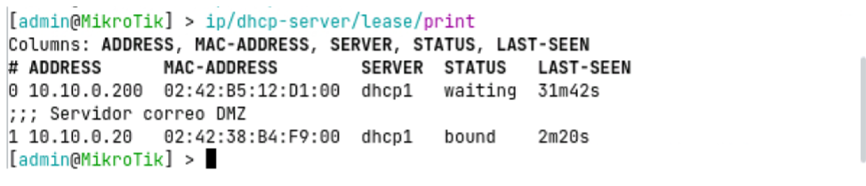
Tras ejecutar el comando, el lease queda actualizado en la tabla, aunque el cliente 
seguirá utilizando la IP anterior hasta que renueve su configuración de red.

En Alpine Linux, podemos forzar la renovación de IP ejecutando:
```sh
udhcpc -i eth0 -n -q -R
```
En la siguiente captura podemos observar cómo el cliente renueva la dirección IP y 
recibe la nueva asignación estática definida en el servidor DHCP.

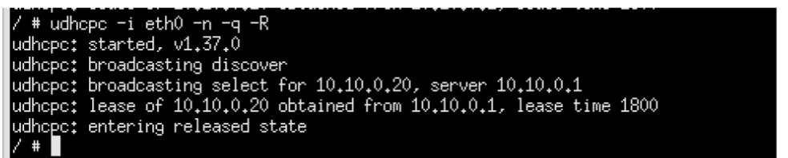
Al igual que hemos modificado la dirección IP del lease, se podrían modificar los 
siguientes parámetros: 
• address: dirección IP asignada al dispositivo (el cambio no se aplica 
hasta que el cliente renueva el lease).
• mac-address: dirección física (MAC) asociada al dispositivo (permite 
mantener una IP reservada al sustituir un equipo o reasignar una reserva 
existente).
• server: servidor DHCP que gestiona el lease (útil en entornos con 
múltiples servidores DHCP o cambios de VLAN).
• comment: campo descriptivo del lease (no afecta al funcionamiento, 
pero es fundamental para la documentación y el mantenimiento).
• lease-time: tiempo de validez del lease (relevante principalmente en 
leases dinámicos o entornos de laboratorio).
• status: estado actual del lease, como bound o waiting (permite verificar 
si la IP está asignada o pendiente de uso).
• dynamic / static: tipo de asignación del lease (indica si la IP es dinámica 
o está reservada de forma permanente).
• last-seen: instante de la última comunicación del cliente con el servidor 
DHCP (útil para diagnóstico y detección de equipos inactivos).
