# Configuración de una DMZ.

## Índice

Introducción  
Ejemplo de configuración de DMZ con Mikrotik  
Escenario de partida 
Creación de los bridges DMZ y LAN  
Aplicando la configuración de red del puerto ether1 con un cliente DHCP  
Aplicando la configuración de red de los bridges LAN y DMZ de manera estática 
Creando los servidores DHCP para bridge-lan y bridge-dmz   
Configurando NAT, para proporcionar salida a internet a las redes DMZ y LAN 
Configurando las reglas de firewall necesarias para proteger nuestra infraestructura 
Reglas INPUT: proteger el router  
Reglas FORWARD: políticas entre zonas 
Publicación del servicio HTTP a internet (WAN → DMZ)  
Corregir la ordenación de las reglas aplicadas
Configuración del servidor http en Alpine Linux y validación del escenario  

## Introducción

En entornos reales de administración de redes, no todos los sistemas deben tener el mismo nivel de exposición ni el mismo grado de confianza. Los servicios que deben ser accesibles desde Internet (servidores web, correo, aplicaciones, VPN, etc.) suponen un riesgo inherente, ya que amplían la superficie de ataque de la infraestructura. La DMZ (Demilitarized Zone) surge precisamente como un mecanismo para aislar estos servicios del resto de la red interna, reduciendo el impacto de una posible intrusión.

Una DMZ es una red intermedia, separada tanto de Internet como de la LAN interna, en la que se ubican los servidores expuestos públicamente. La idea fundamental es clara: si un servicio publicado es comprometido, el atacante no debe poder acceder directamente a la red interna, sino quedar contenido dentro de la zona desmilitarizada.

En MikroTik, la implementación de una DMZ no es un modo automático ni una casilla que se marque, sino el resultado de una arquitectura de red bien definida y de un conjunto coherente de reglas de firewall y NAT. Esto encaja perfectamente con la filosofía del sistema: control explícito, reglas claras y políticas de seguridad basadas en el principio de mínimo privilegio.

A lo largo de esta sección se abordará cómo:

• Definir una red DMZ a nivel de interfaces o bridges.  
• Controlar de forma estricta el tráfico entre Internet, DMZ y LAN.  
• Publicar servicios en la DMZ sin comprometer la seguridad de la red interna.  
• Evitar configuraciones erróneas habituales, como “DMZ abierta” o redes mal segmentadas.  

El objetivo no es solo hacer que funcione, sino comprender por qué se diseña así, qué riesgos se mitigan y cómo esta arquitectura se utiliza en infraestructuras profesionales reales, desde pequeños CPD hasta entornos corporativos.

## Ejemplo de configuración de DMZ con Mikrotik.

En este escenario vamos a configurar un router MikroTik que actúa como punto central de interconexión y control de seguridad entre tres zonas claramente diferenciadas, cada una con un nivel de confianza distinto:

• WAN (Wide Area Network): la zona WAN representa la conexión a Internet, es decir, una red no confiable sobre la que no tenemos control. La WAN se considerará la zona de menor confianza.  
• DMZ (Zona Desmilitarizada): la zona DMZ representa una red intermedia diseñada para alojar servicios que deben ser accesibles desde Internet, pero que no deben comprometer la red interna. La DMZ actúa como una zona tampón: si un servidor es comprometido, el daño queda contenido.  
• LAN (Red interna): la zona LAN representa la red interna de confianza, donde se encuentran los equipos de trabajo y los sistemas no expuestos públicamente. La LAN es la zona de mayor confianza y debe estar estrictamente protegida. 

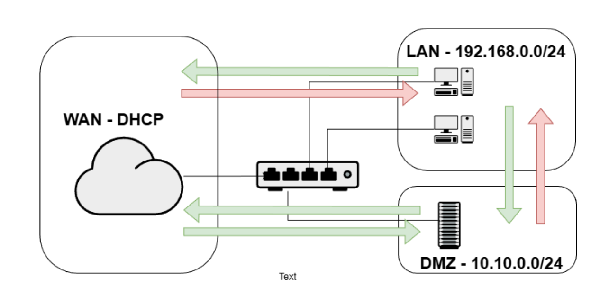

Para ello, vamos a crear un nuevo escenario en GNS3, que iremos configurando paso a paso.

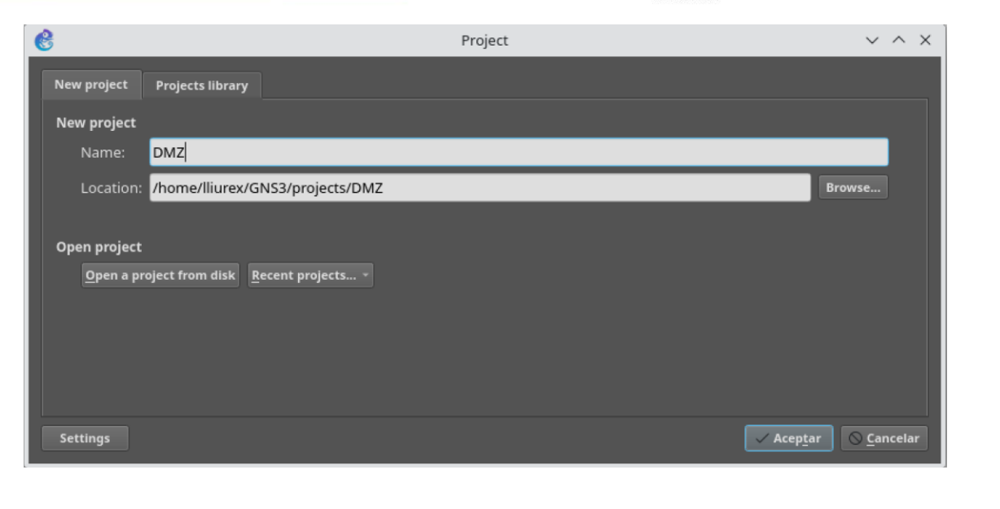

## Escenario de partida

Vamos a partir del siguiente escenario en GNS3, que iremos configurando paso a paso, hasta llegar al objetivo marcado en el punto anterior.

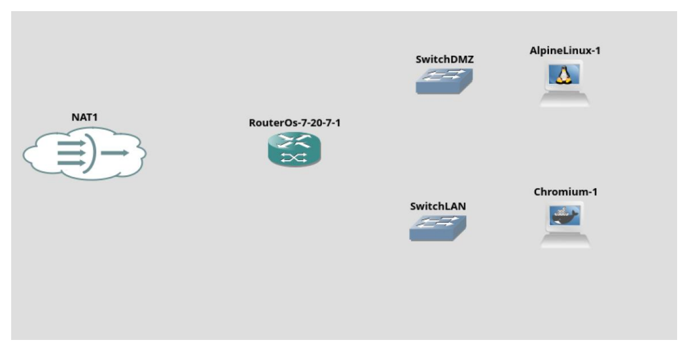

Vamos a conectar el nodo NAT con el puerto ethernet0 del router (que se corresponderá con la interfaz ether1 en la consola de Mikrotik).

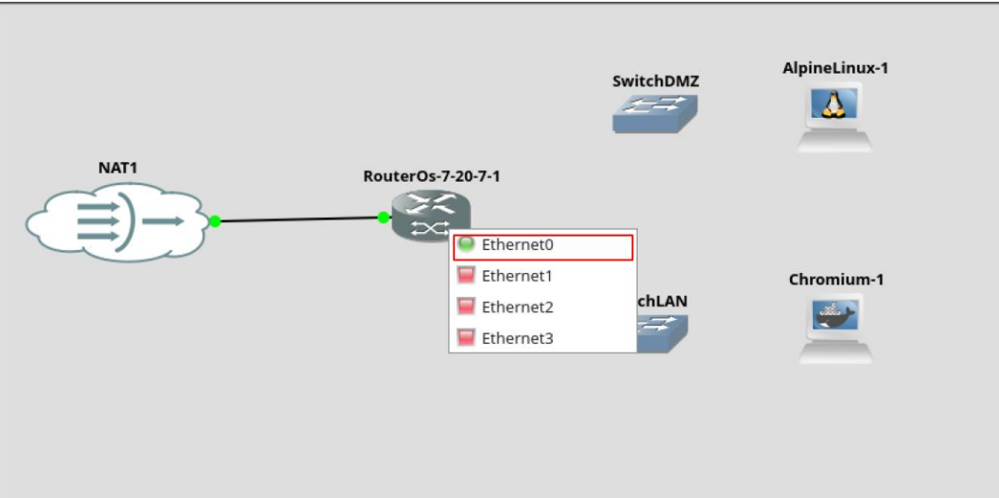

Iniciaremos el escenario, pulsando el botón Play, y abriremos la consola del router, para proceder a su configuración.

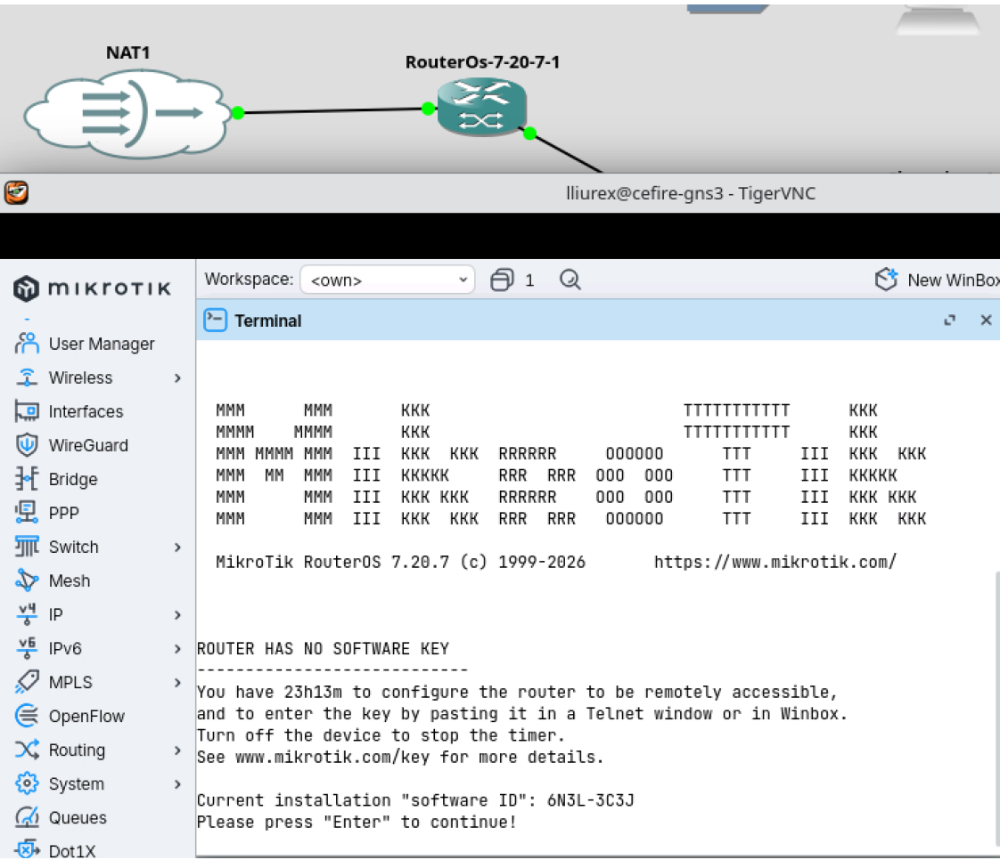

Antes de continuar, vamos a validar que partimos de un router en blanco, ejecutando los siguientes comandos en la consola:

```text
interface/print
ip/address/print
ip/route/print
ip/firewall/nat/print
ip/firewall/filter/print
ip/dhcp-client/print
ip/dhcp-serve/ print
```

Deberemos obtener una salida similar a la siguiente, en la que podemos observar únicamente la existencia de las 4 interfaces físicas:

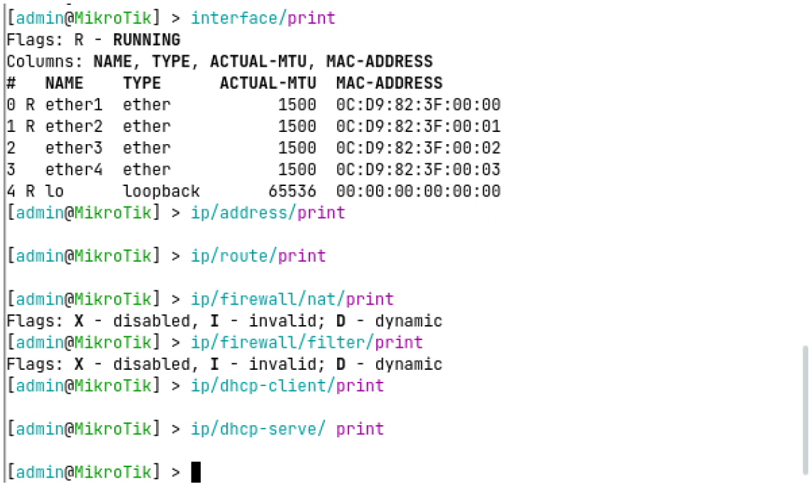

## Creación de los bridges DMZ y LAN

Para empezar, vamos a crear los bridges DMZ y LAN, sobre los que aplicaremos la configuración de las redes internas, ejecutando los siguientes comandos:

```text
interface/bridge/add name=bridge-lan comment="bridge-LAN"
interface/bridge/add name=bridge-dmz comment="bridge-DMZ"
```
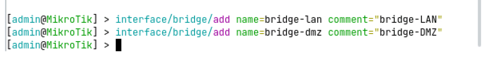

Realizamos una comprobación rápida, antes de continuar, imprimiendo por pantalla los bridges creados

```text
interface/bridge/print
```

Podemos observar los dos bridges creados.

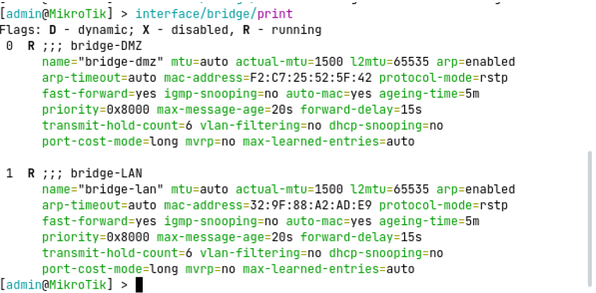

Si todo es correcto, pasamos a añadir los puertos físicos a cada bridge. En este caso, añadiremos ether2 y ether3 al bridge LAN, y ether4 al bridge DMZ:

```text
interface/bridge/port/add bridge=bridge-lan interface=ether2
interface/bridge/port/add bridge=bridge-lan interface=ether3
interface/bridge/port/add bridge=bridge-dmz interface=ether4
```
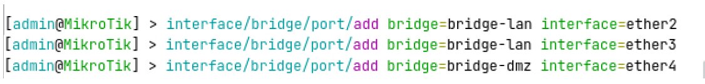

Comprobamos que las interfaces se han añadido correctamente a los bridges correspondientes:

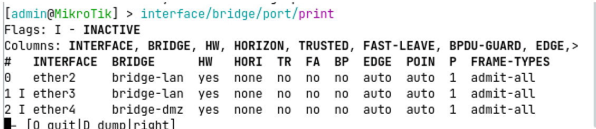

```text
interface/bridge/port/print
```

## Aplicando la configuración de red del puerto ether1 con un cliente DHCP

Para continuar, vamos a configurar la dirección IP de la interfaz ether1, creando un cliente DHCP, que obtenga la dirección IP del servidor DHCP al que esté conectada la red.

```text
ip/dhcp-client/add interface=ether1 use-peer-dns=yes
use-peer-ntp=yes add-default-route=yes disabled=no
comment="WAN por DHCP"
```

Donde:

• use-peer-dns=yes -- indica al router que use los servidores DNS que entregue el proveedor.  
• use-peer-ntp=yes -- sincroniza hora si el ISP lo ofrece. Útil para logs y firewall.  
• add-default-route=yes -- crea automáticamente la ruta por defecto (0.0.0.0/0). Sin esto, no hay salida a Internet.  
• disabled=no -- Activa inmediatamente el cliente.  

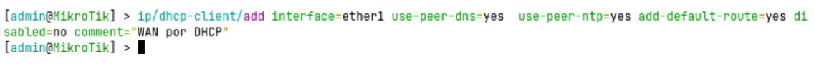

Comprobamos que el cliente DHCP se ha creado correctamente

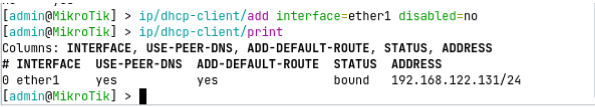

Y validamos:

• La asignación de IP a la interfaz ether1  

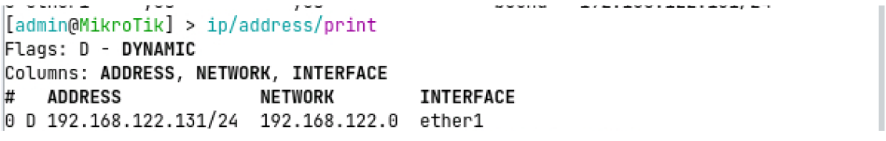
• La configuración de la ruta por defecto, y la ruta de acceso

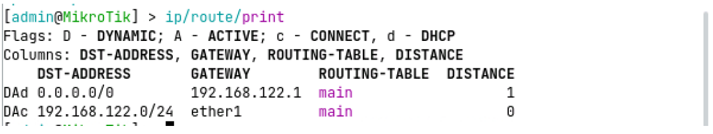

• La configuración de los servidores DNS 

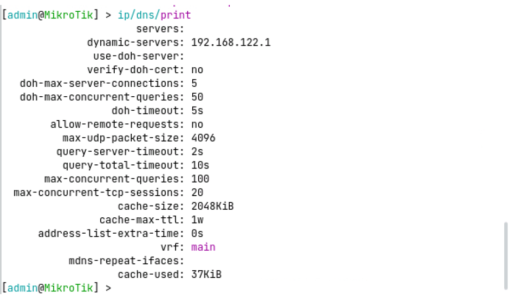
• La conectividad con internet  

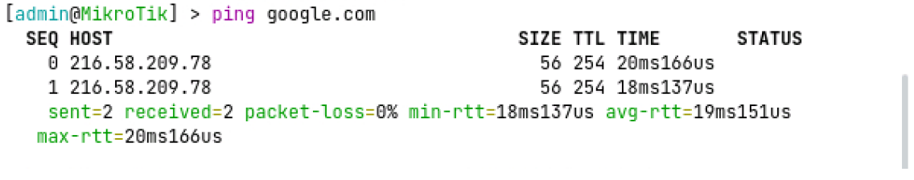

Otras maneras de comprobar si disponemos de conexión a internet sería:

• Descargar una página web:

```text
/tool/fetch url=https://download.mikrotik.com/routeros/stable.npk
keep-result=no
```

• Comprobar que funcionan la resolución de nombres:

```text
/resolve google.es
```

• Ejecutar traceroute TCP

```text
/tool/traceroute address=google.com protocol=tcp port=443
```

• Ejecutar una consulta NTP, y comprobar que se sincroniza la hora

```text
/system/ntp/client/set enabled=yes servers=es.pool.ntp.org
/system/clock/print
```

• Ejecuta una consulta whois

```text
/tool/whois address=8.8.8.8
```

## Aplicando la configuración de red de los bridges LAN y DMZ de manera estática

Vamos a configurar la dirección IP de los bridges bridge-lan y bridge-dmz, para que su direccionamiento IP se corresponda con los datos del diagrama inicial.

En primer lugar, configuramos la dirección IP de bridge-lan, que se corresponderá con la puerta de enlace de la red 192.168.0.0/24. Para ello, ejecutamos el siguiente comando:

```text
ip/address/add address=192.168.0.1/24 interface=bridge-lan
comment="Gateway LAN"
```

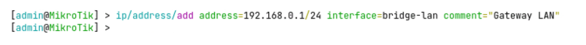

De la misma manera, configuramos la dirección IP de bridge-dmz, para que se corresponda con la puerta de enlace de la red 10.10.0.0/24, ejecutando el siguiente comando:

```text
ip/address/add address=10.10.0.1/24 interface=bridge-dmz
comment="Gateway DMZ"
```
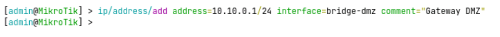
Comprobamos que todo ha ido bien, ejecutando el siguiente comando, que nos mostrará todas las direcciones IP asignadas al router:

```text
ip/address/print
```
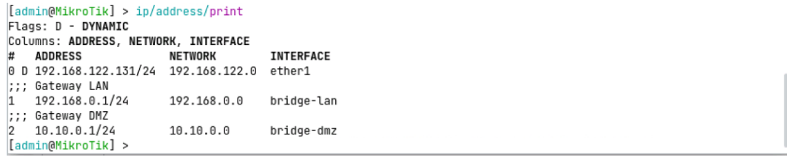

## Creando los servidores DHCP para bridge-lan y bridge-dmz

Vamos a crear dos servidores DHCP. Uno para bridge-lan, que se encargará de proporcionar parámetros de red a los clientes conectados, y uno para bridge-dmz, de manera que podamos centralizar la configuración de red de nuestros servidores.

Para ello, utilizaremos en los dos casos el asistente, ejecutando el comando

```text
ip/dhcp-server/setup
```

Para el servidor DHCP de bridge-lan, aplicaremos los parámetros mostrados en la siguiente captura:

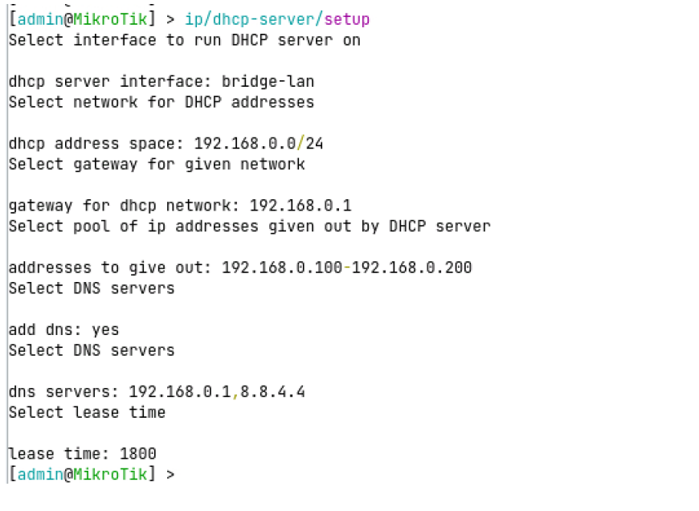

Para el servidor DHCP de bridge-dmz, aplicaremos los parámetros mostrados en la siguiente captura:

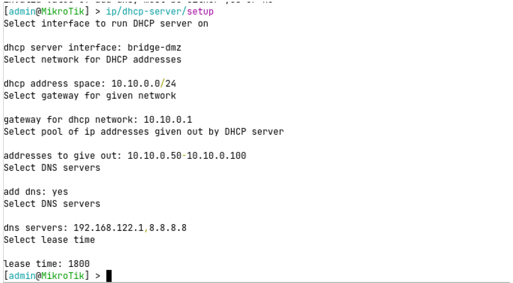

Podemos comprobar los datos de los servidores DHCP creados, ejecutando el comando:

```text
ip/dhcp-server/print
```

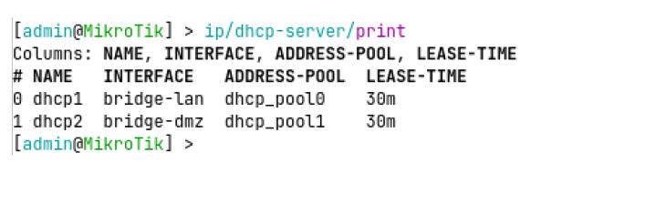

A continuación, vamos a asignar un lease estático para nuestro servidor DMZ. Le asignaremos la IP 10.10.0.10, teniendo en cuenta que su dirección MAC es 02:42:78:e8:9c:00.

Para ello, ejecutamos el siguiente comando:

```text
ip/dhcp-server/lease/add server=dhcp2 address=10.10.0.10
mac-address=02:42:78:e8:9c:00 comment="Servidor DMZ (lease
estático)"
```
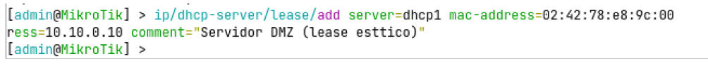
Podemos comprobar que todo ha ido bien, ejecutando el siguiente comando:

```text
ip/dhcp-server/lease/print
```
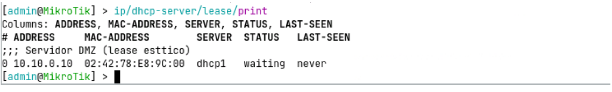

Para Validar que todo ha ido bien, podemos conectar el cliente y el servidor al router

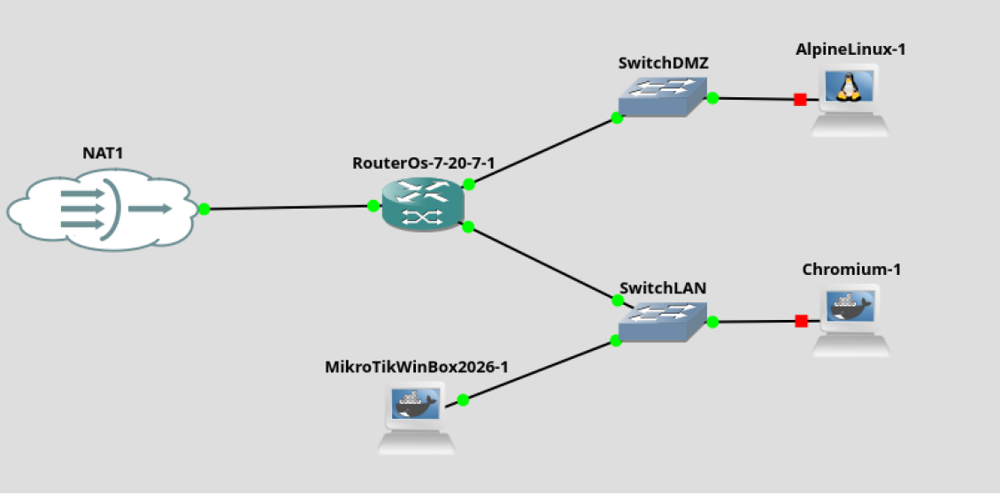
Nos aseguramos de que al iniciar solicitaran dirección IP al servidor DNS, editando la configuración de ambos elementos, pulsando botón derecho sobre cada uno de ellos, y seleccionando la opción “Edit config”

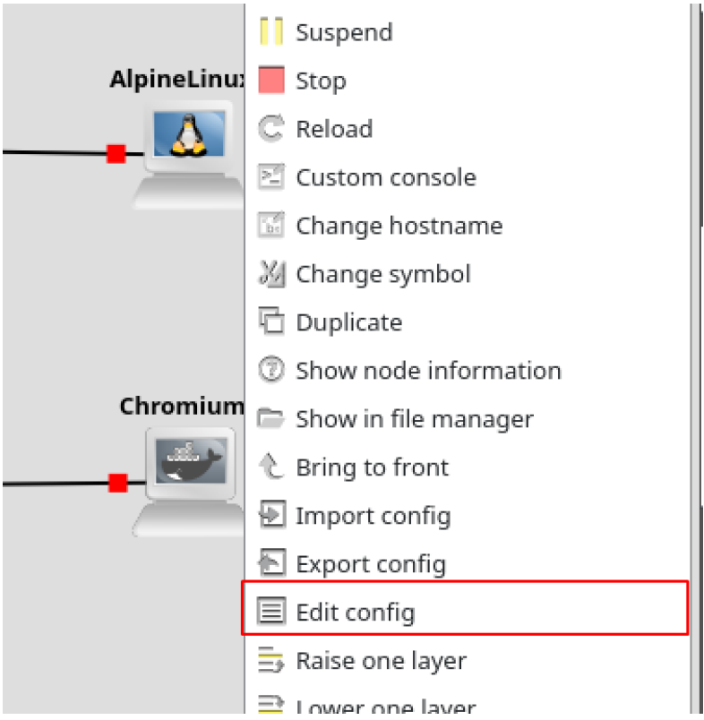
Dentro del fichero de configuración, debemos eliminar los comentarios de las líneas que fuerzan la autoconfiguración de red mediante DHCP:

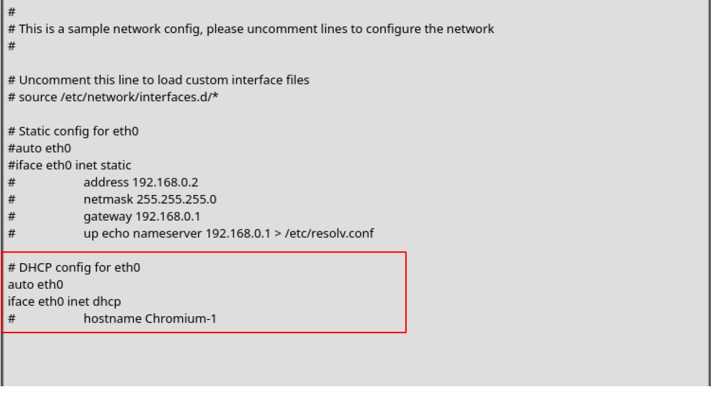

Una vez editada la configuración, guardamos los cambios, y arrancamos la instancia. Repetimos el proceso en el otro appliance.

Una vez arrancadas las dos instancias, podemos volver a la configuración del router, y ejecutar el comando que muestra los leases asignados por los servidores DHCP:

```text
ip/dhcp-server/lease/print
```
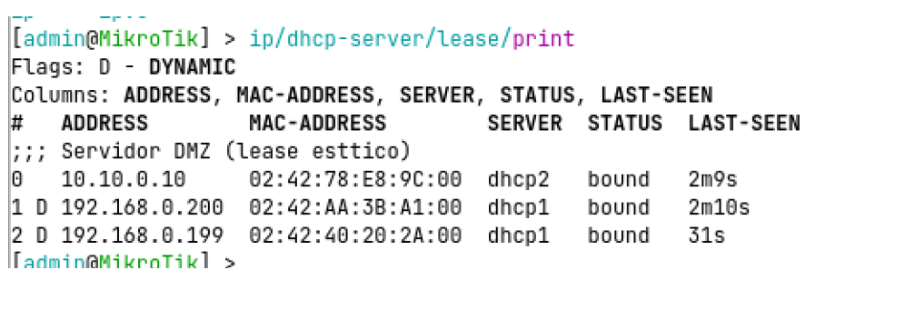
Podemos observar cómo se han asignado varios leases:

• El lease estático, configurado para asignar IP al servidor de la DMZ.  
• Un lease dinámico, asignado al cliente de la red LAN, y otro asignado al appliance de Winbox, utilizado para configurar el router, si está configurado para obtener IP por DHCP.  

## Configurando NAT, para proporcionar salida a internet a las redes DMZ y LAN.

En nuestro escenario, los equipos de la LAN y los servidores de la DMZ utilizan direcciones IP privadas, que no son enrutables directamente en Internet. Para que estos dispositivos puedan comunicarse con redes externas, el router debe traducir sus direcciones privadas a la dirección IP pública (o de salida) de la interfaz WAN.

La técnica que utilizaremos es src-nat con masquerade, que es el método más habitual cuando la interfaz WAN obtiene su dirección IP de forma dinámica (por ejemplo, mediante DHCP). De esta manera, todo el tráfico que salga de la LAN o la DMZ hacia Internet será identificado como procedente del router, y las respuestas podrán volver correctamente a su destino original.

Aunque en MikroTik sería posible utilizar una única regla NAT genérica para dar salida a Internet a todas las redes internas, en este escenario es mucho más recomendable crear una regla NAT diferenciada para cada bridge (LAN y DMZ).

Crear una regla NAT para cada bridge permite:

• Leer la configuración de un vistazo (qué red sale a Internet).  
• Controlar cada red de forma independiente (activar, desactivar o depurar solo LAN o solo DMZ).  
• Mantener coherencia con el diseño de seguridad: no todas las redes internas son iguales.  
• Facilitar el mantenimiento y la docencia.  

Para crear la regla NAT para el tráfico de la red LAN, ejecutamos el siguiente comando:

```text
ip/firewall/nat/add chain=srcnat in-interface=bridge-lan
out-interface=ether1 action=masquerade comment="NAT salida
LAN"
```
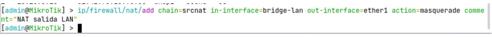
Para crear la regla NAT para el tráfico de la red DMZ, ejecutamos el siguiente comando:

```text
ip/firewall/nat/add chain=srcnat in-interface=bridge-dmz
out-interface=ether1 action=masquerade comment="NAT salida
DMZ"
```
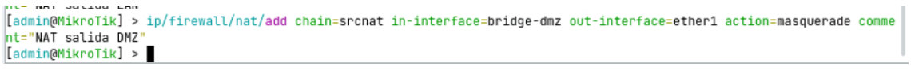
Comprobamos que las reglas se han creado correctamente en Mikrotik

```text
ip/firewall/nat/print
```

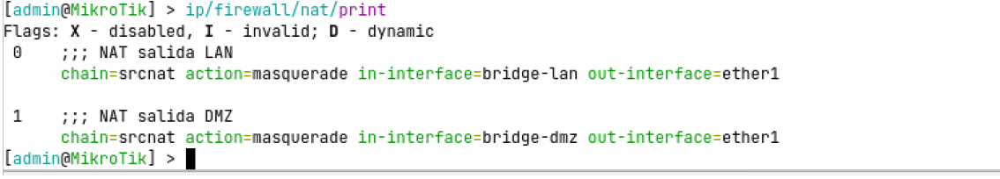

Una vez comprobada la configuración, podemos tratar de conectar a internet con el cliente o con el servidor:

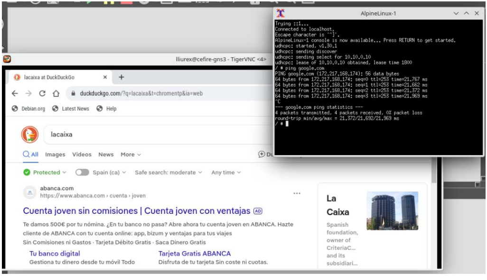

## Configurando las reglas de firewall necesarias para proteger nuestra infraestructura.

En esta sección abordaremos la configuración del firewall del router MikroTik, uno de los elementos clave para garantizar la seguridad de nuestra infraestructura de red.

Para mantener una configuración clara y coherente, separaremos las reglas según su función, trabajando de forma diferenciada sobre las cadenas principales:

• Input: reglas que controlan el tráfico dirigido al propio router (gestión, servicios y diagnóstico).  
• Forward: reglas que regulan el tráfico que atraviesa el router, es decir, las comunicaciones entre LAN, DMZ y WAN.  

Esta separación nos permitirá:

• aplicar el principio de mínimo privilegio,  
• entender fácilmente qué tráfico se permite y cuál se bloquea,  
• y evitar configuraciones confusas o peligrosas.  

## Reglas INPUT: proteger el router

Las reglas input del firewall controlan el tráfico que va dirigido al propio router, no a los equipos de la red. Es decir, deciden quién y cómo puede comunicarse con el router para tareas como administración, diagnóstico o servicios internos.

### Aceptar conexiones ya establecidas / relacionadas

Vamos a añadir una regla que permita al router aceptar tráfico que forma parte de conexiones ya establecidas o que está relacionado con una conexión previa válida.

```text
ip/firewall/filter/add chain=input action=accept connection-state=established,related comment="IN: allow established/related"
```

Esta regla simplifica la configuración, permitiendo tráfico legítimo ya asociado a comunicaciones válidas.

### Bloquear conexiones inválidas

Vamos a añadir una regla que descarte paquetes marcados como invalid, es decir, tráfico que no pertenece a ninguna conexión válida o que está mal formado.

```text
ip/firewall/filter/add chain=input action=drop connection-state=invalid comment="IN: drop invalid"
```

### Permitir ICMP (ping/troubleshoting)

También puede ser interesante permitir el tráfico ICMP dirigido al router, necesario para funciones básicas de diagnóstico y control.

```text
ip/firewall/filter/add chain=input action=accept protocol=icmp
comment="IN: allow ICMP"
```

### Permitir administración SOLO desde LAN

Con la siguiente regla, aceptaremos conexiones que permitan el acceso de administración al router únicamente desde la red LAN, usando los servicios de SSH (22) y WinBox (8291).

```text
ip/firewall/filter/add chain=input action=accept in-interface=bridge-lan protocol=tcp dst-port=22,8291 comment="IN: mgmt from LAN (SSH/Winbox)"
```

### Bloqueo final de todo lo demás hacia el router

Para finalizar, bloquearemos todo el tráfico dirigido al router que no haya sido permitido explícitamente antes.

```text
ip/firewall/filter/add chain=input action=drop comment="IN: drop all
(default deny)"
```

Es la regla que cierra la cadena input y garantiza que el router no exponga servicios innecesarios. Sin esta regla, cualquier tráfico no contemplado quedaría permitido, lo que supone un riesgo claro de seguridad.

### Comprobación de reglas input aplicadas.

Para comprobar las reglas aplicadas hasta el momento, ejecutamos el siguiente comando:

```text
ip/firewall/filter/print where chain=input
```
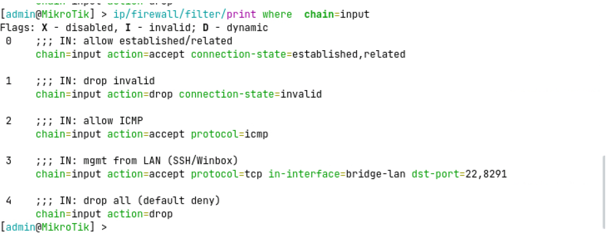
## Reglas FORWARD: políticas entre zonas

Las reglas forward del firewall controlan el tráfico que atraviesa el router, es decir, las comunicaciones entre redes distintas como LAN, DMZ y WAN.

Estas reglas deciden:

• Qué redes pueden comunicarse entre sí,  
• En qué dirección,  
• Bajo qué condiciones.  

### Permitir established/related

En primer lugar, debemos añadir una regla que permita el paso del tráfico que pertenece a conexiones ya establecidas o que está relacionado con una conexión válida, pero en este caso atravesando el router entre redes.

```text
ip/firewall/filter/add chain=forward action=accept connection-state=established,related comment="FWD: allow established/related"
```

### Bloquear conexiones inválidas

De la misma manera, deberemos añadir una regla que descarte el tráfico marcado como invalid que intenta atravesar el router entre distintas redes.

```text
ip/firewall/filter/add chain=forward action=drop connection-state=invalid comment="FWD: drop invalid"
```

### Permitir tráfico de red LAN hacia WAN

Para permitir que los equipos de la red LAN puedan salir a Internet, añadiremos una regla, autorizando el tráfico que entra al router desde bridge-lan y sale por la interfaz WAN (ether1).

```text
ip/firewall/filter/add chain=forward action=accept in-interface=bridge-lan out-interface=ether1 comment="FWD: LAN -> WAN allow"
```

### Permitir tráfico de red LAN hacia DMZ

Para permitir que los equipos de la red LAN puedan conectar a los servicios desplegados en la DMZ, añadiremos una regla, autorizando el tráfico que entra al router desde bridge-lan y sale por el bridge-dmz.

```text
ip/firewall/filter/add chain=forward action=accept in-interface=bridge-lan out-interface=bridge-dmz comment="FWD: LAN -> DMZ allow"
```

### Permitir tráfico de red DMZ hacia WAN

Si necesitamos que los equipos de la DMZ dispongan de acceso a internet, deberemos añadir una regla, autorizando el tráfico que entra al router desde bridge-dmz y sale por la interfaz WAN (ether1).

```text
ip/firewall/filter/add chain=forward action=accept in-interface=bridge-dmz out-interface=ether1 comment="FWD: DMZ -> WAN allow"
```

### Bloquear tráfico de red DMZ hacia LAN

Para proteger la red LAN de accesos no autorizados, deberemos bloquear cualquier intento de comunicación iniciado desde la DMZ hacia la LAN, evitando que los sistemas expuestos en la red perimetral puedan acceder a la red interna.

```text
ip/firewall/filter/add chain=forward action=drop in-interface=bridge-dmz out-interface=bridge-lan comment="FWD: DMZ -> LAN drop"
```

### Bloquear tráfico de red WAN hacia LAN

De la misma manera, deberemos crear una regla que bloquee cualquier intento de conexión iniciado desde la WAN hacia la LAN, impidiendo accesos directos desde Internet a la red interna.

```text
ip/firewall/filter/add chain=forward action=drop in-interface=ether1
out-interface=bridge-lan comment="FWD: WAN -> LAN drop"
```

### Bloquear tráfico de red WAN hacia DMZ

Dado que solo será necesario exponer los servicios necesarios para su acceso desde internet, deberemos bloquear cualquier conexión iniciada desde la WAN hacia la DMZ, dejando la red perimetral cerrada por defecto.

```text
ip/firewall/filter/add chain=forward action=drop in-interface=ether1
out-interface=bridge-dmz comment="FWD: WAN -> DMZ drop (until
publish)"
```

### Bloquear cualquier otro tipo de tráfico

Por último, bloquearemos todo el tráfico que atraviesa el router y que no haya sido permitido explícitamente por reglas anteriores.

```text
ip/firewall/filter/add chain=forward action=drop comment="FWD:
drop all (default deny)"
```

### Comprobación de reglas forward aplicadas.

Para comprobar las reglas aplicadas hasta el momento, ejecutamos el siguiente comando:

```text
ip/firewall/filter/print where chain=forward
```


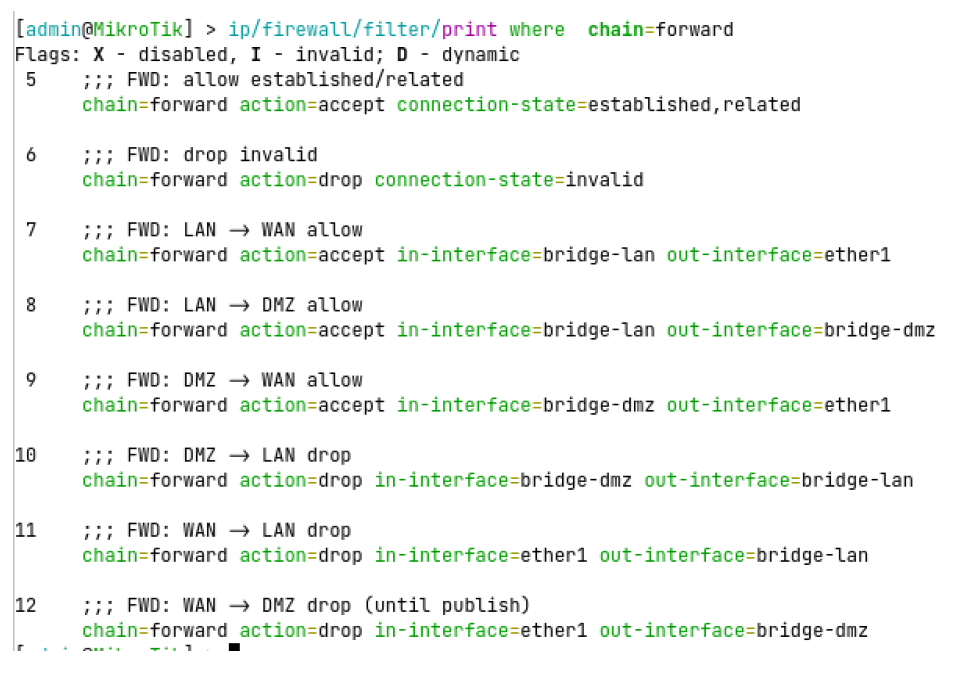
## Publicación del servicio HTTP a internet (WAN → DMZ)

En esta sección vamos a publicar un servicio HTTP alojado en un servidor de la DMZ, permitiendo su acceso desde Internet de forma controlada y segura.

La publicación de servicios no consiste en “abrir la DMZ”, sino en crear excepciones muy concretas al firewall.

### DST-NAT: redirigir TCP/80 hacia el servidor DMZ

Para redirigir las peticiones HTTP (TCP/80) que llegan desde Internet a la interfaz WAN (ether1) hacia el servidor web ubicado en la DMZ (10.10.0.10):

```text
ip/firewall/nat/add chain=dstnat in-interface=ether1 protocol=tcp
dst-port=80 action=dst-nat to-addresses=10.10.0.10 to-ports=80
comment="WAN -> DMZ HTTP (80) to 10.10.0.10"
```

Esta regla no abre el acceso por sí sola: únicamente realiza la redirección.

Para que el tráfico funcione de forma segura, debe ir acompañada de una regla forward específica que permita ese tráfico y mantenga bloqueado todo lo demás.

### FILTER: permitir el forward WAN → DMZ solo para HTTP

A continuación, añadiremos la regla que permitirá el tráfico HTTP iniciado desde Internet hacia el servidor web de la DMZ (10.10.0.10), autorizando únicamente nuevas conexiones TCP al puerto 80.

```text
ip/firewall/filter/add chain=forward in-interface=ether1
out-interface=bridge-dmz protocol=tcp dst-address=10.10.0.10
dst-port=80 connection-state=new action=accept
comment="FWD: allow WAN -> DMZ HTTP to 10.10.0.10"
```

## Corregir la ordenación de las reglas aplicadas.

Para validar la configuración del router, vamos a imprimir todas las reglas forward, ejecutando:

```text
ip/firewall/filter/print where chain=forward
```
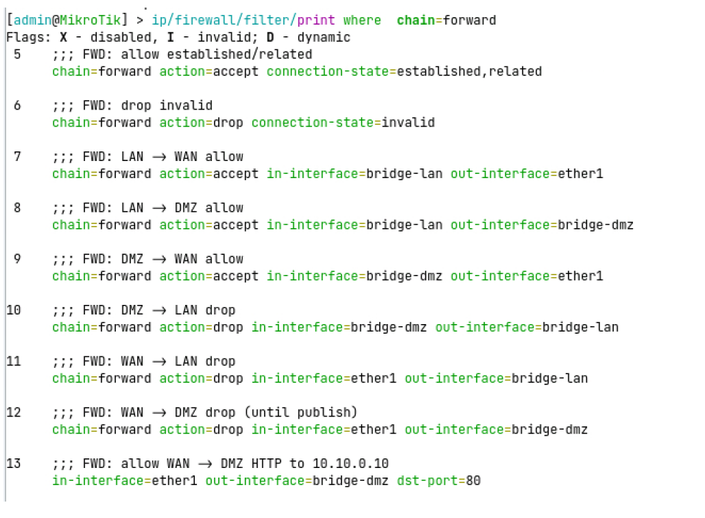

Si observamos la salida, la regla 12 bloquea todas las conexiones dirigidas desde la red WAN a la red DMZ, y la regla 13 habilita el protocolo HTTP desde la red WAN a la red DMZ.

Dado que las reglas se evaluarán en orden, y se ejecutará únicamente la primera regla que coincida con el estado de la conexión, la regla 13 nunca llegará a evaluarse, dado que siempre se bloqueará el tráfico que la cumple por la regla 12.

Para modificar el orden de evaluación, podemos intercambiar la regla 12 por la 13, con el siguiente comando:

```text
ip/firewall/filter/move 13 12
```

Podemos Volver a analizar las reglas creadas, ejecutando de nuevo el comando:

```text
ip/firewall/filter/print where chain=forward
```
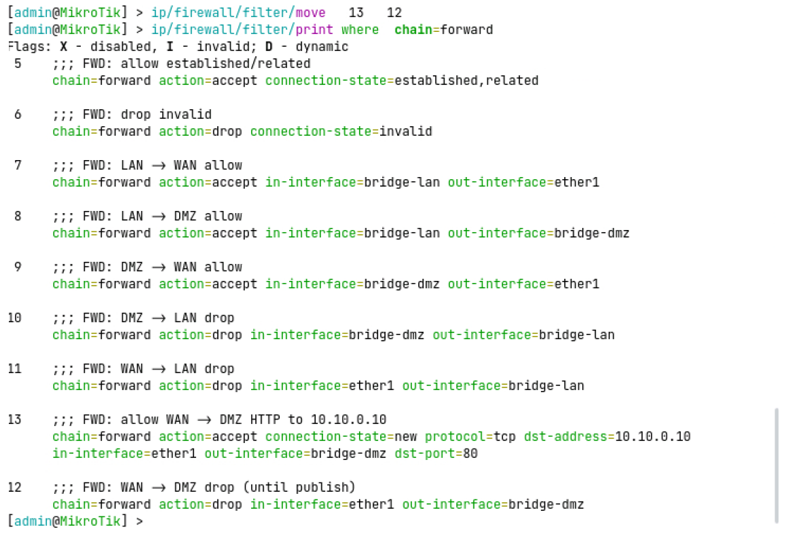
Con este cambio, nuestras reglas serán totalmente funcionales, y podemos validar el escenario completo.

## Configuración del servidor http en Alpine Linux y validación del escenario.

Para instalar e iniciar el servicio http en Alpine Linux, debemos abrir un terminal, y ejecutar el siguiente script:

```text
apk update;
apk add python3;
mkdir -p /var/www;
echo "HTTP OK desde Alpine (DMZ)" > /var/www/index.html;
cd /var/www;
python3 -m http.server 80;
```

Si todo ha funcionado correctamente, tendremos validada la conexión entre DMZ y WAN.

Abrimos el navegador web conectado en red LAN, y tratamos de acceder a la ip del servidor http (10.10.0.10). Si todo ha ido bien, habremos validado la conexión entre la red LAN y la red DMZ

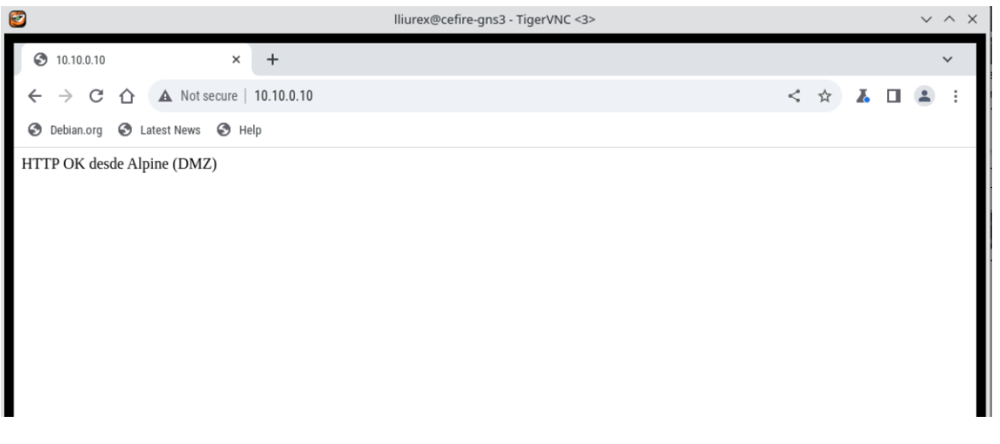

A continuación, podemos conectar un cliente con navegador web en la red LAN.

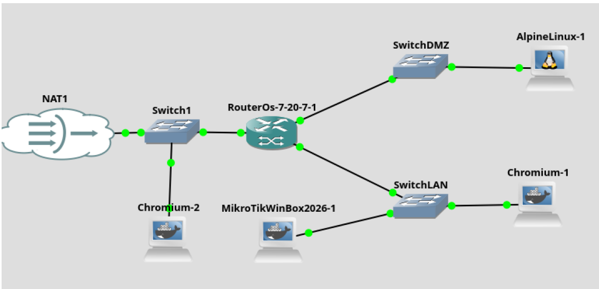

Si abrimos el cliente, y tratamos de acceder al puerto 80 del router, y todo está bien configurado, nos devolverá el contenido de la página web servida desde el servidor de la DMZ.

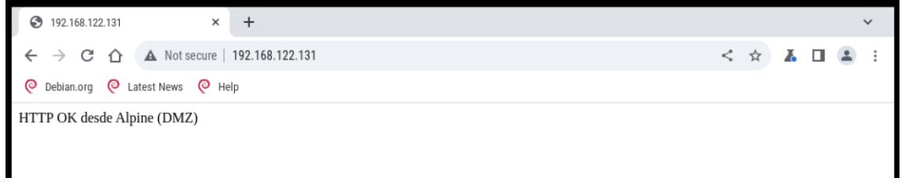

Por último, vamos a tratar de conectar desde el servidor en la DMZ al cliente, a través de su IP privada. En la captura podemos comprobar como no se obtiene respuesta de la petición:

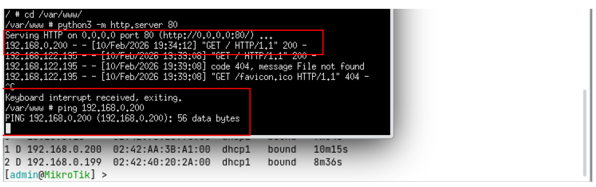

Con esta configuración dejamos el servicio HTTP publicado de forma controlada y segura, validando en la práctica cómo NAT y firewall trabajan conjuntamente sin comprometer el aislamiento entre LAN, DMZ y WAN.
