# Configuración de reglas de firewall.

## Índice
Introducción
Cómo se define una regla de firewall en MikroTik.  
Elementos de tipo chain  
Elementos de tipo action 
Elementos de tipo filtro (condiciones) 
Procesamiento de las reglas de firewall en MikroTik 
Ausencia de política implícita  
Ejemplo práctico. 
Ejemplo 1 – Permitir el tráfico ya establecido.   
Ejemplo 2 – Bloquear tráfico inválido.   
Ejemplo 3 – Permitir salida a Internet desde la LAN 
Ejemplo 4 – Bloquear el resto del tráfico 
Ejemplo 5 – Eliminación de una regla configurada. 
Ejemplo 6 – Añadir una regla en una posición específica

## Introducción

En el ámbito de la administración de redes, el uso de firewalls es una práctica 
consolidada. Herramientas como UFW permiten aplicar políticas de filtrado de 
forma relativamente abstracta, ocultando la complejidad interna del 
procesamiento de paquetes y priorizando la simplicidad operativa. 
Sin embargo, en entornos profesionales y dispositivos de red dedicados, como los 
routers MikroTik, el enfoque es diferente: el administrador tiene un control 
explícito y detallado sobre cómo y cuándo se aplican las reglas de seguridad.
La configuración de reglas de firewall en MikroTik no se basa en perfiles predefinidos 
ni en políticas implícitas, sino en un modelo declarativo y secuencial, donde cada 
regla se evalúa en orden y el comportamiento del firewall depende directamente de 
las decisiones del administrador. Esto exige un mayor rigor conceptual, pero a 
cambio ofrece una flexibilidad y precisión muy superiores.
En este tema se abordará la configuración de reglas de firewall en MikroTik desde 
una perspectiva práctica, poniendo el foco en:

- La estructura real de una regla de firewall y sus parámetros.
- El recorrido del tráfico a través del router y las distintas cadenas de filtrado.
- La importancia del orden de las reglas y de las políticas por defecto.
- Las diferencias clave respecto a firewalls basados en iptables/UFW.

Este conocimiento será la base sobre la que se construirán configuraciones más 
avanzadas, como la redirección de puertos, la segmentación de redes y la 
implementación de DMZ, donde el control fino del tráfico es un requisito 
imprescindible.

## Cómo se define una regla de firewall en MikroTik.

Una regla de firewall, en MikroTik, se define a partir de tres elementos básicos:

- **Cadena (chain):** indica en qué punto del recorrido del tráfico se aplica la 
regla (input, forward u output). Toda regla debe pertenecer obligatoriamente 
a una cadena.

- **Acción (action):** define qué hace el firewall cuando el tráfico coincide con la 
regla, como permitirlo (accept), bloquearlo (drop o reject) o registrarlo (log). 
Sin una acción definida, la regla no tiene efecto.

- **Condiciones:** permiten especificar qué tráfico debe coincidir con la regla, 
utilizando parámetros como la interfaz de entrada o salida, la dirección IP de 
origen o destino, el protocolo, los puertos o el estado de la conexión. Estas 
condiciones no son obligatorias, pero si no se define ninguna, la regla se 
aplicará a todo el tráfico de la cadena.

A partir de estos tres elementos básicos es posible definir tantas reglas de firewall 
como sean necesarias para controlar el tráfico de la red. MikroTik analiza las reglas 
de forma secuencial, de arriba hacia abajo, dentro de cada cadena, evaluando si el 
paquete cumple las condiciones definidas en cada una de ellas. 
En el momento en que una regla coincide con las características del paquete 
analizado, se ejecuta la acción asociada y el proceso de evaluación se detiene, sin 
comprobar las reglas posteriores. Por este motivo, el orden de las reglas es un factor 
crítico en la configuración del firewall, ya que una regla mal situada puede anular o 
impedir el funcionamiento de las siguientes.

### Elementos de tipo chain

El parámetro chain define el punto del recorrido del tráfico en el que el firewall 
evalúa la regla. En MikroTik, cada paquete que pasa por el router es clasificado en 
una cadena concreta antes de comenzar la evaluación de reglas.

Una regla de firewall debe pertenecer obligatoriamente a una cadena, ya que sin 
ella el router no sabría en qué contexto aplicar la regla. Una regla colocada en una 
cadena incorrecta no tendrá ningún efecto, aunque esté correctamente definida.
Las cadenas principales utilizadas en la configuración de firewall son:

- input: filtra el tráfico cuyo destino es el propio router. Se utiliza para controlar 
el acceso a los servicios de administración y gestión del dispositivo, como 
Winbox, SSH, WebFig o ICMP.
- forward: filtra el tráfico que atraviesa el router, es decir, el que va de una red 
a otra. Es la cadena más utilizada para aplicar políticas de seguridad entre 
redes internas, Internet y zonas intermedias como una DMZ.
- output: filtra el tráfico generado por el propio router hacia otras redes. 
Aunque suele dejarse sin restricciones en muchos escenarios, permite un 
control más estricto del comportamiento del dispositivo.

### Elementos de tipo action

El parámetro action indica qué hace el firewall cuando un paquete coincide con 
las condiciones de la regla, determinando el comportamiento final del firewall 
ante cada tipo de tráfico. Toda regla debe tener definida una acción; de lo contrario, 
la regla no produce ningún efecto sobre el tráfico.
Las acciones más habituales en la configuración de firewall de MikroTik son:
- accept: permite el paso del tráfico y detiene el procesamiento de reglas para 
ese paquete.
- drop: bloquea el tráfico de forma silenciosa, sin notificar al origen. Es la 
opción más utilizada en políticas de seguridad.
- reject: bloquea el tráfico e informa al origen mediante un mensaje de 
rechazo. Puede ser útil en entornos controlados, aunque no suele 
recomendarse hacia Internet.
- log: registra el tráfico que coincide con la regla en los logs del sistema. 
Normalmente, se utiliza con fines de diagnóstico y suele combinarse con 
reglas adicionales de aceptación o bloqueo.

### Elementos de tipo filtro (condiciones)

Los elementos de tipo filtro permiten especificar qué tráfico debe coincidir con 
una regla concreta. Estas condiciones no son obligatorias, pero cuanto más 
precisas sean, más específica y segura será la regla.
Entre los filtros más utilizados se encuentran:
- Interfaces
  - in-interface → interfaz por la que entra el tráfico
  - out-interface → interfaz por la que sale el tráfico
- Direcciones IP
  - src-address → dirección o red de origen.
  - dst-address → dirección o red de destino.
- Protocolos y puertos
  - protocol → tcp, udp, icmp, etc.
  - src-port → puerto de origen.
  - dst-port → puerto de destino.
- Estado de la conexión
  - connection-state → new, established, related, invalid.
Es importante tener en cuenta que si una regla no define ningún filtro, se aplicará a 
todo el tráfico que pase por la cadena correspondiente, lo que puede tener un 
impacto significativo en la conectividad de la red.

## Procesamiento de las reglas de firewall en MikroTik.

Una vez definidas las reglas de firewall, MikroTik las procesa siguiendo un modelo 
secuencial y determinista. Esto significa que el router no evalúa todas las reglas 
a la vez, ni selecciona la más específica, sino que analiza las reglas en el orden en 
el que aparecen, de arriba hacia abajo, dentro de cada cadena.
Cuando un paquete entra en el router, RouterOS realiza los siguientes pasos:
- Determina a qué cadena pertenece el paquete (input, forward u output).
- Comienza a evaluar las reglas de esa cadena en orden.
- Comprueba si el paquete cumple las condiciones definidas en cada regla.
- En el momento en que una regla coincide:
  - Se ejecuta la acción asociada.
  - El procesamiento se detiene para ese paquete.
  - Las reglas posteriores no se evalúan.
Este comportamiento convierte el orden de las reglas en un elemento crítico de la 
seguridad. Una regla demasiado genérica situada en una posición incorrecta puede 
bloquear tráfico legítimo o permitir comunicaciones no deseadas, 
independientemente de que existan reglas más específicas debajo.

### Ausencia de política implícita

A diferencia de otros firewalls, MikroTik no aplica una política por defecto 
automática de permitir o denegar tráfico. Si un paquete no coincide con ninguna 
regla de la cadena correspondiente, el tráfico se permite.
Por este motivo, una configuración de firewall correctamente diseñada debe 
finalizar siempre con una regla explícita de bloqueo, que actúe como cierre de la 
política definida.
Este enfoque obliga al administrador a definir conscientemente qué tráfico se 
permite, evitando comportamientos implícitos que puedan comprometer la 
seguridad de la red.

## Ejemplo práctico.

Partiendo del escenario del tema anterior, en el que configuramos acceso a internet 
desde la red interna, mediante la configuración de NAT:

Vamos a añadir algunas reglas de seguridad, como ejemplo práctico.

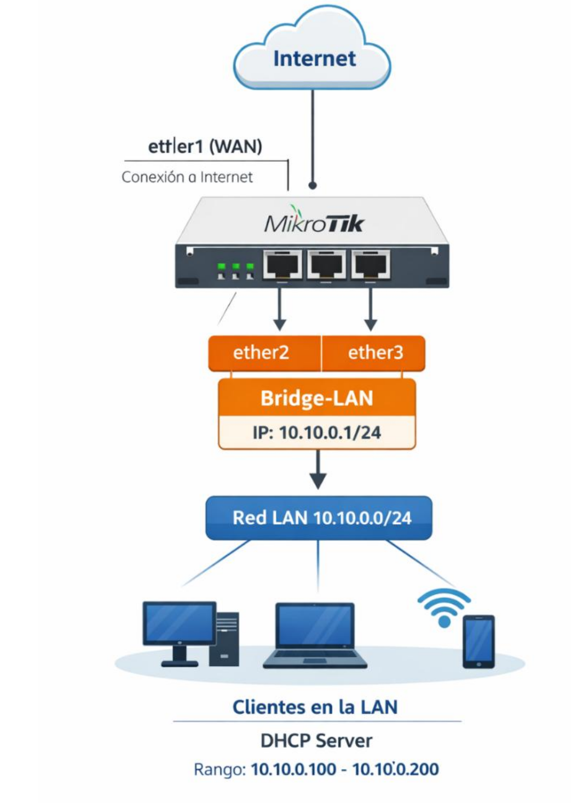

### Ejemplo 1 – Permitir el tráfico ya establecido.

Antes de definir reglas específicas, es buena práctica permitir el tráfico que forma 
parte de conexiones ya existentes, añadiendo la siguiente regla.

```text
ip/firewall/filter/add chain=forward 
connection-state=established,related action=accept
comment="Permitir conexiones establecidas y relacionadas"
```
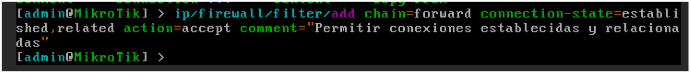
Podemos comprobar la nueva regla añadida, ejecutando el comando: 

```text
ip/firewall/filter/print
```
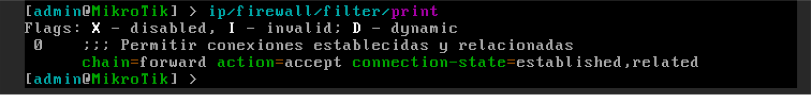
Con esta regla, conseguimos permitir el tráfico que forma parte de conexiones ya 
establecidas (established) o relacionadas (related).
  - established: paquetes que pertenecen a conexiones iniciadas 
  previamente, por ejemplo, respuestas a solicitudes HTTP desde la 
  LAN.
  - related: paquetes asociados a conexiones existentes, como 
  transferencias de datos de FTP (permitiendo abrir la conexión de 
  datos si se ha establecido una conexión de control) o respuestas 
  ICMP relacionadas con una conexión TCP.
Ventajas de esta regla:
- Las respuestas a conexiones iniciadas desde la LAN seguirán 
funcionando sin necesidad de reglas adicionales.
- Evita que RouterOS tenga que reevaluar cada paquete individualmente, 
mejorando eficiencia y reduciendo carga de CPU.
- Colocada al inicio de la cadena, garantiza que reglas posteriores no 
interfieran con tráfico legítimo.

### Ejemplo 2 – Bloquear tráfico inválido.

En MikroTik, un paquete se marca como invalid cuando no pertenece a ninguna 
conexión reconocida por el firewall stateful del router o no cumple con la lógica de 
seguimiento de estado de la conexión. 
Esto incluye paquetes que llegan fuera de orden, con errores de protocolo, con 
cabeceras inconsistentes, o que no tienen relación con una sesión existente ni con 
ninguna conexión establecida o relacionada. 
El router analiza cada paquete comparándolo con su tabla de seguimiento de 
conexiones y, si no puede asociarlo a una conexión válida, lo clasifica 
automáticamente como inválido, de forma que pueda ser descartado por reglas de 
firewall antes de afectar la red o consumir recursos innecesarios.
Para filtrar los paquetes inválidos que lleguen a nuestro router, podemos añadir la 
siguiente regla:

```text
ip/firewall/filter/add chain=forward 
connection-state=invalid action=drop 
comment="Bloquear tráfico inválido"
```
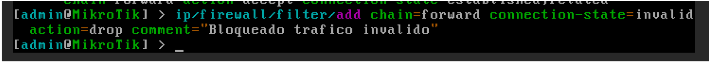
Podemos comprobar la nueva regla añadida, ejecutando el comando: 

```text
ip/firewall/filter/print
```
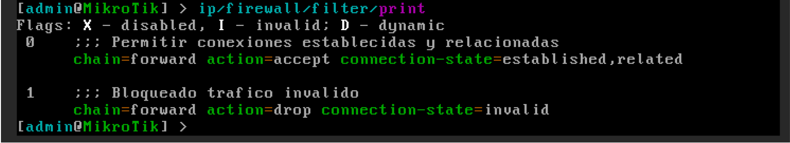
### Ejemplo 3 – Permitir salida a Internet desde la LAN.

Aunque hemos configurado a internet, como hemos comentado durante las 
explicaciones, por seguridad se debería añadir una regla, al final, que bloquee todo 
el tráfico.
De manera que si queremos seguir permitiendo el tráfico desde la red 10.10 hacia 
internet, deberemos especificarlo mediante una regla con action=accept.

```text
ip/firewall/filter/add chain=forward 
src-address=10.10.0.0/24 out-interface=bridge-gateway
action=accept comment="Permitir LAN a Internet"
```
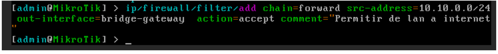
Podemos comprobar la nueva regla añadida, ejecutando el comando: 

```text
ip/firewall/filter/print
```
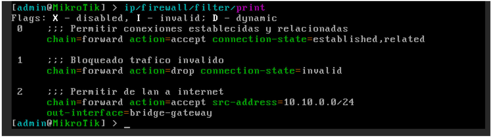
Con esta regla, permitimos el tráfico que:
- Se inicie en la red 10.10.0.0/24.
- El destino sea accesible por la interfaz ether1.
Dado que en una regla anterior hemos permitido todo el tráfico que previamente 
establecido, cuando llegue un paquete de respuesta por la interfaz ether1 hacia la 
red 10.10.0.0/24, si la conexión está abierta, el tráfico estará permitido.

### Ejemplo 4 – Bloquear el resto del tráfico.

Para garantizar la seguridad de la red, después de permitir explícitamente el tráfico 
legítimo, es fundamental añadir una regla que bloquee todo el resto del tráfico que 
no cumpla ninguna condición anterior. 

```text
ip/firewall/filter/add chain=forward 
action=drop comment="Bloquear todo el resto del tráfico"
```
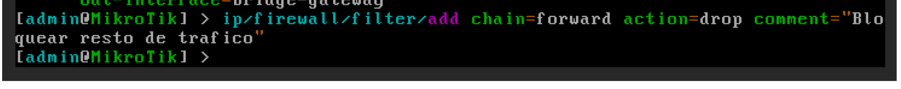
Podemos comprobar la nueva regla añadida, ejecutando el comando: 

```text
ip/firewall/filter/print
```
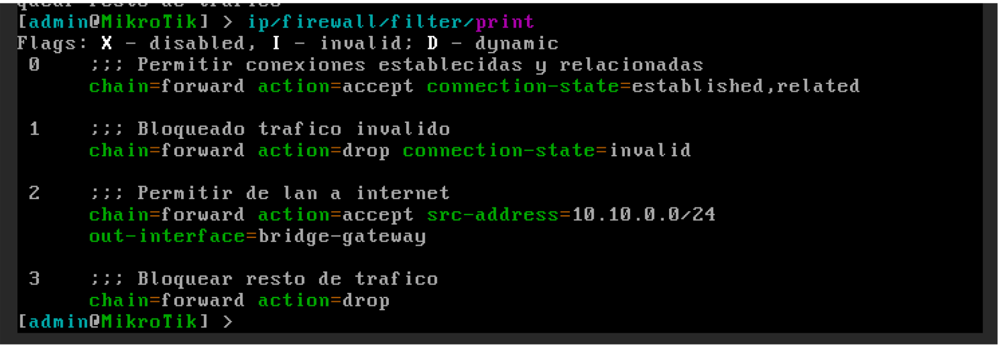

Esta regla evita accesos no autorizados y comportamientos inesperados. Gracias a 
la evaluación secuencial del firewall, los paquetes que coincidan con reglas 
anteriores seguirán siendo permitidos, mientras que el resto se bloquea 
automáticamente, protegiendo la red sin necesidad de especificar cada flujo de 
forma individual.

### Ejemplo 5 – Eliminación de una regla configurada.

Para eliminar una regla, en primer lugar, debemos identificar que posición ocupa en 
el listado de reglas. Para ello, mostramos el listado de reglas:

```text
ip/firewall/filter/print
```
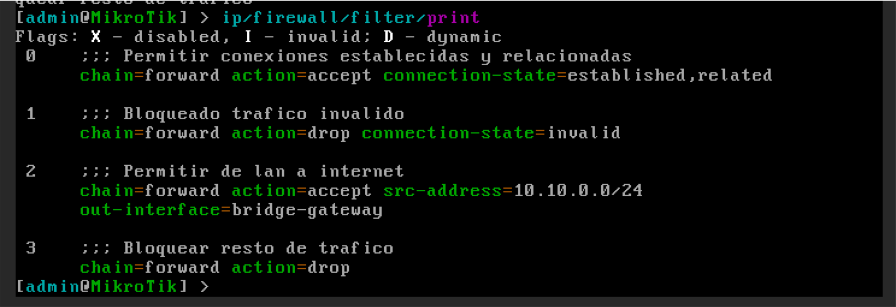
Identifica la regla que permite la salida de tráfico desde la red 10.10.0.0/24 a 
internet. Si su índice es el 2, para eliminar la regla, debemos ejecutar:

```text
ip/firewall/filter/remove 2
```
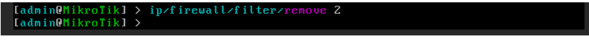

Podemos comprobar que todo ha ido correctamente, mostrando de nuevo el 
listado.

```text
ip/firewall/filter/print
```
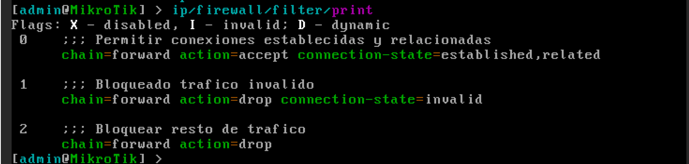

### Ejemplo 6 – Añadir una regla en una posición específica.

Imaginemos que queremos volver a permitir todo el tráfico de la red LAN hacia 
internet, pero esta vez, queremos identificar la red, utilizando la interfaz de origen 
del tráfico (bridge-10-10). Para que sea efectiva, debemos añadir la regla en la 
posición correcta (antes de la regla de bloqueo general). 

En primer lugar, listamos las reglas, para comprobar la posición en la que queremos 
insertar la nueva regla:

```text
ip/firewall/filter/print
```
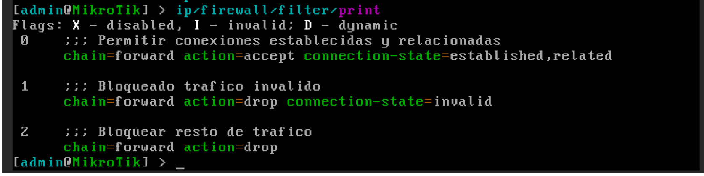
A continuación, definimos la nueva regla, añadiendo el parámetro place-before a 
la configuración de la regla:

```text
ip/firewall/filter/add chain=forward 
in-interface=bridge-lan out-interface=ether1
action=accept place-before=2
comment="Permitir tráfico LAN a Internet"
```
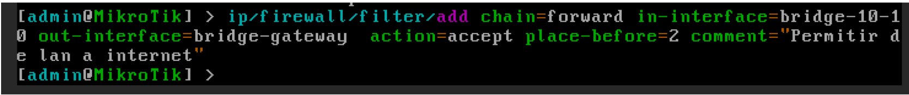
Podemos comprobar la nueva regla añadida, ejecutando el comando: 

```text
ip/firewall/filter/print
```
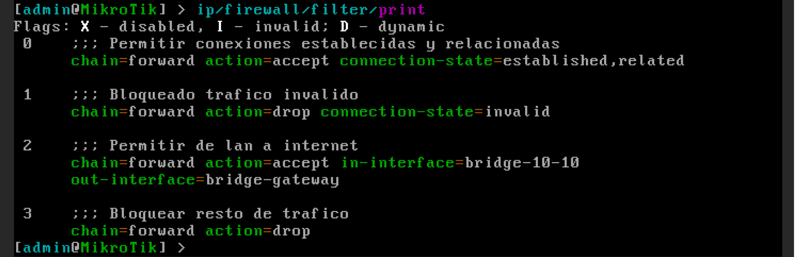