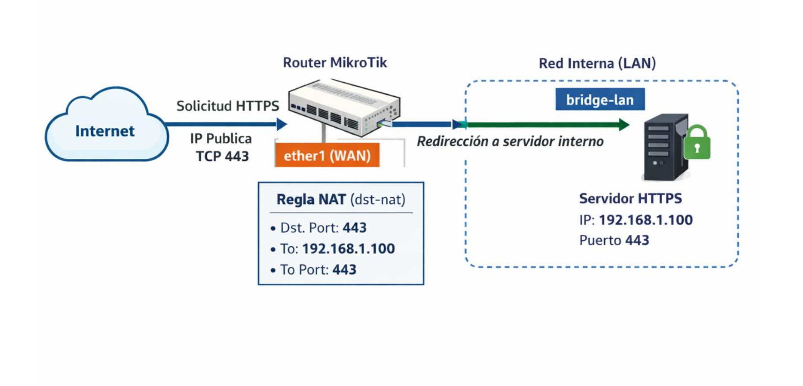

# Redirección de puertos.


# Índice
Introducción
Flujo del tráfico en una redirección de puertos en MikroTik
Estructura general de una regla de redirección de puertos (dst-nat)
Ejemplo
Regla NAT: redirección de puertos (dst-nat).
Regla de firewall: permitir el tráfico redirigido (forward).

# Introducción
Hasta este punto del curso, se ha trabajado la configuración del firewall con el objetivo de controlar y proteger el tráfico que circula por el router, aplicando políticas de seguridad basadas en el principio de mínimo privilegio: permitir únicamente el tráfico necesario y bloquear el resto.

Sin embargo, en escenarios reales de administración de redes, no siempre es suficiente con impedir accesos desde el exterior. En muchas ocasiones es necesario publicar servicios internos, de forma que puedan ser accesibles desde Internet de manera controlada.

La redirección de puertos permite que el tráfico entrante dirigido a la dirección IP del router (generalmente su dirección IP pública) y a un puerto concreto sea enviado a un equipo específico de la red interna. Este mecanismo es habitual para exponer servicios como servidores web, aplicaciones corporativas o accesos remotos, manteniendo el resto de la red protegida tras el router.

En MikroTik, la redirección de puertos no se implementa mediante reglas de firewall, sino a través de reglas de NAT, concretamente de tipo dst-nat. Estas reglas modifican el destino de los paquetes entrantes y hacen que el tráfico pase a ser tratado por la cadena forward, donde el firewall decide finalmente si se permite o se bloquea la comunicación.

Es importante entender que una redirección de puertos mal configurada puede comprometer seriamente la seguridad de la red, ya que expone directamente un servicio interno a Internet. Por este motivo, la redirección de puertos debe ir siempre acompañada de reglas de firewall específicas y bien ubicadas, que limiten el acceso únicamente a lo estrictamente necesario.

En los siguientes apartados se estudiará el funcionamiento de la redirección de puertos en MikroTik desde un enfoque práctico, analizando el flujo del tráfico, la relación entre NAT y firewall, y aplicando configuraciones típicas que servirán de base para escenarios más avanzados, como la implementación de una DMZ.

# Flujo del tráfico en una redirección de puertos en MikroTik.
Antes de escribir una regla de redirección, es fundamental entender qué ocurre realmente cuando un paquete llega al router (normalmente desde internet) y queremos redirigirlo a un servidor interno. Este punto suele ser la mayor fuente de errores conceptuales.

De manera simplificada, podemos decir que:
- El paquete llega al router, normalmente desde Internet, a través de la interfaz WAN.
- El router evalúa las reglas de NAT de tipo dst-nat, comprobando si existe alguna regla que coincida con las características del paquete (interfaz de entrada, protocolo y puerto destino).
- Si una regla dst-nat hace match, el router modifica el paquete:
  - Cambia la dirección IP destino por la del servidor interno.
  - Cambia el puerto destino por el puerto en el que escucha el servicio interno.
- Tras aplicar el dst-nat, el tráfico pasa a la cadena forward.
- El paquete ya no va dirigido al router, sino a un host interno, por lo que no se evalúa en la cadena input, sino en forward, donde el firewall decide finalmente si la comunicación se permite o se bloquea.

NAT redirige el tráfico, pero el firewall decide si pasa o no.
Una redirección sin firewall es una mala configuración.

# Estructura general de una regla de redirección de puertos (dst-nat)
De forma genérica, una regla de redirección de puertos tiene la siguiente estructura:
```sh
/ip firewall nat add chain=dstnat in-interface=<interfaz_de_entrada>
protocol=<tcp|udp> dst-port=<puerto_del_router>
action=dst-nat to-addresses=<ip_interna> to-ports=<puerto_interno>
```
Donde:
- chain=dstnat indica que la regla se evalúa cuando el paquete entra al router y va dirigido a una IP de destino.

- in-interface limita la aplicación de la regla a los paquetes que entran por la interfaz WAN (por ejemplo, ether1).

- protocol indica el protocolo del paquete. Es obligatorio cuando se filtra por puerto. Normalmente tcp o udp.

- dst-port es el puerto destino original del paquete, es decir, el puerto público al que se conecta el cliente desde Internet.

- action=dst-nat indica que el router va a modificar el destino del paquete.

- to-addresses indica la dirección IP del servidor interno al que se redirige el tráfico.

- to-ports indica el puerto del servicio en el servidor interno (puede coincidir o no con el puerto externo).

Importante:
- Si el router utiliza masquerade o src-nat para la salida a Internet, el tráfico de respuesta funcionará automáticamente.

- Si no existe una regla de src-nat, la redirección no será funcional, aunque la regla dst-nat sea correcta.

Este punto es clave para evitar la típica pregunta: “La regla está bien, pero no funciona”.

# Ejemplo.
Partiendo del siguiente escenario, en el que suponemos configurada:
- La red interna 192.168.1.0/24, en el bridge lan, asociado a ether2.

- Acceso a internet desde la red interna, mediante la configuración de NAT.


Vamos a configurar la redirección de puertos para permitir acceso al servidor web publicado en la IP 192.168.1.100 puerto 443.

# Regla NAT: redirección de puertos (dst-nat).
En primer lugar, debemos escribir la regla NAT que modifique la dirección y puerto destino del paquete.

Para ello, escribiremos la siguiente regla:
```
ip/firewall/nat/add chain=dstnat
in-interface=ether1 protocol=tcp dst-port=443
action=dst-nat to-addresses=192.168.1.100 to-ports=443
comment="Redirección HTTPS a servidor interno"
```
Analicemos la regla paso a paso:
- chain=dstnat indica que queremos modificar el destino del paquete.
- in-interface=ether1 indica que la regla solo se aplica al tráfico que entra por ether1.
- protocol=tcp indica que solo se redirigirán paquetes TCP (dado que queremos redirigir tráfico HTTPS)
- dst-port=443 indica que solo se redirigirán los paquetes que se dirijan al puerto 443 del router (puerto de HTTPS).
- action=dst-nat indica que se va a cambiar el destino del paquete.
- to-addresses / to-ports indica el nuevo destino: IP del servicio interno y su puerto real.

# Regla de firewall: permitir el tráfico redirigido (forward).
Una vez evaluada la regla dstnat el paquete deja de pertenecer al chain input, para pasar a pertenecer al chain forward, por lo que será necesario añadir la regla pertinente para que el tráfico pueda llegar al servicio destino.

Para ello, debemos añadir la siguiente regla:
```
ip/firewall/filter/add chain=forward in-interface=ether1 connection-state=new
protocol=tcp dst-address=192.168.1.100 dst-port=443 action=accept
comment="Permitir HTTPS redirigido al servidor"
```
Debemos recordar incluir la regla en la posición correcta, para que llegue a ser evaluada, teniendo en cuenta lo aprendido hasta el momento.
