# Configuración de routing inter-VLAN.

## Índice

Introducción  
Paso 1 – Crear interfaces VLAN L3 sobre bridge-vlan  
Paso 2 — Asignar direccionamiento IP a cada VLAN  
Paso 3 — Configuración de servidor DHCP por VLAN  
Paso 4 — Configuración de los clientes para obtener dirección IP mediante DHCP  
Diferencia operativa entre comunicación intra-VLAN e inter-VLAN  

---

## Introducción

En este documento abordaremos la configuración de routing inter-VLAN en RouterOS v7, partiendo de un escenario previamente segmentado en Capa 2.

Tomamos como base el resultado obtenido en la práctica AF18 – Configuración de un bridge con filtrado VLAN, donde se implementó un entorno VLAN-aware sobre un bridge, con las VLAN 10 y 20 correctamente operativas a nivel de switching. En dicha fase se configuró:

- Un bridge con vlan-filtering=yes.  
- Asignación de puertos como access y/o trunk.  
- Tabla de VLAN definida mediante /interface bridge vlan.  
- Separación efectiva de dominios de broadcast.  

Ese escenario permitía segmentación de tráfico, pero no comunicación entre VLAN, ya que el dispositivo únicamente estaba actuando en Capa 2.
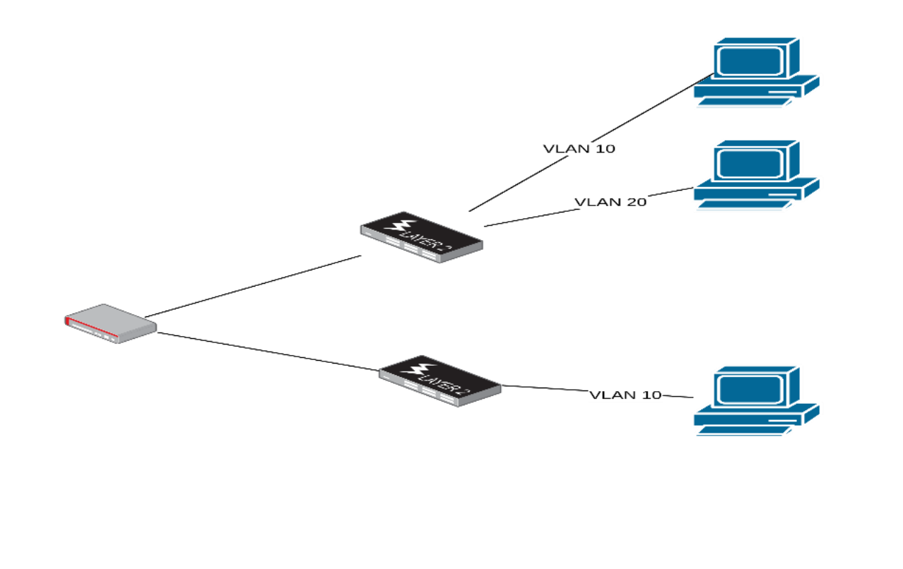
---

En esta nueva etapa incorporaremos funcionalidad de Capa 3, convirtiendo el equipo en un router inter-VLAN capaz de:

- Asignar una subred IP distinta a cada VLAN.  
- Configurarse como gateway para cada red.  
- Permitir la comunicación entre dispositivos de distintas VLAN.  
- Verificar el funcionamiento del encaminamiento.  
- (Opcionalmente) aplicar políticas de control mediante firewall.  

En términos arquitectónicos, pasaremos de un dispositivo que segmenta tráfico a nivel de switching a un equipo que:

- Recibe tráfico etiquetado.  
- Lo procesa en la pila IP.  
- Consulta la tabla de rutas.  
- Reenvía el tráfico hacia la red correspondiente.  

Este es el comportamiento típico de un router de núcleo o gateway en entornos empresariales.

No se repetirá la configuración de Capa 2 ya realizada en el documento AF18 - Configuración de un bridge con filtrado VLAN.

Nos centraremos exclusivamente en la transición hacia Capa 3 y en el funcionamiento del encaminamiento inter-VLAN.

---

## Paso 1 – Crear interfaces VLAN L3 sobre bridge-vlan

Hasta este momento, el bridge bridge-vlan estaba operando exclusivamente en Capa 2. Su función consistía en separar el tráfico por VLAN y mantener aislados los dominios de broadcast, pero no tenía capacidad de realizar encaminamiento entre redes.

En este paso crearemos interfaces VLAN lógicas de Capa 3 asociadas al bridge. Estas interfaces permitirán que el router:

- Reciba tráfico etiquetado por VLAN.  
- Lo procese a nivel IP.  
- Actúe como gateway para cada red.  

Es fundamental comprender que:

- El bridge sigue haciendo switching.  
- Las nuevas interfaces VLAN permiten hacer routing.  
- No estamos modificando la configuración L2 existente.  

En términos prácticos, estamos “dándole dirección IP” a cada VLAN para convertirla en una red enrutable. Este es el punto exacto donde el dispositivo deja de ser solo un switch segmentado y empieza a comportarse como un router inter-VLAN.

A continuación, creamos una interfaz VLAN lógica de Capa 3 asociada a la VLAN 10 sobre el bridge “bridge-vlan”:
```
interface/vlan/add \
name=vlan10 \
interface=bridge-vlan \
vlan-id=10
```
---

Este comando genera una interfaz virtual que procesará exclusivamente el tráfico etiquetado con VLAN ID 10 y permitirá, en el siguiente paso, asignarle direccionamiento IP.

Seguidamente, repetimos el procedimiento para la VLAN 20:

```
interface/vlan/add \
name=vlan20 \
interface=bridge-vlan \
vlan-id=20
```
De este modo, disponemos de dos interfaces independientes —vlan10 y vlan20— preparadas para actuar como gateway de sus respectivas redes.

Para comprobar que ambas interfaces se han creado correctamente, ejecutamos:
```
interface/vlan/print
```

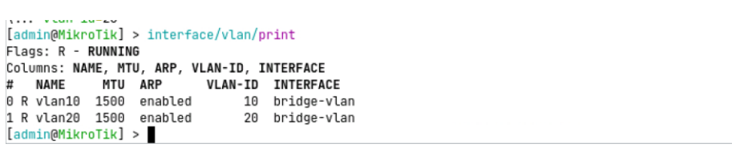
---
El resultado muestra las dos interfaces asociadas al bridge bridge-vlan con sus
correspondientes identificadores VLAN.
## PASO 2 — Asignar direccionamiento IP a cada VLAN

Una vez creadas las interfaces VLAN de Capa 3, el siguiente paso consiste en asignar una subred IP distinta a cada una de ellas, permitiendo que el router actúe como gateway para ambas redes.

En este ejemplo utilizaremos el siguiente esquema:

- VLAN 10 → 192.168.10.0/24 Gateway: 192.168.10.1  
- VLAN 20 → 192.168.20.0/24 Gateway: 192.168.20.1  

Este diseño es habitual en entornos empresariales, ya que asocia cada VLAN a una subred diferenciada, facilitando la identificación, la gestión y el diagnóstico de red.

Para asignar las direcciones IP a cada interfaz VLAN, ejecutamos:
```
ip/address/add \
address=192.168.10.1/24 \
interface=vlan10
```
```
ip/address/add \
address=192.168.20.1/24 \
interface=vlan20
```
Podemos comprobar la asignación, ejecutando:
```
ip/address/print
```

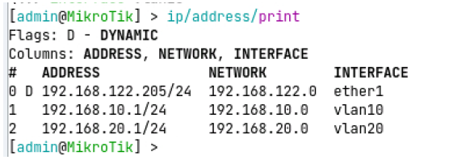

Como se explicó previamente, al asignar una dirección IP a una interfaz en RouterOS se producen automáticamente varios efectos a nivel de routing:

- El sistema crea una ruta conectada en la tabla de enrutamiento.  
- La red asociada pasa a estar directamente alcanzable desde el router.  
- La dirección IP configurada se convierte en la puerta de enlace para los dispositivos de esa VLAN  

---

Este comportamiento se debe a que RouterOS tiene el encaminamiento habilitado por defecto. No es necesario activar ningún mecanismo adicional para permitir el reenvío de tráfico entre redes directamente conectadas.

En consecuencia, a partir de este punto:

- El router reconoce ambas subredes como propias.  
- Está capacitado para reenviar tráfico entre ellas.  
- Queda habilitado el routing inter-VLAN a nivel de Capa 3.  

Para verificar la presencia de las rutas conectadas, ejecutamos:
```
ip/route/print
```

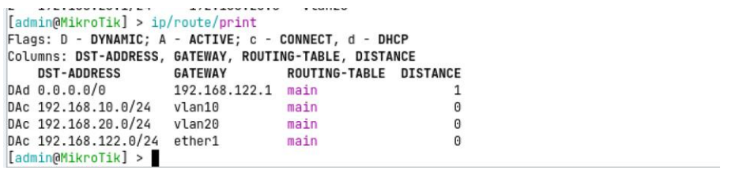
En la tabla de rutas deben aparecer ambas redes marcadas como DAC (Dynamic, Active, Connected), lo que confirma que el router está preparado para realizar encaminamiento entre ellas.


---

## PASO 3 — Configuración de servidor DHCP por VLAN

Hasta este momento, los dispositivos cliente requieren configuración manual de dirección IP, máscara, gateway y DNS. Este enfoque no es escalable ni operativo en entornos reales, por lo que implementaremos un servidor DHCP independiente para cada VLAN.

En RouterOS, el servidor DHCP se asocia siempre a una interfaz específica. Esto implica que cada VLAN debe disponer de su propio servicio DHCP vinculado a su interfaz de Capa 3 correspondiente (vlan10 y vlan20). De esta forma, cada red gestionará automáticamente su propio direccionamiento sin interferir con las demás.

Para configurar el servidor DHCP de la VLAN 10, ejecutaremos el asistente de configuración:
```
ip/dhcp-server/setup
```
Y seleccionaremos los siguientes parámetros:


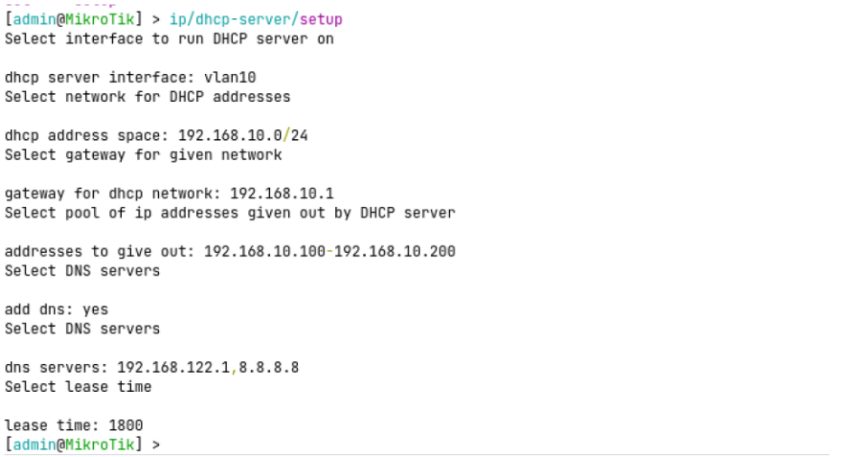
Para configurar el servidor DHCP de la VLAN 20, volvemos a ejecutar el asistente:
```
ip/dhcp-server/setup
```
Y seleccionaremos los siguientes parámetros:

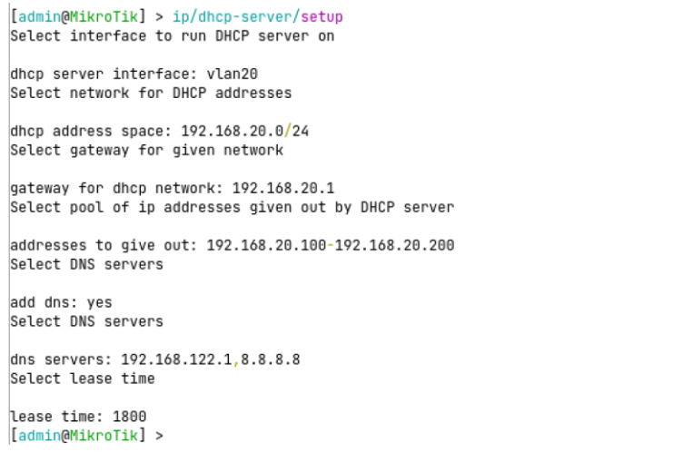

Con esto, cada VLAN dispone de su propio servicio DHCP independiente. Para comprobar que ambos servidores están activos, ejecutamos:
```
ip/dhcp-server/print
```
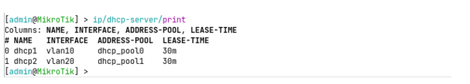

Para verificar las redes asociadas a cada servidor, ejecutamos:
```
ip/dhcp-server/network/print
```
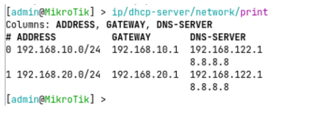

Y para comprobar las concesiones asignadas a los clientes (si ya han solicitado dirección), ejecutamos:
```
ip/dhcp-server/lease/print
```
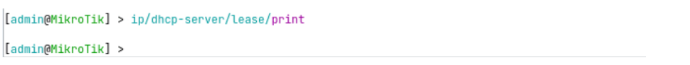

En este punto, el router no solo enruta entre VLAN, sino que también gestiona automáticamente el direccionamiento de cada red, reproduciendo el comportamiento habitual de un gateway en un entorno empresarial segmentado.

---

## Paso 4 — Configuración de los clientes para obtener dirección IP mediante DHCP

Una vez configurados los servidores DHCP para cada VLAN, el siguiente paso consiste en adaptar los dispositivos cliente para que obtengan automáticamente su configuración de red.

Para realizar este ajuste, debemos modificar la configuración de cada instancia cliente. En el entorno de laboratorio, hacemos clic con el botón derecho sobre la máquina correspondiente y seleccionamos la opción “Edit config”.

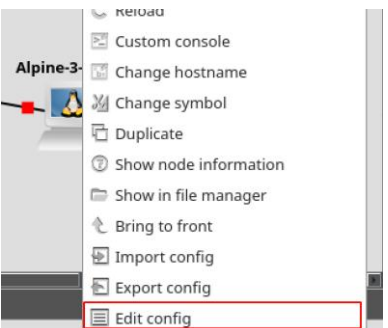

Dentro de cada instancia, localizamos el bloque de configuración de red donde anteriormente se definía la dirección IP de forma manual. En este punto, debemos comentar la configuración estática (dirección IP, máscara y gateway) y descomentar o activar la configuración que solicita dirección IP mediante DHCP.

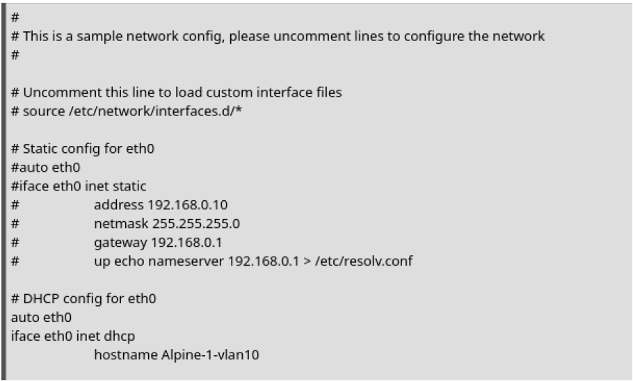

Una vez aplicada la modificación en la configuración de red de cada instancia, procedemos a iniciarlas para que soliciten automáticamente una dirección IP al servidor DHCP correspondiente a su VLAN.

Durante el arranque, cada cliente enviará una solicitud DHCP (DHCP Discover) dentro de su dominio de broadcast. El router, a través del servidor DHCP asociado a la interfaz VLAN correspondiente, responderá asignando una dirección IP disponible junto con los parámetros de red definidos.

Para verificar que las direcciones se han asignado correctamente, podemos ejecutar en el router el siguiente comando:
```
ip/dhcp-server/lease/print
```
La salida mostrará las concesiones activas, indicando la dirección IP asignada, la dirección MAC del cliente y el estado de la concesión. Esto confirma que el servicio DHCP está funcionando correctamente en cada VLAN.

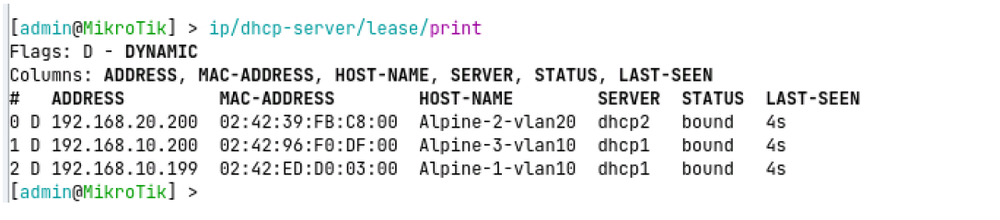

Como puede observarse, los equipos pertenecientes a la VLAN 10 han recibido direcciones IP dentro del rango 192.168.10.0/24, mientras que los equipos de la VLAN 20 han obtenido direcciones dentro del rango 192.168.20.0/24.

Esto confirma que cada servidor DHCP está funcionando correctamente y que la asignación de direcciones se realiza en función de la interfaz VLAN asociada.

A continuación, podemos verificar la conectividad realizando pruebas de ping entre los distintos equipos. Es recomendable comprobar:

- Conectividad intra-VLAN (entre dispositivos de la misma VLAN).  
- Conectividad inter-VLAN (entre dispositivos de VLAN 10 y VLAN 20).  

En el segundo caso, el tráfico deberá atravesar el router, que actuará como gateway y realizará el encaminamiento entre redes.

Si la configuración es correcta, los equipos de distintas VLAN podrán comunicarse entre sí a través del router, validando así el funcionamiento del routing inter-VLAN.

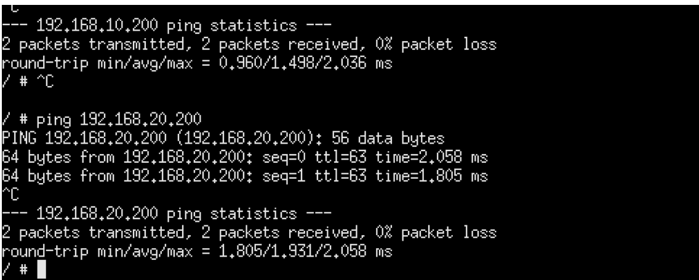

---

Con la configuración aplicada, es fundamental entender que las interfaces vlan10 y vlan20 funcionan como interfaces virtuales de Capa 3, equivalentes desde el punto de vista lógico a interfaces físicas independientes. Cada una representa una red distinta dentro del router, dispone de su propio direccionamiento IP y participa de forma autónoma en la tabla de enrutamiento.

Por defecto, el tráfico entre las VLAN configuradas está permitido, ya que RouterOS reenvía automáticamente paquetes entre redes directamente conectadas. No obstante, este comportamiento puede regularse mediante reglas de firewall en la cadena forward, donde es posible definir qué comunicaciones se autorizan o se bloquean entre redes.

El mecanismo es idéntico al empleado en el escenario de configuración de la DMZ: el router analiza el tráfico que atraviesa de una interfaz a otra y aplica políticas explícitas basadas en criterios definidos por el administrador. De este modo, una simple interconexión entre VLAN puede evolucionar hacia una arquitectura segmentada, controlada y alineada con los estándares de seguridad propios de entornos empresariales.

---

## Diferencia operativa entre comunicación intra-VLAN e inter-VLAN

Cuando dos dispositivos pertenecen a la misma VLAN —por ejemplo, VLAN 10— y uno envía tráfico al otro, toda la comunicación se resuelve exclusivamente en Capa 2. El equipo emisor comprueba, mediante su máscara de red, que la dirección IP de destino forma parte de su misma subred, por lo que no necesita recurrir al gateway. Si desconoce la dirección MAC del destinatario, realiza una solicitud ARP dentro de la propia VLAN 10. Una vez obtenida la MAC, el paquete IP se encapsula en una trama Ethernet etiquetada con VLAN 10 y el bridge la reenvía directamente al puerto correspondiente. En este escenario el router no interviene en ningún momento, ya que el tráfico no abandona el dominio de broadcast de la VLAN.

Sin embargo, cuando un dispositivo de VLAN 10 intenta comunicarse con otro de VLAN 20, el comportamiento cambia sustancialmente. El equipo emisor detecta que la dirección IP de destino no pertenece a su red local y, por tanto, envía el tráfico al gateway configurado (la dirección IP del router en VLAN 10). El bridge entrega la trama etiquetada a la interfaz vlan10, donde el tráfico asciende a Capa 3. El router analiza la cabecera IP, consulta la tabla de rutas y determina que la red de destino está asociada a la interfaz vlan20. Acto seguido, vuelve a encapsular el paquete en una nueva trama Ethernet, esta vez etiquetada con VLAN 20, y lo reenvía hacia el destino. En este caso sí interviene el router, produciéndose el encaminamiento inter-VLAN.
