# Servicio DNS.

## Índice

Introducción
Escenario de partida
Verificar el estado actual del DNS  
Configurar servidores DNS conocidos de manera manual  
Habilitar las peticiones DNS desde clientes externos  
Evitar dynamic-servers 
Integración del servicio DNS en los servidores DHCP 
Configuración de registros DNS estáticos   
Comprobación del estado de la caché DNS  
Interceptar peticiones DNS de la red interna, y forzar su resolución   
Conclusión 

## Introducción

El sistema operativo MikroTik RouterOS incorpora un servicio DNS integrado que puede actuar como DNS caché, DNS reenviador (forwarder), resolver para el propio router y servidor DNS para los equipos de la red.

Es fundamental comprender que RouterOS no es un servidor DNS autoritativo completo, como podría ser BIND o un entorno basado en Active Directory, sino un sistema orientado principalmente a la resolución y reenvío de consultas.

Cuando un cliente realiza una petición DNS al router, este sigue un proceso estructurado:

- Primero comprueba si existe una entrada estática configurada.
- Si no existe una entrada estática, revisa su caché.
- En caso de no encontrar respuesta en la caché, reenvía la consulta a los servidores DNS externos definidos.
- Cuando el servicio DNS encuentra una respuesta válida, la almacena temporalmente y la devuelve al cliente.

El servicio DNS forma parte del sistema y no requiere instalación ni activación independiente; el router puede resolver nombres para su propio funcionamiento siempre que tenga servidores configurados.

No obstante, para que los dispositivos de la red puedan utilizarlo como servidor DNS es necesario habilitar explícitamente el acceso desde equipos externos.

En los próximos apartados trabajaremos de forma práctica y estructurada la configuración del servicio DNS en RouterOS.

## Escenario de partida.

Para el desarrollo de los ejemplos y prácticas de esta unidad partiremos del escenario previamente configurado en el documento AF16 – Configuración de una DMZ.

De este modo, los ejemplos no se plantearán en un entorno aislado, sino en un escenario realista en el que el DNS interactúa con la LAN, la DMZ y el acceso a Internet, permitiendo comprender su papel dentro de una arquitectura de red completa.

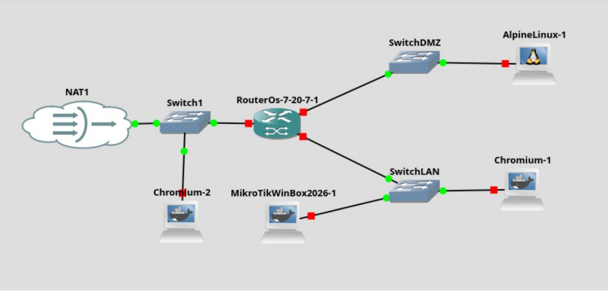

## Verificar el estado actual del DNS

Para analizar el estado actual del servidor DNS, podemos ejecutar el siguiente comando:

```bash
/ip/dns/print
```
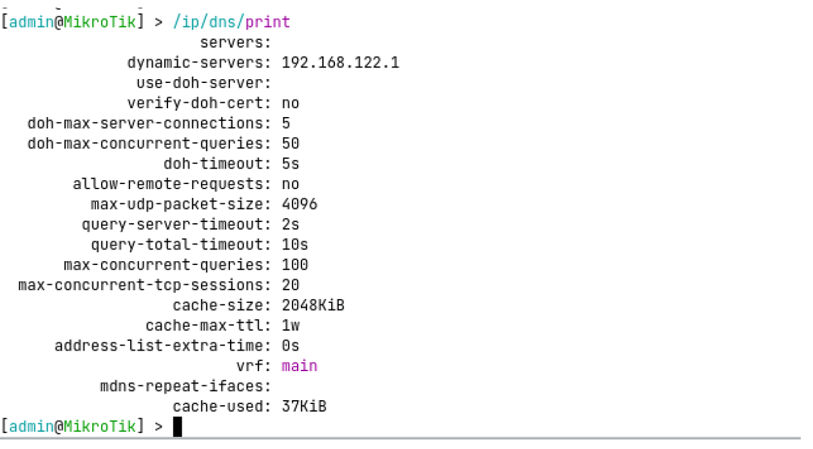

En la salida se pueden observar los siguientes parámetros básicos:

- **servers:** (vacío)
  - No hay DNS “manuales” configurados (por ejemplo 1.1.1.1, 8.8.8.8).
  - Eso no significa que el router no pueda resolver; significa que depende de los “dynamic-servers”.
- **dynamic-servers:** 192.168.122.1
  - Servidores dinámicos recibidos del servidor DHCP al que se ha conectado el router (en este caso, el servidor DNS de la red NAT de GNS3)
- **allow-remote-requests:** no
  - No se permiten conexiones remotas al servicio DNS.
  - Los clientes en LAN/DMZ no pueden usar al router como servidor DNS.

## Configurar servidores DNS conocidos de manera manual.

Vamos a configurar dos servidores DNS conocidos, para que nuestro servidor DNS consulte a los mismos, cuando no tenga respuesta en caché.

En este caso, configuraremos los servidores 1.1.1.1 (DNS público de cloudflare) y 8.8.8.8 (DNS público de Google), ejecutando el siguiente comando:

```bash
/ip/dns/set servers=1.1.1.1,8.8.8.8
```
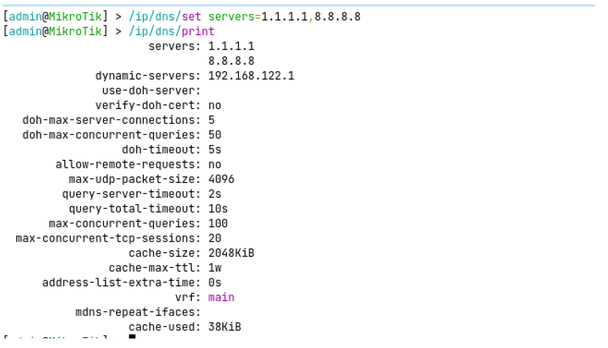
## Habilitar las peticiones DNS desde clientes externos.

Vamos a configurar la opción que permitirá a los clientes utilizar el servidor DNS del router ejecutando el siguiente comando:

```bash
/ip/dns/set allow-remote-requests=yes
```
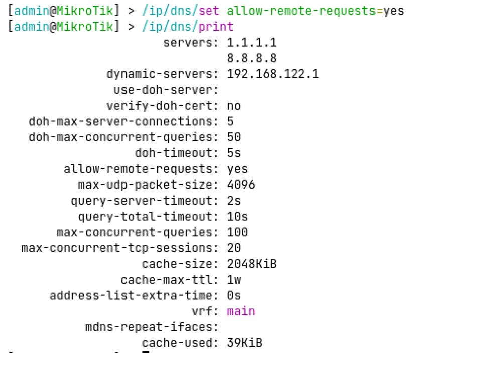
Debemos recordar que esta configuración no obliga a los clientes a usar el router. Solo lo permite.

## Evitar dynamic-servers

Si tenemos configurado un cliente DHCP en la interfaz ether1, para obtener la configuración de la red WAN del servidor DNS de la red, RouterOS incluye los servidores DNS proporcionados en el parámetro dynamic-servers.

Para evitar confusiones sobre que servidor DNS se está utilizando en las resoluciones de nombres, vamos a eliminar este parámetro.

Para ello, en primer lugar, mostramos el listado de clientes dhcp del router, ejecutando:

```bash
/ip/dhcp-client/print
```
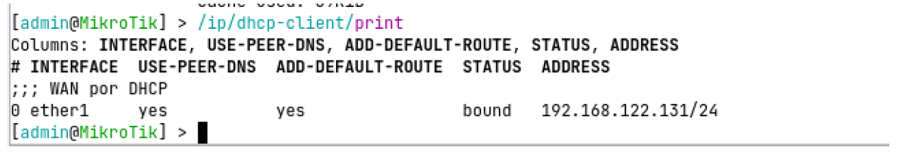

Identificamos el índice del cliente DHCP (en este caso el 0), y ejecutamos el siguiente comando, para eliminar el uso de dns proporcionados dinámicamente:

```bash
ip/dhcp-client/set 0 use-peer-dns=no
```

Como alternativa, se puede modificar el parámetro utilizando un filtro por interfaz:

```bash
ip/dhcp-client/set [find where interface=ether1] use-peer-dns=no
```
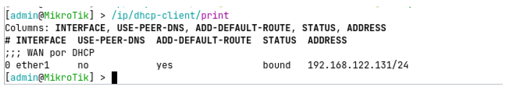

Podemos comprobar el resultado, mirando el detalle de la configuración del servidor DNS:

```bash
/ip/dns/print
```
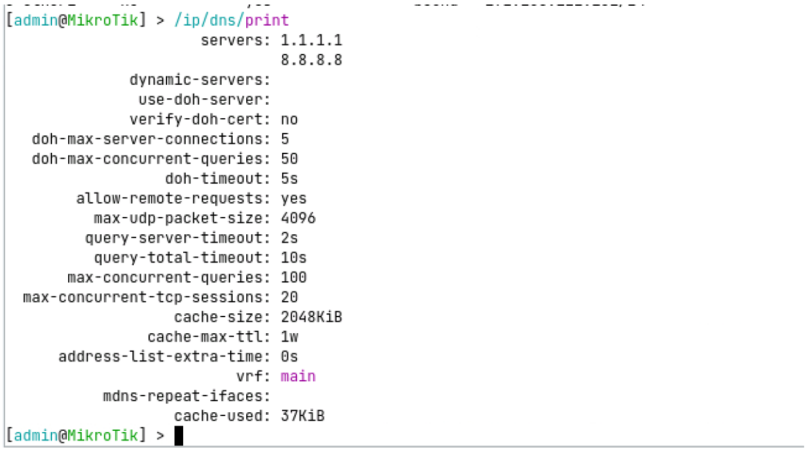

En la salida podremos observar como el parámetro dynamic-servers se encuentra vacío, y solo quedan los servidores DNS configurados de manera manual.

Podemos validar la resolución de nombres, ejecutando en el router el siguiente comando:

```bash
:put [:resolve www.google.com]
```
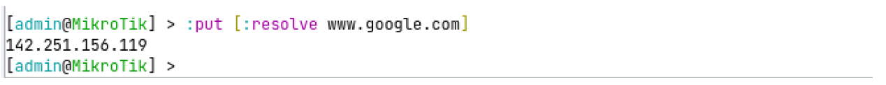
## Integración del servicio DNS en los servidores DHCP

Con la configuración actual, el router puede resolver peticiones DNS, pero los clientes de LAN y DMZ no lo utilizan. Vamos a modificar la configuración del servidor DHCP, para que los clientes de la LAN (y DMZ si procede) utilicen el router como servidor DNS.

Antes de modificar la configuración, vamos a identificar las IP del router en cada uno de los bridges, ejecutando el comando:

```bash
ip/address/print.
```
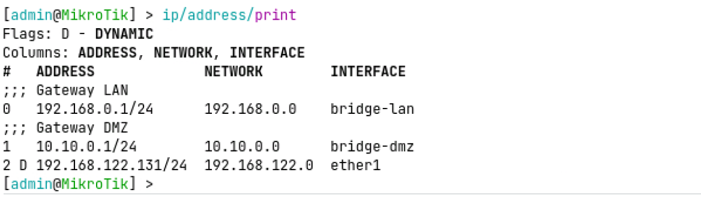
En la captura podemos observar la IP de bridge-lan (192.168.0.1/24) y la IP de bridge-dmz (10.10.0.1/24).

También debemos revisar la configuración de los servidores DHCP del router, para poder identificar sobre qué servidor debemos realizar cada modificación, ejecutando el siguiente comando:

```bash
ip/dhcp-server/print.
```
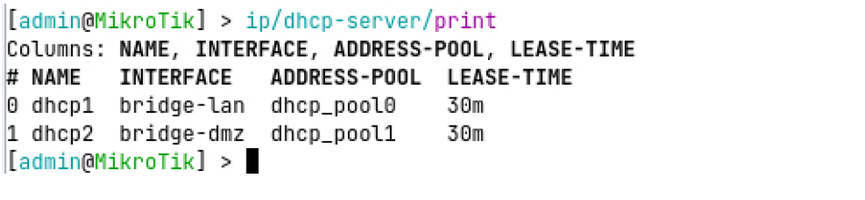
Teniendo en cuenta las capturas anteriores, vamos a modificar el parámetro dns-server de la configuración de red de los dos servidores DHCP, para que utilicen la IP del router como servidor DNS de los clientes:

```bash
ip/dhcp-server/network/set [find where interface=bridge-lan] dns-server=192.168.0.1
ip/dhcp-server/network/set [find where interface=bridge-dmz] dns-server=10.10.0.1
```
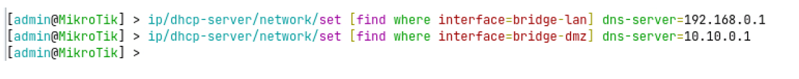
También podríamos haber ejecutado los comandos utilizando el índice del servidor DHCP, en lugar de un filtro:

```bash
ip/dhcp-server/network/set 0 dns-server=192.168.0.1
ip/dhcp-server/network/set 1 dns-server=10.10.0.1
```
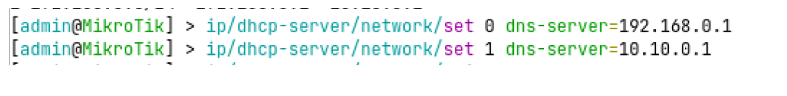

Validamos, mostrando la configuración de las redes de los servidores DHCP

```bash
ip/dhcp-server/network/print
```
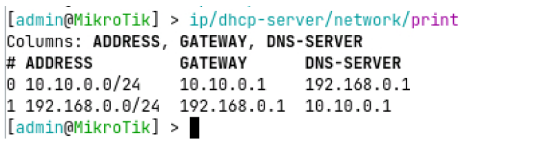
Si accedemos a un cliente y renovamos su IP, podremos comprobar la nueva configuración recibida:

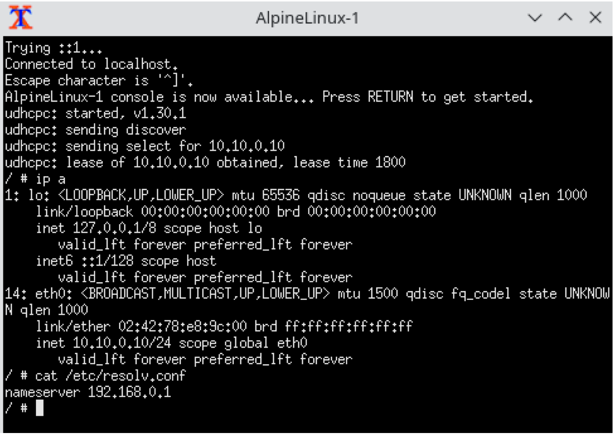

Recuerda que en el tema anterior configuramos reglas de firewall, que impedirán realizar peticiones DNS al router, desde cualquier red.

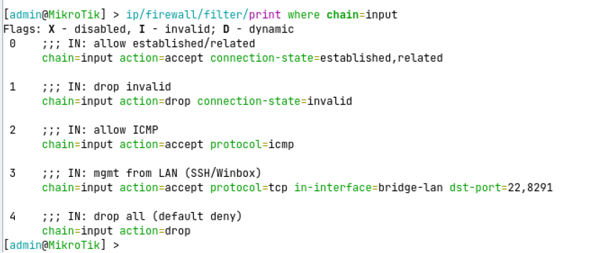

Para permitir este tráfico, deberás habilitar las peticiones desde la red interna:

- Habilitamos peticiones TCP y UDP al puerto 53 desde bridge-lan, incluyendo la regla antes de la regla de bloqueo general de la cadena input

```bash
ip/firewall/filter/add chain=input protocol=tcp dst-port=53 \
in-interface=bridge-lan action=accept place-before=4 \
comment="IN: allow DNS TCP from LAN"

ip/firewall/filter/add chain=input protocol=udp dst-port=53 \
in-interface=bridge-lan action=accept place-before=4 \
comment="IN: allow DNS UDP from LAN"
```

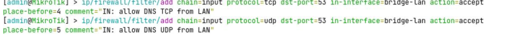
- Y habilitamos la misma regla para peticiones realizadas desde bridge-dmz, incluyendo la regla antes de la regla de bloqueo general de la cadena input

```bash
ip/firewall/filter/add chain=input protocol=tcp dst-port=53 \
in-interface=bridge-dmz action=accept place-before=4 \
comment="IN: allow DNS TCP from DMZ"

ip/firewall/filter/add chain=input protocol=udp dst-port=53 \
in-interface=bridge-dmz action=accept place-before=4 \
comment="IN: allow DNS UDP from DMZ"
```
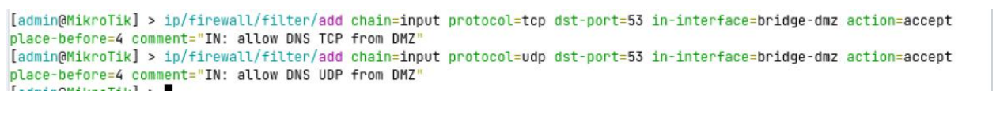
Volvemos a comprobar el estado de las reglas de firewall, para la cadena input:

```bash
ip/firewall/filter/print where chain=input
```
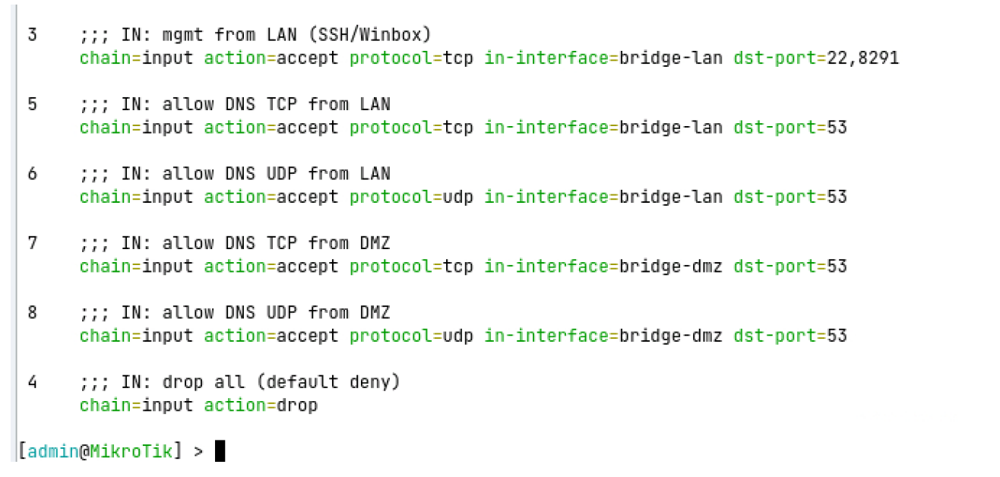
Si todo ha ido bien, ya podremos realizar resoluciones de nombre desde la red interna:

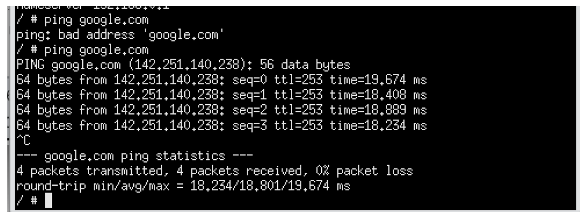

Se pueden crear reglas para listas de interfaces, de manera que podamos agrupar las reglas que son para todas las redes internas, por ejemplo. Si quieres saber más sobre el tema, busca información sobre el uso del parámetro interface-list en mikrotik

## Configuración de registros DNS estáticos

Una vez configurado y protegido el servicio DNS, el siguiente paso consiste en incorporar resolución de nombres interna mediante entradas estáticas.

En una red estructurada como la del escenario AF16 (con LAN y DMZ), no es recomendable acceder a los servicios únicamente por dirección IP; lo correcto es utilizar nombres coherentes que faciliten la administración y reflejen la función de cada equipo.

En este apartado aprenderemos a crear registros DNS estáticos en el router para que los servicios internos puedan resolverse localmente, sin depender de servidores externos y manteniendo el control completo de la resolución dentro de la red.

En primer lugar, vamos a listar las entradas estáticas de nuestro servidor DNS:

```bash
ip/dns/static/print
```
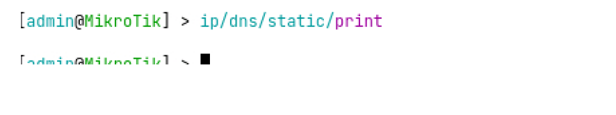
Como vemos, el servidor no tiene ninguna entrada configurada por defecto.

Para crear una entrada DNS estática para nuestro servidor web, que resuelva el nombre “intranet.local” a la IP 10.10.0.10, utilizaremos el siguiente comando:

```bash
ip/dns/static/add name=intranet.local address=10.10.0.10 \
comment="Intranet DMZ"
```
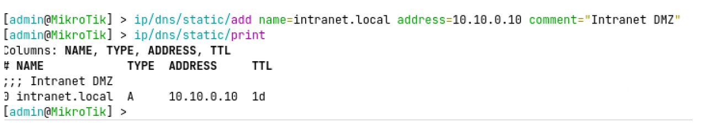
A continuación, podemos comprobar como el nombre DNS se puede utilizar desde los appliances desplegados en la red interna:

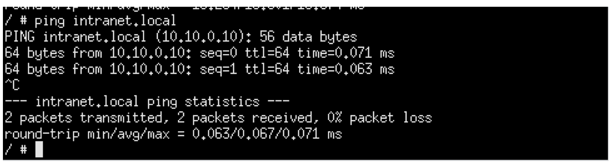

Vamos a añadir una nueva entrada, para el dominio intranet.gva.es, que se traduzca por la misma IP.

```bash
ip/dns/static/add name=intranet.gva.es address=10.10.0.10 \
comment="Intranet gva falsa"
```
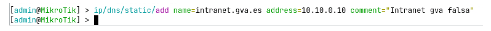
Comprobemos como el cliente resolverá la IP interna, si intenta acceder al nuevo dominio configurado.

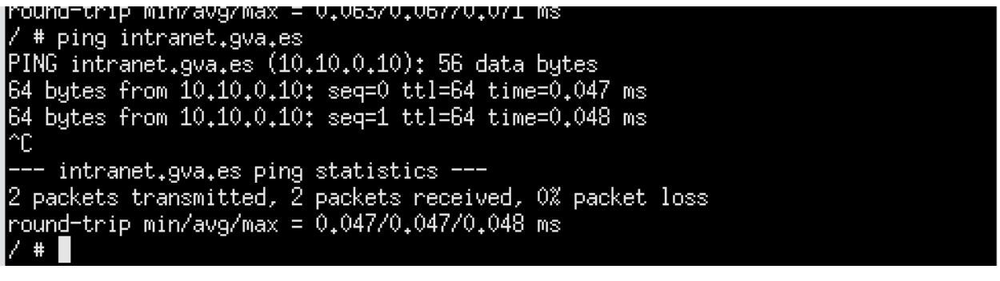

Con esto nuestros alumnos podrán comprender como la configuración del servidor DNS de la red puede condicionar la navegación de todos los clientes 😊

## Comprobación del estado de la caché DNS

Una vez realizadas varias consultas DNS, es recomendable comprobar el estado de la caché del router para entender cómo está gestionando las resoluciones.

En MikroTik RouterOS, la caché DNS almacena temporalmente las respuestas obtenidas, evitando tener que consultar repetidamente a los servidores externos y reduciendo así la latencia y el tráfico saliente.

Para visualizar su contenido utilizamos el comando:

```bash
ip/dns/cache/print
```

Este comando muestra los nombres de dominio que han sido resueltos recientemente, la dirección IP asociada y el tiempo restante de validez (TTL).

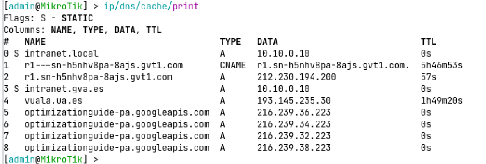

Esta comprobación permite verificar que el servicio DNS está funcionando correctamente, que los clientes están utilizando el router como servidor DNS y que el mecanismo de optimización mediante caché está operativo.

Podemos borrar la cache DNS ejecutando:

```bash
ip/dns/cache/flush
```
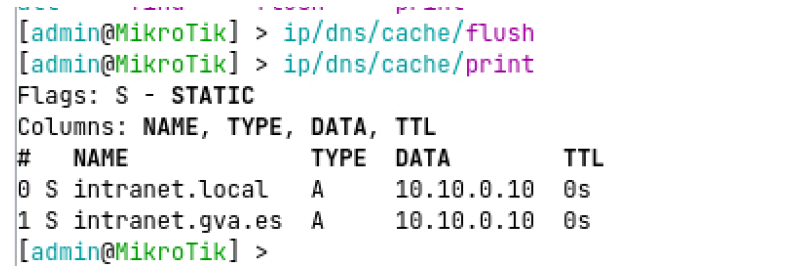

## Interceptar peticiones DNS de la red interna, y forzar su resolución

Aunque hayamos configurado nuestro servidor DNS en el router, los clientes de la red interna pueden utilizar su servidor preferido, modificando su configuración de red.

En la siguiente captura podemos ver una configuración de red de Alpine Linux que seguiría enviando las peticiones de resolución de nombre al servidor DNS de Google (8.8.8.8)

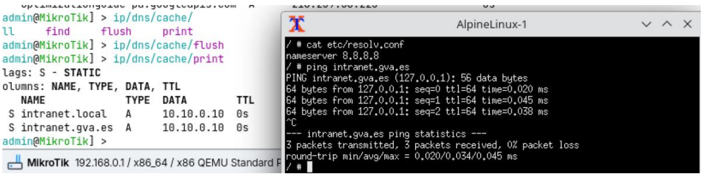

Para evitar este comportamiento, podemos redirigir las peticiones a servidores DNS externos, para que las resuelva el servidor DNS de nuestro router, mediante estas cuatro instrucciones:

```bash
ip/firewall/nat/add chain=dstnat protocol=tcp dst-port=53 \
in-interface=bridge-lan action=redirect to-ports=53 \
comment="Forzar DNS TCP de LAN hacia router"

ip/firewall/nat/add chain=dstnat protocol=udp dst-port=53 \
in-interface=bridge-lan action=redirect to-ports=53 \
comment="Forzar DNS UDP de LAN hacia router"

ip/firewall/nat/add chain=dstnat protocol=tcp dst-port=53 \
in-interface=bridge-dmz action=redirect to-ports=53 \
comment="Forzar DNS TCP de DMZ hacia router"

ip/firewall/nat/add chain=dstnat protocol=udp dst-port=53 \
in-interface=bridge-dmz action=redirect to-ports=53 \
comment="Forzar DNS UDP de DMZ hacia router"
```

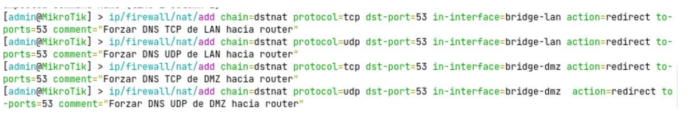

Si volvemos a probar la resolución desde la misma máquina de la red interna, veremos que se ha forzado la resolución desde el servidor DNS del router.

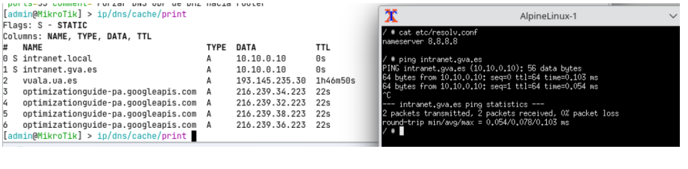

Esto es debido a que hemos forzado el siguiente comportamiento:

- Cliente intenta consultar 8.8.8.8:53
- El paquete entra por bridge-lan o bridge-dmz
- dstnat modifica el destino → router:53
- El servicio DNS del router procesa la consulta
- Si no tiene respuesta reenvía a los DNS externos configurados
- Devuelve la respuesta al cliente
- El cliente no percibe la modificación.

## Conclusión

Con la configuración realizada, el servicio DNS del router queda completamente integrado en la arquitectura de red: resuelve consultas externas, mantiene una caché optimizando el rendimiento, ofrece resolución interna mediante entradas estáticas y, si se ha configurado la redirección, impone una política de uso centralizado para todos los equipos de la LAN y la DMZ.

De este modo, el DNS deja de ser un simple servicio auxiliar y pasa a formar parte activa del diseño y la seguridad de la red, interactuando con DHCP, NAT y firewall dentro de una configuración coherente y controlada.
