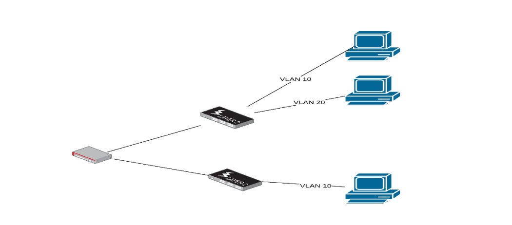
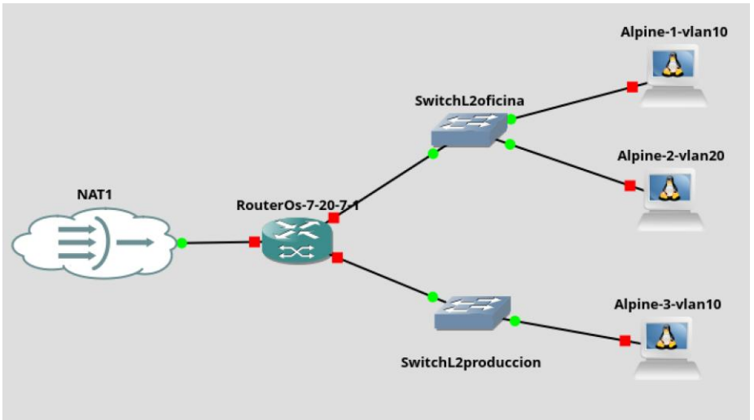
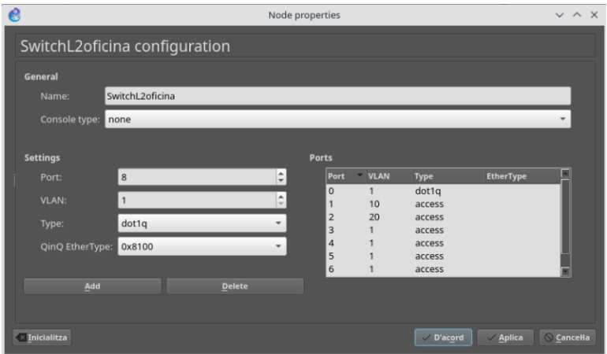
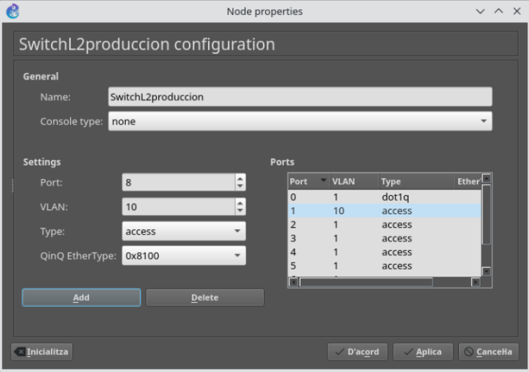
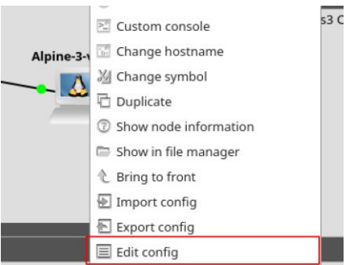
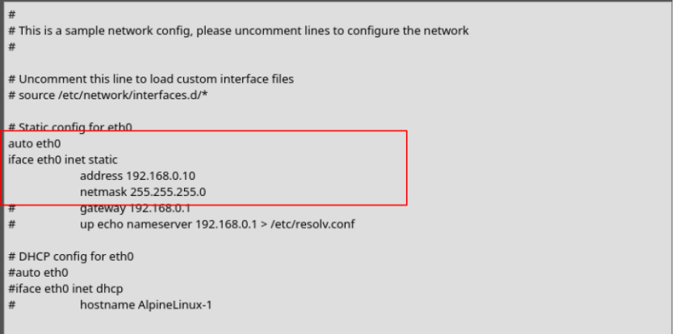
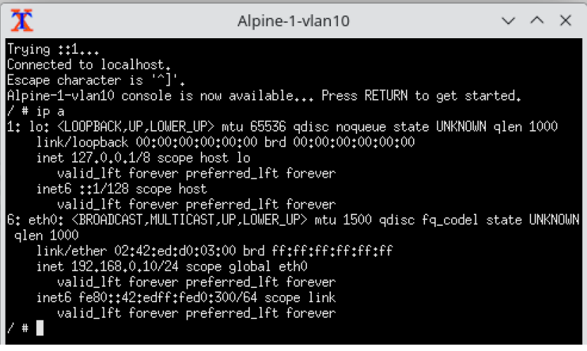
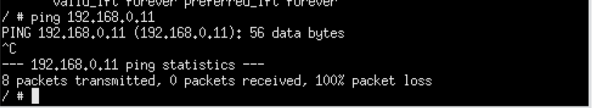
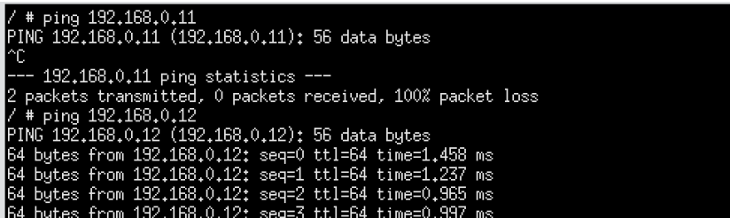

# Segmentación de red mediante VLAN en Capa 2.

## Índice

Introducción  
Configuración inicial del escenario  
Configuración del switch superior  
Configuración del switch inferior  
Configuración de los equipos Alpine Linux  
Configuración del router Mikrotik  
Paso 1 – Crear el bridge con filtrado VLAN activado  
Paso 2 – Añadir los puertos al bridge como enlaces trunk  
Paso 3 – Declarar la VLAN 10 en la tabla VLAN  
Paso 4 – Declarar la VLAN 20 en la tabla VLAN  
Paso 5 – validación de la configuración aplicada  

---

## Introducción 3

En este documento abordamos uno de los conceptos estructurales en el diseño de redes conmutadas modernas: la segmentación lógica mediante VLAN (Virtual Local Area Network).

El propósito de esta práctica no es configurar enrutamiento inter-VLAN ni desplegar servicios de red avanzados. El objetivo es comprender con claridad cómo se implementa la separación de tráfico en Capa 2 del modelo OSI, es decir, en el plano de conmutación Ethernet, utilizando filtrado VLAN en un bridge de RouterOS v7.

Para realizar el ejercicio utilizaremos:

- Switches genéricos de capa 2  
- Un router MikroTik (RouterOS v7)  
- Varios equipos finales (instancias Alpine en GNS3)  

Todos los equipos compartirán el mismo rango de direcciones IP. Sin embargo, estarán distribuidos en VLAN diferentes.

Esta decisión es deliberada desde el punto de vista didáctico: permitirá demostrar que la separación en VLAN opera en Capa 2, independientemente del direccionamiento IP configurado en los hosts.

Recordemos que cada VLAN:

- Constituye un dominio de broadcast independiente  
- Aísla el tráfico respecto a otras VLAN en el plano de conmutación  
- Requiere etiquetado IEEE 802.1Q cuando el tráfico atraviesa enlaces troncales  

En consecuencia, aunque los dispositivos estén conectados al mismo hardware físico, si pertenecen a VLAN distintas no podrán comunicarse entre sí a nivel de Capa 2. El aislamiento se produce antes de que intervenga cualquier mecanismo de enrutamiento.

---

## Configuración inicial del escenario

Comenzaremos creando un nuevo proyecto en GNS3 que reproducirá la topología de trabajo.

El escenario estará compuesto por:

- Una instancia de RouterOS v7 (MikroTik)  
- Dos instancias de Ethernet Switch genérico (Capa 2)  
- Tres instancias de Alpine Linux (equipos finales)  

Una vez creados los dispositivos, realizaremos las conexiones tal como se muestra en la figura del escenario.

---

La interconexión deberá realizarse del siguiente modo:

### Router MikroTik

- ether1 → conectado a NAT (salida a Internet)  
- ether2 → conectado al puerto 1 del switch superior (SwitchL2oficina)  
- ether3 → conectado al puerto 1 del switch inferior (SwitchL2producción)  

### Switch superior (SwitchL2oficina)

- Puerto 2 → conectado a Alpine-1-vlan10  
- Puerto 3 → conectado a Alpine-2-vlan20  

### Switch inferior (SwitchL2producción)

- Puerto 2 → conectado a Alpine-3-vlan10  

---

## Configuración del switch superior

En este punto configuraremos el switch superior para que gestione correctamente el tráfico VLAN que recibirá desde el MikroTik.

El objetivo es establecer:

- Un puerto troncal hacia el router, capaz de transportar múltiples VLAN etiquetadas mediante IEEE 802.1Q.  
- Puertos de acceso para los equipos finales, cada uno perteneciente a su VLAN correspondiente.  

La configuración deberá quedar de la siguiente manera:

- Puerto 1 (conectado a Mikrotik), configurado como Trunk 802.1Q (dot1q).  
Este puerto transportará tramas etiquetadas en este enlace.  

- Puerto 2 (conectado a Alpine-1-vlan10), configurado como access 10 (VLAN 10).  
Las tramas saldrán sin etiqueta hacia el host, pero el switch las asociará internamente a la VLAN 10.  

- Puerto 3 (conectado a Alpine-2-vlan20), configurado como access 20 (VLAN 20).  
Las tramas saldrán sin etiqueta hacia el host, pero el switch las asociará internamente a la VLAN 20.  

---

## Configuración del switch inferior

Configuraremos el switch inferior de manera similar al switch superior, con el objetivo de que gestione correctamente el tráfico VLAN que recibirá desde el MikroTik.

Para ello, estableceremos:

- Un puerto troncal hacia el router, capaz de transportar múltiples VLAN etiquetadas mediante IEEE 802.1Q.  
- Puertos de acceso para los equipos finales, cada uno perteneciente a su VLAN correspondiente.  

La configuración deberá quedar del siguiente modo:

- Puerto 1 (conectado a Mikrotik), configurado como Trunk 802.1Q (dot1q).  
Este puerto transportará tramas etiquetadas en este.  

- Puerto 2 (conectado a Alpine-3-vlan10), configurado como access 10 (VLAN 10).  
Las tramas saldrán sin etiqueta hacia el host, pero el switch las asociará internamente a la VLAN 10.  

---

Llegados a este punto, es importante que el alumnado observe que:

- Aunque Alpine-1 y Alpine-3 están conectados a switches físicos distintos, ambos pertenecen a la VLAN 10.  
- El tráfico entre ellos podrá circular porque el trunk transporta la VLAN 10 etiquetada hasta el MikroTik.  
- El aislamiento no depende del switch físico, sino de la pertenencia a la VLAN.  

Este matiz es fundamental antes de pasar a la configuración del bridge con vlan-filtering en RouterOS, donde el MikroTik actuará como elemento central de segmentación en Capa 2.

---

## Configuración de los equipos Alpine Linux

Para realizar las pruebas de conectividad, asignaremos direccionamiento IP estático a todas las instancias de Alpine Linux.

Todos los equipos compartirán el mismo rango de red (192.168.0.0/24), lo cual es una decisión deliberada para demostrar que la separación VLAN opera en Capa 2, independientemente del direccionamiento IP configurado.

Propuesta de asignación:

- Alpine-1-vlan10 → IP 192.168.0.10/24  
- Alpine-2-vlan20 → IP 192.168.0.11/24  
- Alpine-3-vlan10 → IP 192.168.0.12/24  

En esta fase no configuraremos puerta de enlace, ya que no estamos trabajando todavía con enrutamiento.

Para configurar IP estática en las instancias Alpine, pulsamos botón derecho sobre la instancia y seleccionamos la opción “Edit config”.

Descomentamos y modificamos las líneas correspondientes a la configuración estática, adaptándolas al escenario.

Es importante que el alumnado comprenda que estamos configurando la IP directamente en el sistema operativo, no en el switch ni en el router.

Una vez modificada la configuración, arrancamos las instancias, y comprobamos que la IP se ha aplicado correctamente, ejecutando el comando <<ip a>>.

---

Se debe verificar:

- Que la interfaz tiene asignada la dirección correcta.  
- Que la máscara es /24.  
- Que la interfaz está en estado UP.  

En este punto, podemos realizar una prueba de conectividad entre Alpine-1-vlan10 (192.168.0.10) y Alpine-2-vlan20 (192.168.0.11) ejecutando un ping entre ellas.

El resultado esperado es que no haya respuesta.

Este comportamiento es correcto y deseado, ya que:

- Ambos equipos están en el mismo rango IP.  
- Pero pertenecen a VLAN diferentes.  
- Y, por tanto, se encuentran en dominios de broadcast distintos.  

Aunque el direccionamiento IP coincida, la separación en Capa 2 impide que se resuelva ARP entre ellos.

---

## Configuración del router Mikrotik

Hasta este momento hemos trabajado con switches tradicionales de Capa 2, donde la gestión de VLAN se realiza directamente sobre los puertos del propio dispositivo. En ese modelo, un puerto configurado como access pertenece a una única VLAN y asigna internamente esa VLAN al tráfico no etiquetado que recibe. Por su parte, un puerto configurado como trunk transporta múltiples VLAN de forma simultánea, utilizando etiquetado IEEE 802.1Q para identificar a qué VLAN pertenece cada trama. En este enfoque, la lógica de segmentación se implementa íntegramente dentro del propio switch.

Sin embargo, en RouterOS v7 el planteamiento es diferente. Un dispositivo MikroTik no es únicamente un router; también puede actuar como un switch de Capa 2 mediante la creación de un bridge. Este bridge agrupa interfaces físicas y permite la conmutación de tráfico entre ellas.

La diferencia clave aparece cuando activamos el parámetro vlan-filtering=yes. En ese momento, el bridge deja de comportarse como un simple conmutador transparente y pasa a funcionar como un switch gestionable con soporte VLAN. Es decir, incorpora su propia tabla VLAN, permite definir qué puertos pertenecen a cada VLAN y controla qué tráfico puede circular por cada interfaz.

En consecuencia, la segmentación ya no se configura directamente en cada puerto como ocurre en un switch tradicional. En RouterOS, la lógica VLAN se implementa en el bridge mediante la combinación de:

- La configuración de los puertos dentro del bridge.  
- La tabla VLAN del bridge.  
- La activación explícita del filtrado VLAN.  

Una vez comprendido el modelo conceptual de funcionamiento del bridge con filtrado VLAN en RouterOS, vamos a trasladar estos principios teóricos a nuestro escenario y diseñar paso a paso su implementación práctica.

---

## Paso 1 – Crear el bridge con filtrado VLAN activado

/interface/bridge/add \
name=bridge-vlan \
vlan-filtering=yes \
protocol-mode=rstp

---

## Paso 2 – Añadir los puertos al bridge como enlaces trunk

/interface/bridge/port/add \
bridge=bridge-vlan \
interface=ether2 \
ingress-filtering=yes \
frame-types=admit-only-vlan-tagged

/interface/bridge/port/add \
bridge=bridge-vlan \
interface=ether3 \
ingress-filtering=yes \
frame-types=admit-only-vlan-tagged

---

## Paso 3 – Declarar la VLAN 10 en la tabla VLAN

/interface/bridge/vlan/add \
bridge=bridge-vlan \
vlan-ids=10 \
tagged=bridge-vlan,ether2,ether3

---

## Paso 4 – Declarar la VLAN 20 en la tabla VLAN

/interface/bridge/vlan/add \
bridge=bridge-vlan \
vlan-ids=20 \
tagged=bridge-vlan,ether2

---

## Paso 5 – validación de la configuración aplicada

Con esta configuración:

- El MikroTik actúa como un switch de Capa 2 con filtrado VLAN.  
- Los equipos en VLAN 10 pueden comunicarse entre sí, aunque estén en switches distintos.  
- Los equipos en VLAN 20 solo pueden comunicarse dentro de su VLAN.  
- No existe comunicación entre VLAN 10 y VLAN 20.  

El aislamiento se produce íntegramente en Capa 2, sin necesidad de enrutamiento.

Para validar la configuración, realizaremos pruebas de conectividad desde Alpine-1-vlan10 (192.168.0.10) hacia el resto de los equipos.

