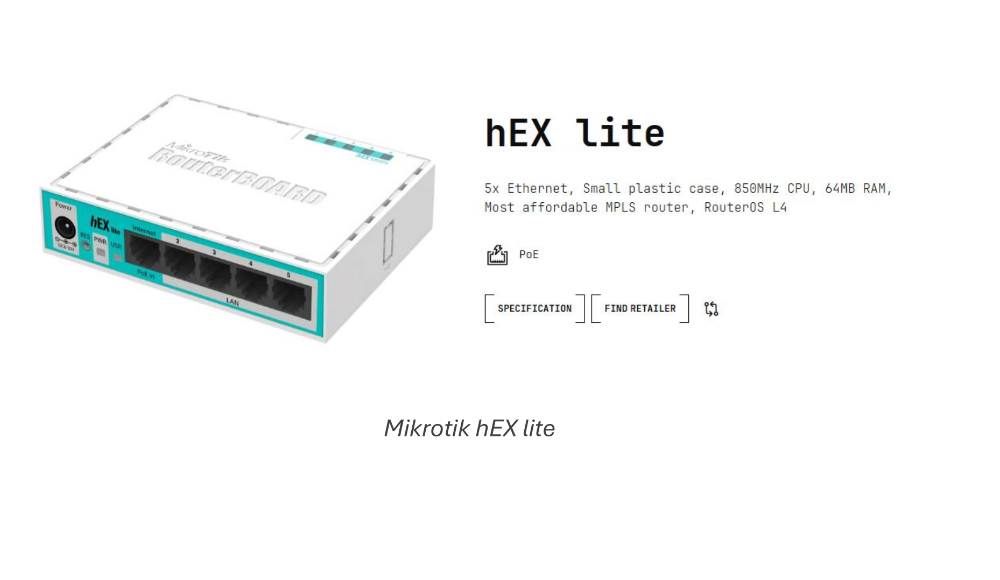
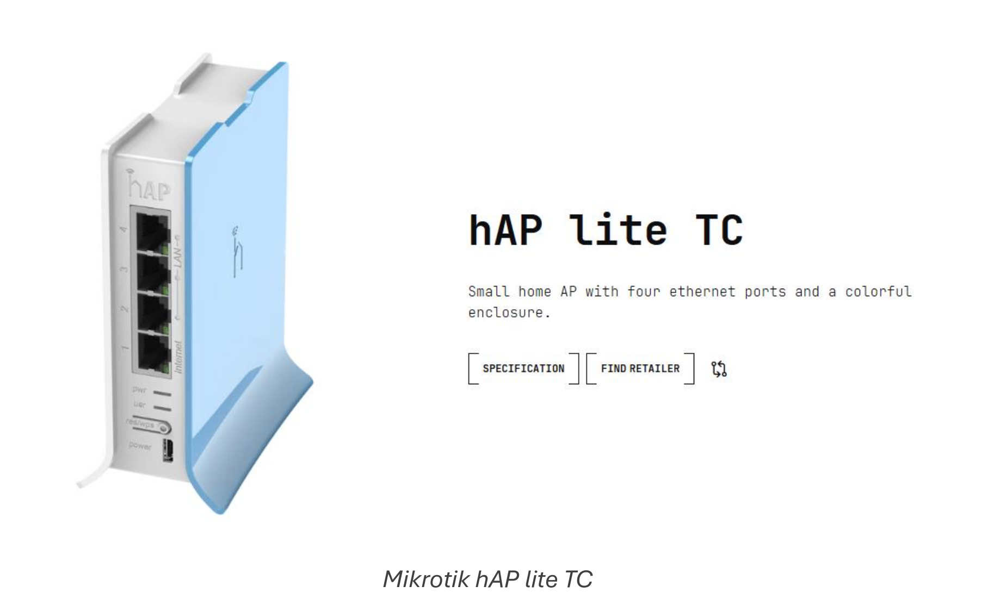
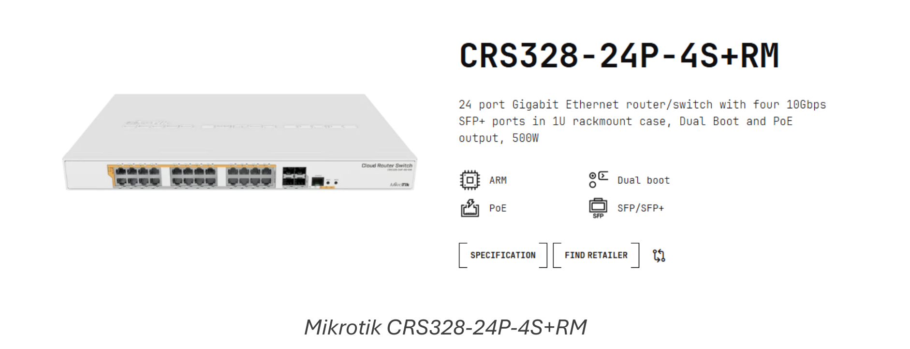
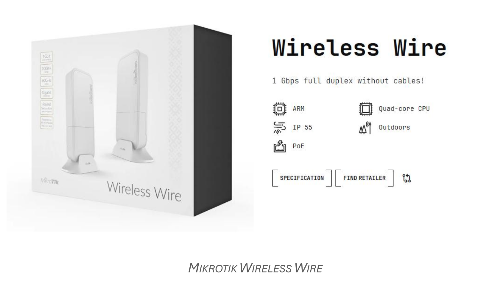

# Introducción a MikroTik y RouterOS.

# Índice

¿Qué es MikroTik?  
Filosofía  
Ecosistema  
MikroTik frente a otros fabricantes de redes  
RouterOS: el corazón del sistema  
¿Qué permite hacer RouterOS?  
Formas de interactuar con RouterOS  

---

# ¿Qué es MikroTik?

## Filosofía

Cuando se menciona MikroTik en una conversación sobre redes, es habitual que aparezca asociada a routers o dispositivos de comunicaciones. Sin embargo, quedarse en esa idea resulta insuficiente para comprender qué aporta realmente esta empresa y por qué tiene tanto sentido introducirla en un contexto formativo.

MikroTik es, ante todo, una propuesta para entender las redes desde dentro. No nace con la intención de simplificar al máximo la experiencia del usuario final, sino con la de ofrecer herramientas que permitan ver, analizar y decidir cómo se comporta una red. Esta diferencia de enfoque es clave y conviene dejarla clara desde el principio.

En muchos entornos cotidianos, el router se percibe como un elemento invisible: está ahí, funciona y apenas se interactúa con él. Es una pieza más del mobiliario tecnológico. MikroTik plantea justo lo contrario. Sus dispositivos están pensados para que quien los administra pueda observar qué ocurre, intervenir cuando sea necesario y comprender las consecuencias de cada decisión. No hay magia ni automatismos opacos; hay lógica, estructura y control.

Esta forma de trabajar conecta directamente con la manera en que se enseña informática y redes en Formación Profesional. Aprender no consiste únicamente en que algo funcione, sino en saber por qué funciona y qué pasaría si lo hiciéramos de otra forma. En este sentido, MikroTik no es solo una herramienta técnica, sino un recurso pedagógico de primer orden.

Otro aspecto fundamental es la separación clara entre el dispositivo físico y el sistema que lo gobierna. El equipo, por sí mismo, no define el comportamiento de la red. Es el software el que determina cómo se gestionan las conexiones, el tráfico o los servicios. Esta idea, aparentemente sencilla, resulta muy potente desde el punto de vista educativo, ya que permite establecer paralelismos con otros ámbitos de la informática y refuerza la comprensión de conceptos como configuración, roles o servicios.

La filosofía de MikroTik se apoya en una premisa clara: quien administra la red debe tener el control. Esto implica asumir cierta responsabilidad y, al mismo tiempo, adquirir una comprensión más profunda del sistema. No se trata de pulsar botones al azar, sino de tomar decisiones informadas. Precisamente por eso, trabajar con MikroTik favorece una actitud más reflexiva y crítica frente a la tecnología.

En el aula, esta aproximación permite romper con la idea de la red como algo abstracto o inalcanzable. El alumnado empieza a percibirla como un sistema lógico, con reglas claras y consecuencias visibles. Comprender esto desde el inicio es esencial para afrontar con éxito los contenidos posteriores del curso.

---

## Ecosistema

Una vez comprendida la filosofía general de MikroTik, el siguiente paso natural es observar cómo esa forma de entender las redes se concreta en dispositivos reales. MikroTik no trabaja con un único tipo de producto, sino con un conjunto amplio de equipos diseñados para adaptarse a contextos muy diferentes, tanto educativos como profesionales.

Mikrotik hEX lite

En su catálogo encontramos routers de pequeño tamaño, pensados para instalaciones sencillas o entornos de aprendizaje, así como dispositivos más robustos, preparados para funcionar de manera continua en redes de mayor envergadura. También existen equipos específicos para redes inalámbricas y dispositivos orientados a tareas de conmutación. A pesar de esta diversidad, todos ellos comparten una misma lógica de funcionamiento y una misma filosofía de diseño.

Mikrotik hAP lite TC

Este aspecto es especialmente relevante desde un punto de vista formativo. No se trata de aprender a manejar un modelo concreto, sino de familiarizarse con un ecosistema coherente, en el que los conocimientos adquiridos pueden trasladarse de un dispositivo a otro sin empezar de cero. El profesorado y el alumnado trabajan siempre dentro de un mismo marco conceptual, lo que facilita un aprendizaje progresivo y sólido.

Mikrotik CRS328-24P-4S+RM

Otro rasgo característico del ecosistema MikroTik es que no existe una frontera clara entre dispositivos “básicos” y “avanzados” en cuanto a la forma de trabajar. Las diferencias se encuentran principalmente en las prestaciones del hardware, pero no en la manera de entender la red. Esto permite que un mismo equipo pueda utilizarse inicialmente para ilustrar conceptos sencillos y, más adelante, para analizar situaciones más complejas, sin cambiar de herramienta ni de entorno.

MIKROTIK WIRELESS WIRE

En el aula, esta continuidad resulta especialmente valiosa. El dispositivo deja de ser un fin en sí mismo y se convierte en un medio para experimentar, observar y comprender cómo funcionan las redes de comunicaciones. De este modo, el ecosistema MikroTik puede entenderse como un laboratorio permanente, en el que cada equipo es una puerta de entrada a los mismos principios y conceptos fundamentales.

---

## MikroTik frente a otros fabricantes de redes

Cuando se analiza el ecosistema MikroTik desde un punto de vista profesional, resulta casi inevitable compararlo con otros fabricantes ampliamente conocidos en el ámbito de las redes de comunicaciones. Entre ellos, Cisco suele ser la referencia más habitual, tanto en entornos empresariales como en el imaginario formativo de muchos docentes y estudiantes.

Cisco representa, tradicionalmente, el estándar de las grandes infraestructuras de red. Sus soluciones están muy presentes en grandes empresas, centros de datos y entornos corporativos complejos. A nivel formativo, su enfoque suele ir ligado a itinerarios muy estructurados, certificaciones oficiales y un modelo de aprendizaje claramente orientado al mundo empresarial de gran escala. Este planteamiento tiene un enorme valor, pero también implica barreras de entrada elevadas en términos de coste, complejidad y curva de aprendizaje.

MikroTik se sitúa en un punto diferente del espectro. Su propuesta no busca competir directamente en todos los escenarios con fabricantes como Cisco, sino ofrecer una alternativa flexible y accesible que permita trabajar con conceptos profesionales desde etapas formativas más tempranas. En lugar de centrarse en ecosistemas cerrados o altamente especializados, MikroTik apuesta por un entorno único, coherente y configurable, válido tanto para pequeños despliegues como para escenarios más complejos.

Desde el punto de vista educativo, esta diferencia es clave. Mientras que en muchos entornos Cisco el aprendizaje inicial puede verse condicionado por la necesidad de seguir un camino muy concreto, MikroTik permite experimentar desde el principio. El profesorado puede plantear situaciones reales sin necesidad de introducir, de forma prematura, una carga excesiva de teoría o terminología certificadora.

Otra diferencia importante reside en la relación entre coste y prestaciones. MikroTik ofrece dispositivos y soluciones que permiten reproducir escenarios profesionales reales sin requerir grandes inversiones. Esto lo convierte en una herramienta especialmente atractiva para centros educativos, donde los recursos son limitados, pero la necesidad de realismo es alta. El objetivo no es replicar exactamente una red corporativa de gran empresa, sino comprender los principios que la hacen funcionar.

También existen diferencias en la filosofía de uso. En muchos entornos profesionales basados en Cisco, la administración de red suele estar muy especializada y segmentada. MikroTik, en cambio, favorece una visión más global del sistema, donde quien administra la red tiene acceso directo a todos los elementos que la componen. Esta visión resulta especialmente adecuada en contextos formativos, ya que permite al alumnado entender la red como un todo y no como un conjunto de piezas aisladas.

En el aula, esta comparación ayuda a transmitir una idea fundamental: no existe un único fabricante “mejor” en términos absolutos, sino herramientas más o menos adecuadas según el contexto. MikroTik no sustituye a Cisco, ni pretende hacerlo. Lo que ofrece es un entorno intermedio ideal para aprender, experimentar y construir una base sólida que, llegado el momento, facilite la transición hacia otros fabricantes y tecnologías.

---

## RouterOS: el corazón del sistema

Cuando se trabaja con dispositivos de red, es habitual centrar la atención en el hardware: el router, el número de puertos, la antena o el formato físico del equipo. Sin embargo, en el caso de MikroTik, el verdadero protagonista no es el dispositivo en sí, sino el sistema que lo gobierna. Ese sistema es RouterOS.

RouterOS es un sistema operativo especializado en redes. Al igual que ocurre con los sistemas operativos de propósito general, su función no es realizar una única tarea, sino coordinar y gestionar el conjunto de recursos disponibles para que el dispositivo pueda desempeñar distintos roles dentro de una red. Desde esta perspectiva, un router deja de ser un aparato con una función fija y pasa a convertirse en un sistema configurable.

Entender RouterOS implica asumir una idea fundamental: el comportamiento de un router no está predeterminado. No existe una única forma “correcta” de que funcione un dispositivo MikroTik. Es el administrador quien decide qué papel desempeña en la red, qué servicios ofrece y cómo se relaciona con el resto de los equipos. El hardware proporciona las capacidades físicas; RouterOS define la lógica.

Este enfoque resulta especialmente valioso en un contexto educativo. Permite explicar que un mismo dispositivo puede actuar como router de acceso a Internet, como cortafuegos, como punto de acceso inalámbrico o como elemento de interconexión entre redes, simplemente cambiando su configuración. No se trata de cambiar de aparato, sino de cambiar la forma de pensar el problema.

Desde el punto de vista conceptual, RouterOS introduce al alumnado en una visión más realista de las redes de comunicaciones. La red deja de ser un conjunto de dispositivos aislados y pasa a entenderse como un sistema organizado, en el que cada elemento cumple una función definida. Esta visión ayuda a relacionar conceptos que, de otro modo, podrían aparecer desconectados: direccionamiento, control del tráfico, seguridad o servicios de red.

Otro aspecto importante es que RouterOS no oculta la complejidad del sistema, pero tampoco la impone de golpe. Permite trabajar de forma progresiva, empezando por configuraciones sencillas y avanzando hacia escenarios más complejos a medida que se consolidan los conocimientos. Esta característica lo convierte en una herramienta especialmente adecuada para la Formación Profesional, donde los niveles de partida del alumnado suelen ser muy diversos.

En el aula, presentar RouterOS como el “corazón” del dispositivo ayuda a desmontar la idea de que un router es una caja cerrada con un comportamiento fijo. El alumnado comienza a comprender que detrás de cada decisión de red existe una lógica y que esa lógica puede analizarse, modificarse y mejorarse. Este cambio de perspectiva es esencial para desarrollar una comprensión profunda y duradera de las redes.

---

## ¿Qué permite hacer RouterOS?

RouterOS es un sistema operativo de red que integra, en un único entorno, múltiples funciones habituales en una infraestructura de comunicaciones. De forma esquemática, permite:

- Interconectar redes  
  - Enrutar tráfico entre diferentes redes.  
  - Gestionar el acceso a Internet.  
  - Organizar la comunicación entre segmentos de red.  

- Controlar el tráfico de datos  
  - Priorizar determinados tipos de tráfico.  
  - Limitar el ancho de banda.  
  - Gestionar colas y flujos de datos.  

- Proteger la red  
  - Filtrar conexiones entrantes y salientes.  
  - Definir reglas de acceso.  
  - Actuar como cortafuegos (firewall).  

- Gestionar direcciones y servicios básicos  
  - Asignar direcciones IP de forma automática.  
  - Resolver nombres dentro de la red.  
  - Proporcionar servicios de red esenciales.  

- Administrar redes inalámbricas  
  - Configurar puntos de acceso Wi-Fi.  
  - Gestionar clientes inalámbricos.  
  - Controlar el acceso y la calidad de la conexión.  

- Monitorizar el funcionamiento de la red  
  - Observar el uso de recursos.  
  - Analizar tráfico y conexiones.  
  - Detectar problemas de rendimiento.  

El alumnado puede empezar a entender que conceptos como enrutar tráfico, filtrar conexiones o priorizar determinados datos no son ideas abstractas, sino tareas concretas que realiza un sistema de forma continua.

RouterOS no impone un único modo de funcionamiento. Un mismo dispositivo puede comportarse de maneras muy distintas según las necesidades del entorno. En un escenario puede limitarse a interconectar dos redes; en otro, puede encargarse de controlar el acceso, proteger la red o gestionar distintos tipos de tráfico. Esta flexibilidad ayuda a comprender que las redes son sistemas dinámicos y adaptables.

Gracias a ello, nos permite trabajar los contenidos de forma progresiva y contextualizada. No es necesario abordar todas las capacidades del sistema desde el principio. Basta con reconocer que existen y que responden a problemas reales. Más adelante, cada una de estas funciones podrá estudiarse con mayor detalle, siempre dentro de un mismo marco coherente.

En el aula, este reconocimiento contribuye a desmontar la idea de que cada problema de red requiere una herramienta distinta. RouterOS muestra que un único sistema bien entendido puede ofrecer soluciones muy diversas. Esta comprensión favorece una visión más madura y profesional de las redes, alineada con lo que el alumnado encontrará fuera del entorno educativo.

---

## Formas de interactuar con RouterOS

En este punto surge una pregunta natural: ¿cómo se accede a ese sistema?, ¿cómo se le “habla” para indicarle qué debe hacer?

RouterOS puede administrarse a través de diferentes interfaces de administración. Por un lado, dispone de interfaces gráficas, como la aplicación WinBox o el panel web WebFig, que permiten configurar el sistema de forma visual. Por otro lado, también puede gestionarse mediante una interfaz de comandos basada en texto, accesible a través de una conexión SSH o desde la pestaña correspondiente de las propias aplicaciones gráficas.

Tanto las interfaces gráficas como la interfaz de comandos en modo texto permiten realizar todas las operaciones de configuración y mantenimiento sobre los dispositivos. En el aula, esta idea resulta especialmente útil para evitar confusiones frecuentes. El alumnado puede pensar que una interfaz gráfica es “más básica” o que la interfaz de texto corresponde a “otro sistema diferente”. Comprender que ambas son simplemente formas distintas de comunicarse con el mismo núcleo facilita una visión más madura y profesional del funcionamiento de los sistemas.

Además, trabajar con varias formas de interacción permite introducir una reflexión importante: no todas las herramientas son igual de adecuadas para todas las situaciones. En algunos casos, una interfaz visual resulta más clara y accesible; en otros, una interacción más directa ofrece un mayor control. Esta reflexión no se limita a RouterOS, sino que es extrapolable a muchos otros ámbitos de la informática.