# Conectando a RouterOS para su administración  
---

# Introducción

Una vez creada y puesta en marcha la instancia de RouterOS, ya sea en VirtualBox o en GNS3, el siguiente paso es acceder al router para empezar a configurarlo.

RouterOS permite varias formas de administración:

- Consola  
- WinBox  
- WebFig  
- SSH  

---

# Estado inicial del router

En el primer acceso, RouterOS se presenta sin configuraciones previas:

- No hay direcciones IP  
- No hay reglas  
- No hay servicios configurados  

El sistema está listo para comenzar desde cero.

---

# Usuario y contraseña por defecto

Credenciales iniciales:

- Usuario: `admin`  
- Contraseña: (vacía)  

---

# Acceso por consola

Es el método más básico y fiable.

- No requiere red  
- Acceso directo al sistema  
- Usado en instalación y recuperación  

En entornos virtualizados:

- Consola de VirtualBox  
- Consola de GNS3  

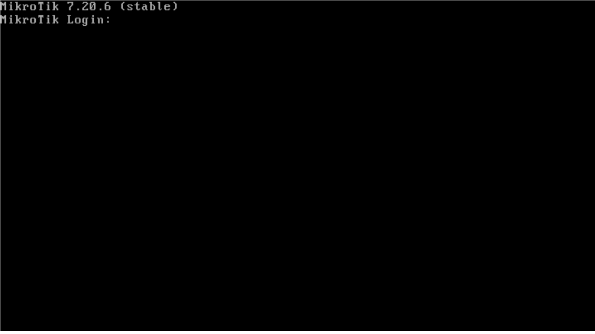

---

# Primer acceso

1. Usuario: `admin`  
2. Contraseña: (vacía)  

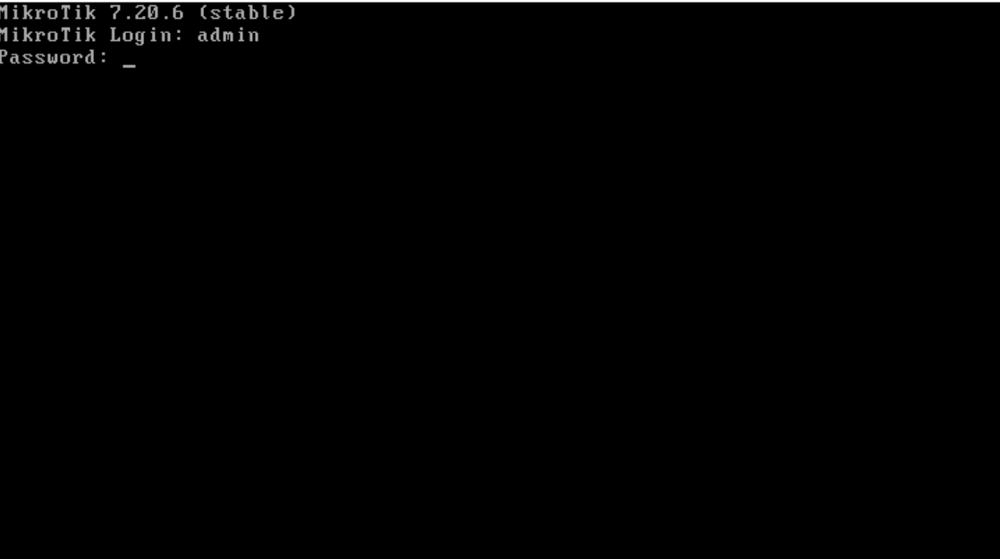

Durante el primer acceso:

- `y` → ver licencia  
- `n` → continuar  

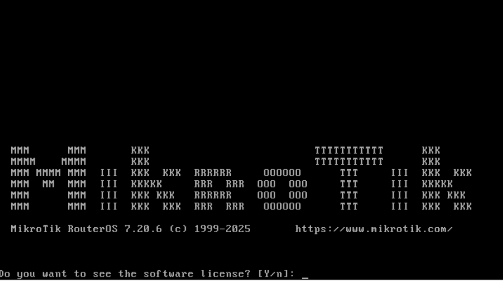

---

# Cambio de contraseña

RouterOS obliga a definir una nueva contraseña.

---

# Comprobación de IP

Comando: 
/ip/address/print

Muestra las direcciones IP del router.

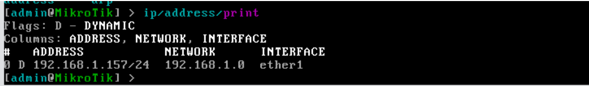

---

## Acceso con WinBox

WinBox es la herramienta gráfica oficial de MikroTik.

Descarga:
https://mikrotik.com/download/winbox

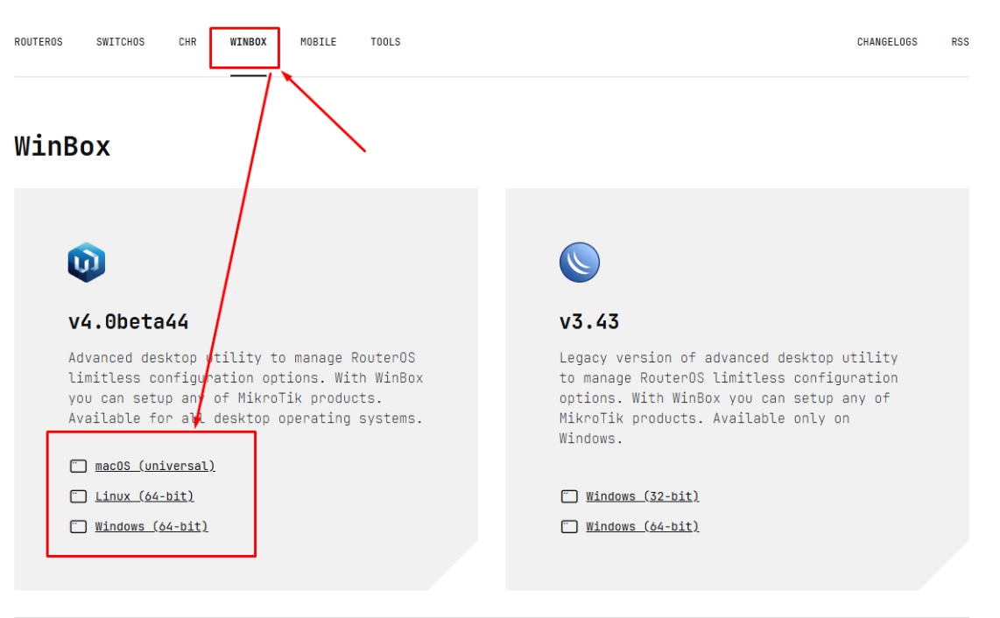

---

### Escaneo de red

WinBox detecta dispositivos automáticamente:

- Por IP  
- Por MAC  

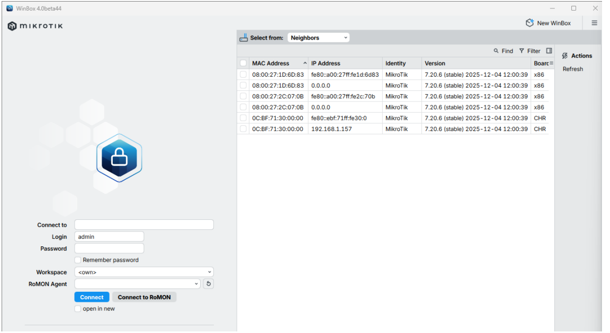

---

### Conexión

1. Seleccionar dispositivo  
2. Introducir usuario y contraseña  
3. Conectar  

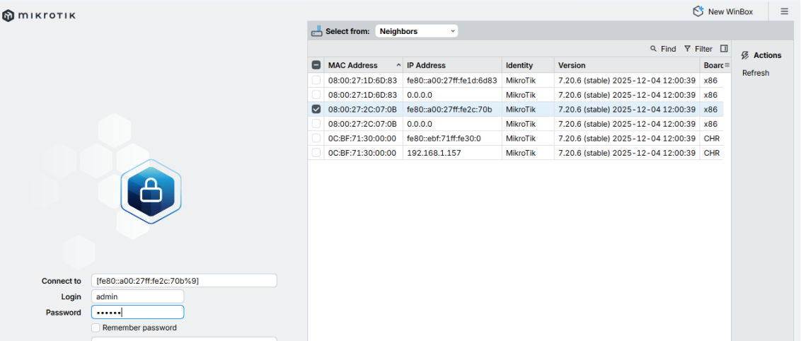

---

## Acceso con WebFig

Interfaz web de RouterOS.

Requisitos:

- IP configurada  
- Navegador  

---

### Login WebFig

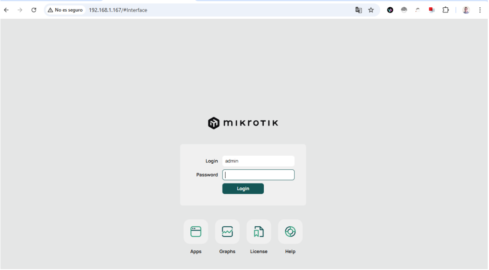

---

### Panel WebFig

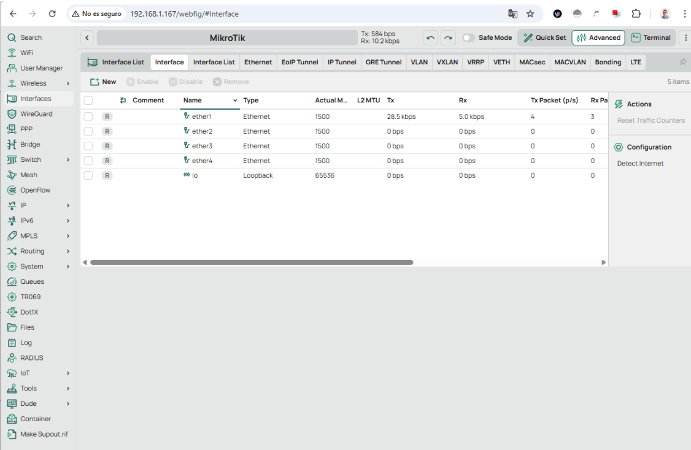

---

## Acceso mediante SSH

Permite administración remota en modo texto.

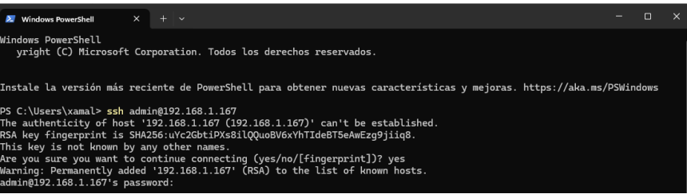

---

### Sesión SSH

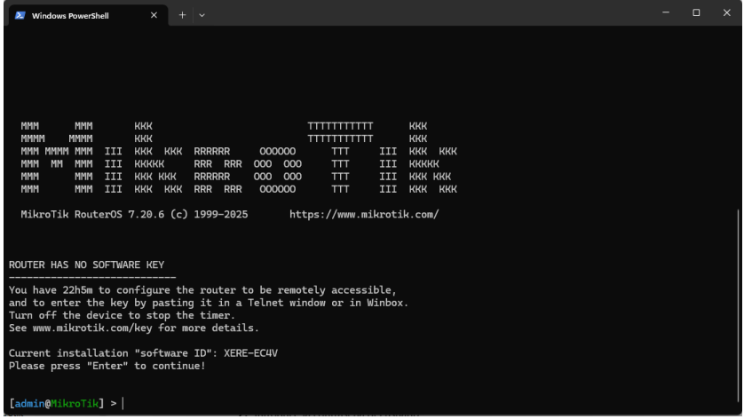

---

RouterOS puede administrarse mediante distintos métodos, cada uno adecuado a una situación concreta.