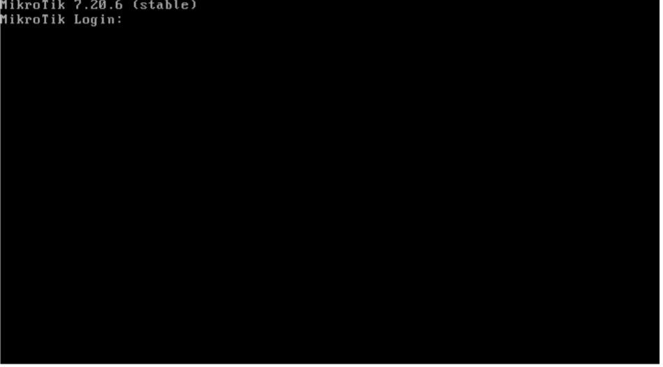
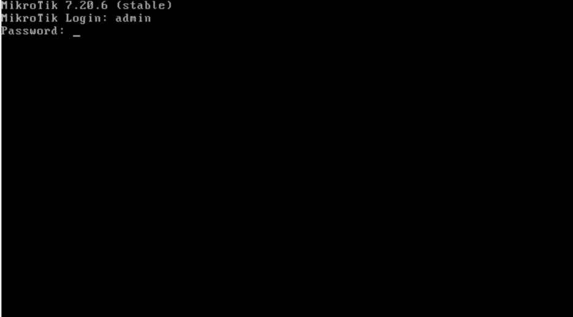
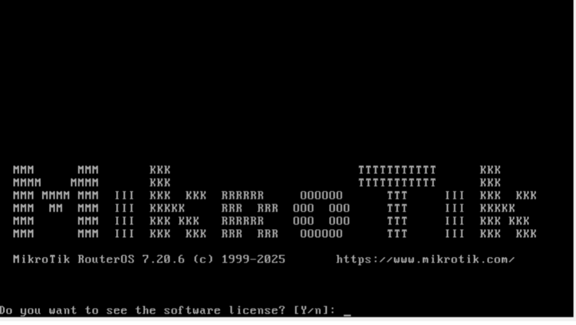
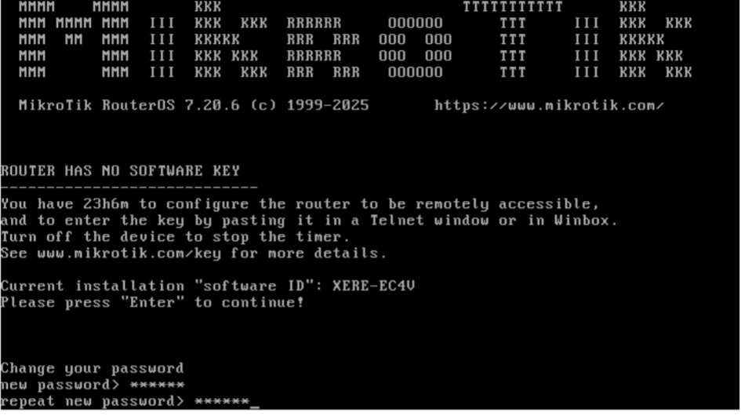
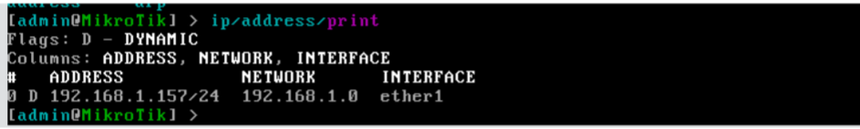
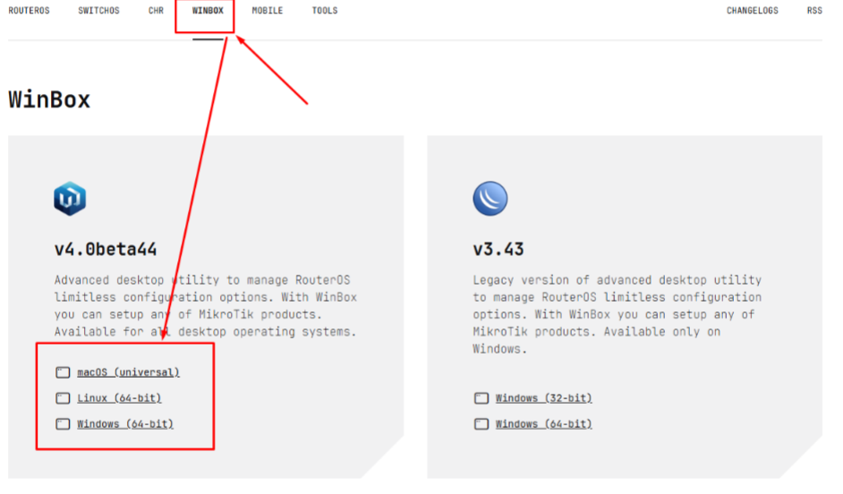
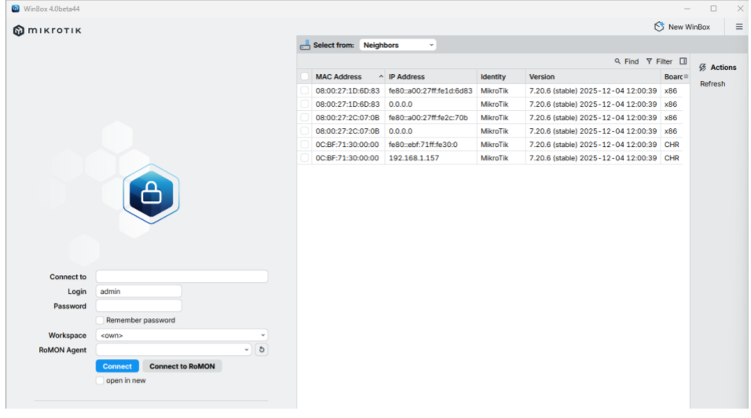
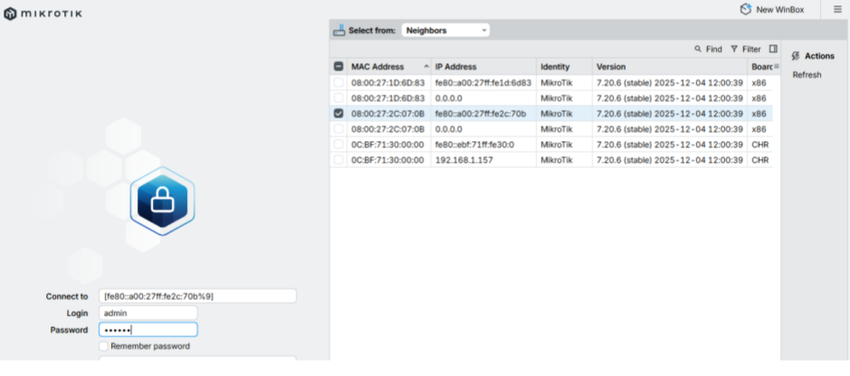
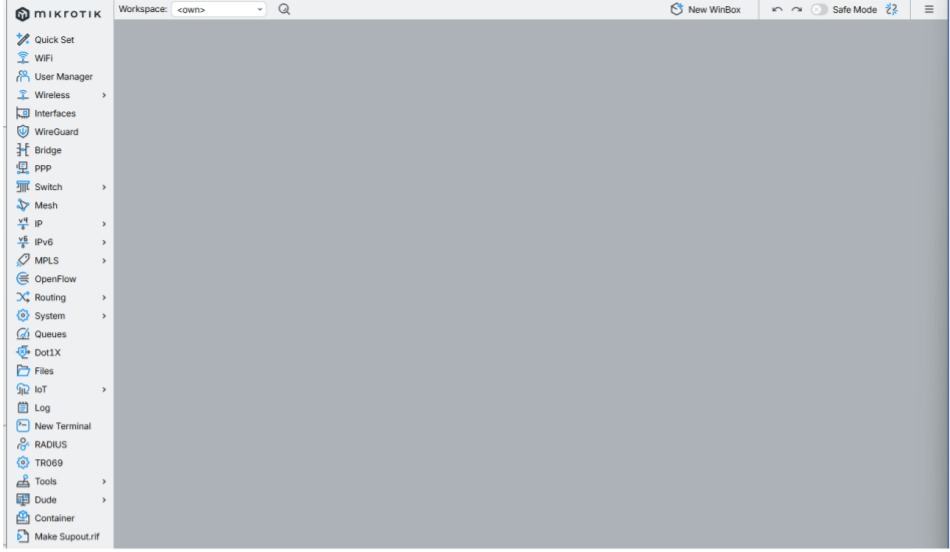
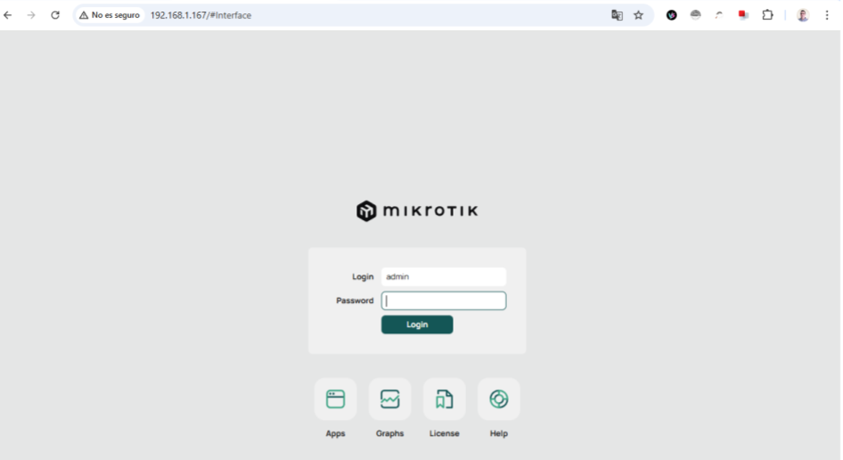

# Conectando a RouterOS para su administración.

---

# Índice

Introducción  
Estado inicial del router  
Usuario y contraseña por defecto en RouterOS  
Acceso por consola.  
Primer acceso a Mikrotik  
Acceso utilizando la aplicación WinBox  
Acceso utilizando WebFig  
Acceso mediante un cliente SSH  

---

# Introducción

Una vez creada y puesta en marcha la instancia de RouterOS, ya sea en VirtualBox o en GNS3, el siguiente paso natural es acceder al router para empezar a configurarlo. A partir de este momento dejamogs atrás la fase de despliegue y entramos en la parte realmente importante del trabajo: modificar y ajustar el comportamiento del sistema.

RouterOS permite la administración a través de distintas interfaces, todas ellas habituales en entornos profesionales. La elección de una u otra dependerá del contexto, del estado del router y del tipo de tarea que se vaya a realizar.

De forma general, dispondremos de las siguientes opciones:

• Consola, que ofrece un acceso directo en modo texto y suele utilizarse en el primer arranque, en tareas de diagnóstico o cuando no existe conectividad de red.  
• WinBox, la aplicación gráfica específica de MikroTik, muy utilizada en la administración diaria por su rapidez y facilidad de uso.  
• WebFig, una interfaz web accesible desde el navegador, especialmente útil en entornos donde no se puede instalar software adicional.  
• SSH, un método de acceso remoto en modo texto, ampliamente empleado en la administración de sistemas y redes.  

A lo largo del curso iremos utilizando varias de estas formas de acceso, priorizando en cada momento la que resulte más adecuada según el escenario planteado y los objetivos de la práctica.

---

# Estado inicial del router

En el primer acceso, RouterOS se presenta en su estado inicial, sin configuraciones previas aplicadas. El sistema arranca “en limpio”, lo que significa que no hay parámetros personalizados cargados y que el comportamiento del router es el esperado tras una instalación recién realizada.

En este punto, todas las interfaces están disponibles y operativas desde el punto de vista físico, pero aún no tienen definida ninguna lógica de red: no hay direcciones IP asignadas, ni reglas, ni servicios configurados. El router está, por tanto, listo para comenzar a configurarse paso a paso.

Desde el punto de vista didáctico, este momento es especialmente importante. Todo el alumnado parte exactamente del mismo estado, lo que facilita el seguimiento de las prácticas, la comparación de resultados y la detección de errores cuando algo no funciona como se espera.

---

# Usuario y contraseña por defecto en RouterOS

En la primera conexión a RouterOS, independientemente del método utilizado —consola, WinBox, WebFig o SSH—, el sistema solicitará un usuario y una contraseña. Mientras no se haya aplicado ninguna configuración previa, RouterOS utiliza unas credenciales por defecto muy simples, pensadas para facilitar el acceso inicial al dispositivo.

El usuario por defecto es admin y la contraseña no está establecida, por lo que no debe introducirse nada en ese campo. Cuando el sistema solicite la contraseña, bastará con pulsar Enter, dejando el campo en blanco.

Estas credenciales se emplean únicamente para el primer acceso y permiten comprobar que el router funciona correctamente antes de comenzar con su configuración.

---

# Acceso por consola.

En un router físico de MikroTik, la conexión por consola es el método más básico y fiable para acceder al sistema. No depende de que la red esté configurada ni de que exista conectividad previa, por lo que se utiliza habitualmente durante la primera puesta en marcha, en tareas de mantenimiento o en situaciones de recuperación.

El procedimiento es sencillo. El router se conecta al ordenador mediante un cable de consola, que puede ser de tipo serie o USB según el modelo. En algunos dispositivos concretos, también es posible conectar directamente un monitor y un teclado. Desde el ordenador se utiliza un programa de terminal (como PuTTY, Minicom u otro equivalente) y se abre una sesión de consola con los parámetros habituales del puerto. Al encender el router, se muestran los mensajes de arranque y, una vez finalizado el proceso, aparece el prompt solicitando usuario y contraseña.

Este tipo de acceso representa el nivel más directo de interacción con el sistema, equivalente a estar físicamente delante del router y trabajar con él sin intermediarios.

En los entornos virtualizados, esta conexión tiene su equivalencia directa en la consola de VirtualBox o en la consola de GNS3, que son las utilizadas en los apartados anteriores para comprobar la correcta instalación y el arranque de RouterOS.

---

# Primer acceso a Mikrotik

En un router recién instalado, el acceso inicial se realiza con el usuario admin y la contraseña en blanco. Tras introducir el usuario, basta con pulsar Enter cuando se solicite la contraseña.

Durante este primer acceso, el sistema mostrará un mensaje preguntando si se desea visualizar la licencia de software. Es posible leerla pulsando y, o bien continuar directamente con el proceso pulsando n para omitir este paso.

A continuación, RouterOS solicitará que se establezca una nueva contraseña para el usuario admin. En este momento se debe introducir la contraseña de administración que se vaya a utilizar a partir de ahora. Este paso es obligatorio y marca el inicio de la configuración básica de seguridad del router.

Dependiendo de la configuración inicial aplicada por RouterOS, es posible que el cliente DHCP esté activo en el primer puerto de red, lo que permitiría que el router obtenga automáticamente una dirección IP. Para comprobarlo, se puede utilizar el siguiente comando:

/ip/address/print.

Este comando mostrará las direcciones IP asignadas a las distintas interfaces del router.

---

# Acceso utilizando la aplicación WinBox

WinBox es la aplicación gráfica oficial de MikroTik para la administración de dispositivos RouterOS. Se trata de una herramienta ligera, rápida y muy completa, que permite configurar prácticamente todos los aspectos del router de forma visual, manteniendo en todo momento un control preciso sobre el sistema.

La aplicación WinBox puede descargarse desde la página oficial de MikroTik (https://mikrotik.com/download/winbox). En este caso se utilizará la versión para Windows, aunque existen alternativas para otros sistemas operativos.

Al abrir WinBox, la aplicación escanea automáticamente la red en busca de dispositivos MikroTik accesibles y muestra una lista con los routers detectados. Esta detección no depende únicamente de direcciones IP: WinBox es capaz de localizar dispositivos utilizando su dirección MAC, lo que resulta especialmente útil cuando el router todavía no tiene una configuración de red definida.

En la ventana principal se muestran las direcciones MAC detectadas y, cuando están disponibles, las direcciones IPv4 e IPv6 asociadas a cada una de ellas. Para conectar con un dispositivo, basta con seleccionar la fila correspondiente y completar los campos de usuario y contraseña.

Si las credenciales son correctas, WinBox establecerá la conexión con el router y mostrará la interfaz de administración, desde la que será posible acceder a todas las opciones de configuración de RouterOS. A partir de este momento, el router queda plenamente accesible para continuar con las tareas del curso.

---

# Acceso utilizando WebFig

WebFig es la interfaz web de administración incluida en RouterOS. Permite gestionar un router MikroTik directamente desde un navegador, sin necesidad de instalar ningún software adicional en el equipo desde el que se accede. A nivel funcional, WebFig ofrece prácticamente las mismas opciones que WinBox, pero accesibles a través de HTTP o HTTPS.

Para poder utilizar WebFig es necesario que el router tenga conectividad IP con el equipo cliente y conocer la dirección IP asignada a alguna de sus interfaces. Además, será suficiente con disponer de un navegador web actualizado.

A diferencia de WinBox, WebFig no permite el acceso por dirección MAC, por lo que resulta imprescindible que el router tenga al menos una dirección IP configurada y accesible. Una vez introducida la IP del router en la barra de direcciones del navegador, el sistema solicitará el usuario y la contraseña.

Si las credenciales son correctas, se cargará la interfaz web de RouterOS, desde la que será posible acceder a las distintas opciones de configuración del router y continuar con las prácticas del curso.

Si los datos son correctos, la aplicación conectará con la interfaz web del router, y nos mostrará sus opciones de configuración.

---

# Acceso mediante un cliente SSH

El acceso mediante SSH (Secure Shell) permite administrar RouterOS de forma remota, segura y en modo texto a través de la red. Es uno de los métodos más habituales en entornos profesionales, especialmente cuando se trabaja desde sistemas GNU/Linux, macOS o desde servidores sin entorno gráfico.

Desde el punto de vista formativo, el uso de SSH tiene un valor añadido evidente: acerca al alumnado a la administración real de sistemas y redes, donde el acceso remoto y la línea de comandos forman parte del trabajo cotidiano.

Para poder acceder a RouterOS utilizando un cliente SSH es necesario que el router tenga conectividad IP con el equipo desde el que se realiza la conexión, conocer la dirección IP asignada a alguna de sus interfaces y disponer de un cliente SSH actualizado.

Una vez introducidos los datos de conexión correctos, el cliente establecerá la sesión con el servidor SSH del router y permitirá ejecutar los comandos necesarios para continuar con la configuración y administración del sistema.

